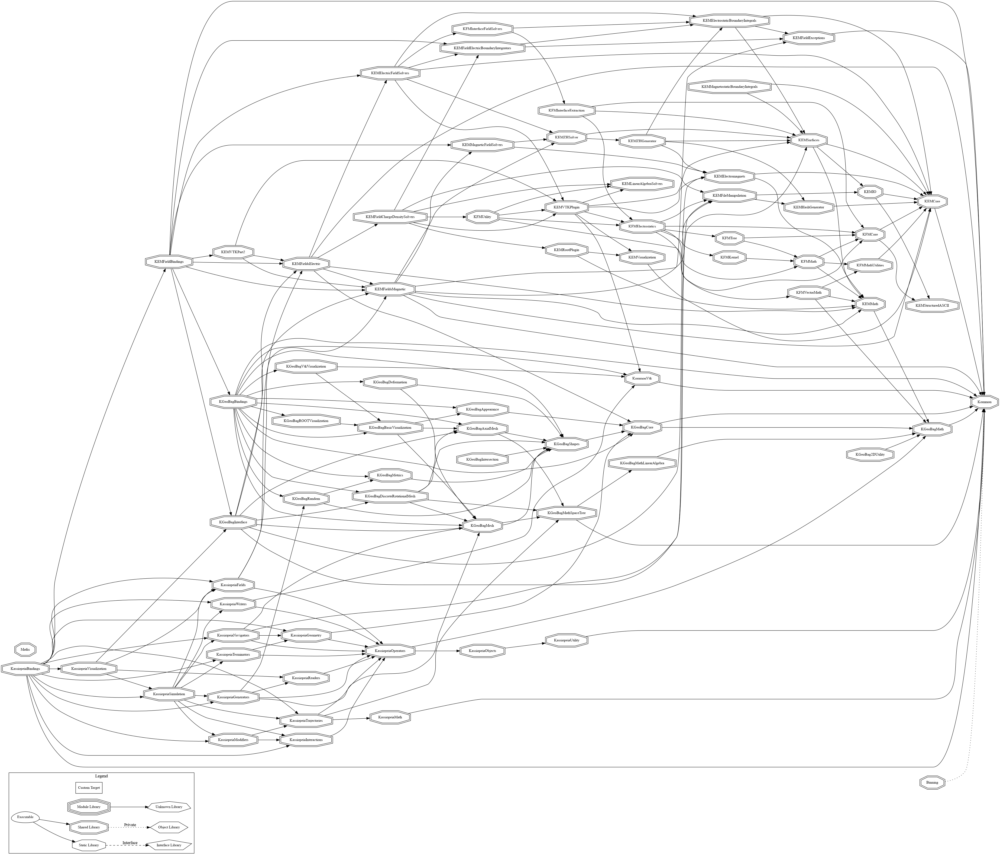
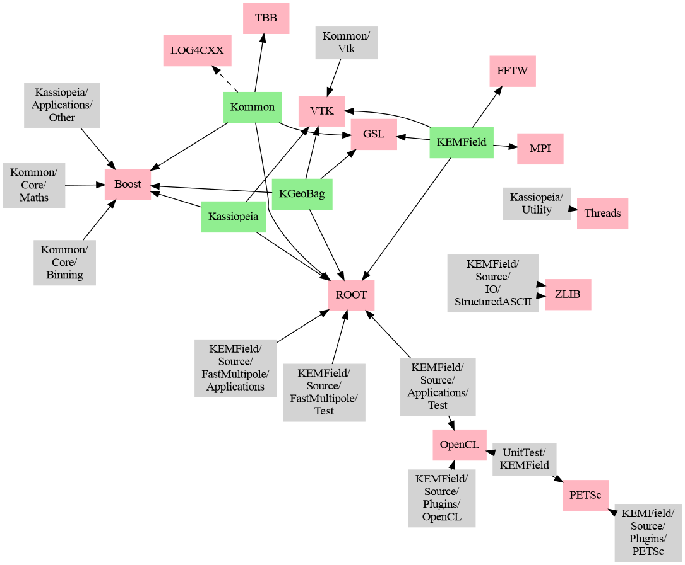

# Kassiopeia

See the [README](README.md) file for basic instructions about setting up Kasper
and creating the necessary accounts.

 Kassiopeia: Simulation of electric and magnetic fields and particle tracking
==============================================================================

 Joining the developers
------------------------

1.  The primary platform for development is a private GitLab repository that
    is used internally by the KATRIN collaboration. The Kassiopeia version
    on GitHub that is publicly available contains a reduced set of Kasper
    modules without references to KATRIN-specific elements.

    1.  External users of the software are welcome to contribute to its
        development. Please use the features available on the GitHub
        platform to update any part of the code. It is suggested to create
        a personal fork of the code repository, from which pull requests
        can be initiated.

    2.  Pull requests on GitHub will be reviewed by the core developers,
        and changes may be required before the updated code can be merged
        into the main branch. GitHub will be used for all communication.

    3.  Pull requests that were merged into the main branch will also be
        propagated upstream into the main repository on the KATRIN GitLab.
        Any updates to the public Kassiopeia version thus become part
        of the mainline source code, and will benefit both the KATRIN
        collaboration as well as external users of the software.

2.  Please note that the software is still "work in progress" and it
    cannot be guaranteed that there are no bugs or other issues.

    1.  To let the core developers know about any problems when building
        or running the software, please use the GitHub issue tracking
        system.

3.  To contact the core developers, it is best to use GitHub's features
    of communication. Alternatively, the following mailing list can
    be used: katrin-kasper [at] lists.kit.edu

 Kasper code structure
-----------------------

1.  The Kasper source code consists of several modules that implement
    specific functionality, such as particle tracking or data analysis.
    The modules are configured by the CMake build system and can be
    activated individually. Note that although the modules are located
    in independent directories, they often depend on other Kasper modules.
    The CMake configuration will take care of activating any necessary
    dependencies.

    1.  See the [CHANGELOG](CHANGELOG.md) for a list of Kasper modules,
        their current software versions and recent changes.

    2.  The graph below outlines the module dependencies. Kasper modules
        that are referenced by other modules are shown as blue boxes,
        unreferenced modules as red boxes. Code directories that are part
        of a Kasper module, but have additional dependencies are shown
        as black circles.

        

    3.  Each module, and thus the Kasper software as a whole, also has
        dependencies on external packages, such as the ROOT library.
        See the [README](README.md) for details and a list of required
        and optional dependencies.

        The graph below outlines the package dependencies. Kasper modules
        are shown as blue or red boxes, as above. External packages are
        shown as blue circles. Required dependencies to a package are
        indicated by a solid line, and optional dependencies by a dashed
        line. Kasper code directories with additional dependencies are again
        shown as black circles.

        

    4.  All code in Kasper should follow a consistent coding style. The
        style-file [.clang-format](.clang-format) is provided for automated
        code formatting using the clang-format tool. Developers should make
        sure that any merged code is formatted correctly.

    5.  Code documentation is still unfinished at this point. We are using
        Doxygen for automated generation of documentation files, which can
        be enabled in CMake. See the [Documentation/README](Documentation/README)
        for details.

    5.  A small set of helper scripts is located in the [Scripts](Scripts/)
        directory. These are intended to support code formatting and
        automated cleanup (clang-format and clang-tidy), help with code
        profiling (gperftools), produce dependency graphs (see above),
        generate documentation and update the Changelog.
