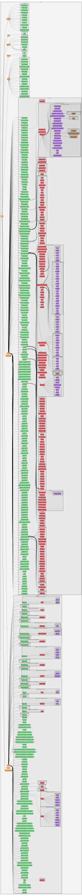

Bindings documentation
======================

This section provides documentation for the **XML bindings**. Many Kasper
modules can parse XML files during intialization; the bindings classes define
the available XML elements, their attributes and their relation to C++ classes.

Overview
--------

The files below show the allowed *elements* and *attributes* that can be used
in Kasper XML files; according to the syntax:
```
  <element attribute_1="value_1" attribute_2="value_2">
    <child_element attribute_3="value_3" />
  </element>
```

Elements can be nested according to what is shown here, and each element can
have a number of attributes. Note that in some cases, certain child elements
and attributes are required; in other cases, they are mutually exclusive. Note
that this information is not represented here in the documentation.

* **[bindings_full.md](bindings_full.md)** contains a Markdown representation
  of the available bindings. The document is grouped into section that each
  have a table with all XML elements and attributes. Each section also
  includes a brief XML snippet as a usage example and links to child elements.
* **[bindings_full.rst](bindings_full.rst)** contains the same representation
  of the available bindings in reStructuredText (rST) format.
* **[bindings_full.xml](bindings_full.xml)** contains all available bindings
  and their attributes in XML format. The attributes contain placeholder values
  which indicate their data type. This file is not intended to be processed
  by Kasper applications, but servers as an almost-complete XML code example.
* **[bindings_full.svg](bindings_full.svg)** contains a graphical
  representation of the XML elements and their relations. The graph is produced
  with the GraphViz software. The graph shows all relations between XML
  elements and their C++ classes, but not their attributes. 
* The following files contain a more detailed graphical representation of the
  XML elements of individual Kasper modules along with their attributes:
  * **[bindings_Kommon.svg](bindings_Kommon.svg)** for the `Kommon` module
  * **[bindings_KaLi.svg](bindings_KaLi.svg)** for the `KaLi` module
  * **[bindings_KGeoBag.svg](bindings_KGeoBag.svg)** for the `KGeoBag` module
  * **[bindings_KEMField.svg](bindings_KEMField.svg)** for the `KEMField` module
  * **[bindings_Kassiopeia.svg](bindings_Kassiopeia.svg)** for the `Kassiopeia` module
  * **[bindings_KSC.svg](bindings_KSC.svg)** for the `KSC` module
  * **[bindings_SSC.svg](bindings_SSC.svg)** for the `SSC` module
  * **[bindings_KaFit.svg](bindings_KaFit.svg)** for the `KaFit` module

Source script
-------------

The files in this directory can be autgenerated with a Python script
[gen-bindings-docs.py](../../Scripts/gen-bindings-docs.py) which provides
options to generate XML, Markdown (`.md`), reStructuredText (`.rst`), and
GraphViz (`.dot`) files. The GraphViz files can be converted into image
files (`.svg`). Run the script with the `--help` option to see all options.

The shell script [gen-bindings-docs.sh](../../Scripts/gen-bindings-docs.sh)
carries out all these individual steps and updates the files listed here.

Bindings graph
--------------

This graph shows the available XML elements in Kasper and their relations:


