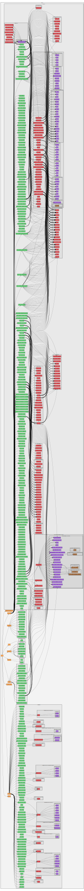

.. _bindings-label:

Bindings Documentation
**********************

This section provides documentation for the **XML bindings**. Many Kasper
modules can parse XML files during intialization; the bindings classes define
the available XML elements, their attributes and their relation to C++ classes.

.. contents:: On this page
    :local:
    :depth: 2

Overview
========

The files below show the allowed *elements* and *attributes* that can be used
in Kasper XML files; according to the syntax:

.. code-block:: xml

    <element attribute_1="value_1" attribute_2="value_2">
        <child_element attribute_3="value_3" />
    </element>

Elements can be nested according to what is shown here, and each element can
have a number of attributes. Note that in some cases, certain child elements
and attributes are required; in other cases, they are mutually exclusive. Note
that this information is not represented here in the documentation.

Additional documentation on the XML bindings is available on GitHub:
`Documentation/Bindings <https://github.com/KATRIN-Experiment/Kassiopeia/blob/main/Documentation/Bindings/>`_.

Bindings graph
==============

The graphs shows the relation between the available XML elements.

List of bindings
================

The tables below show the child elements and attributes along with their type for each XML element.
Note that the column pairs *child element / child type* and *attribute / attribute type* are linked: each listed type
corresponds to the item on the left. The list of attributes is independent to the list of child elements. For many
elements the child elements and attributes cannot be freely combined (e.g. some are mutually exclusive), but this is
not reflected here.

.. include:: ./bindings_full.rst
