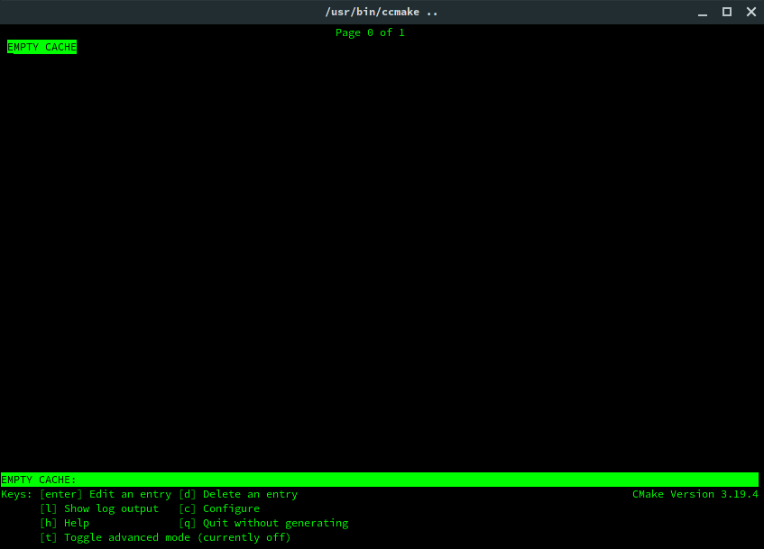
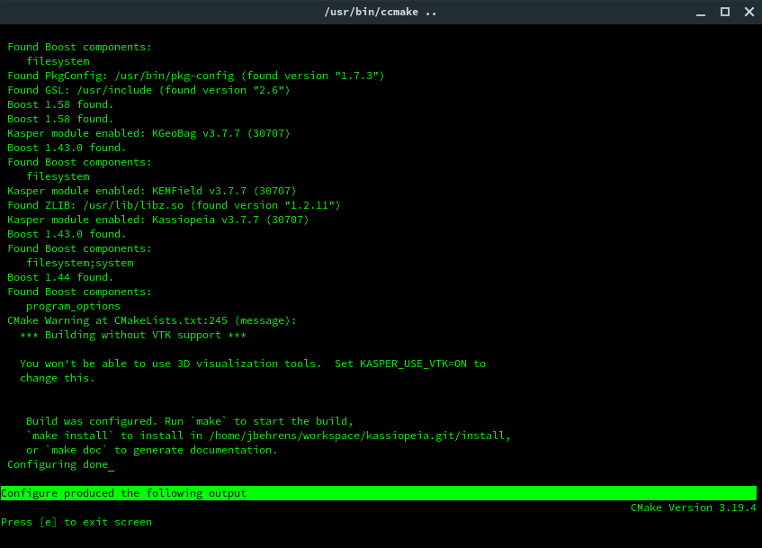
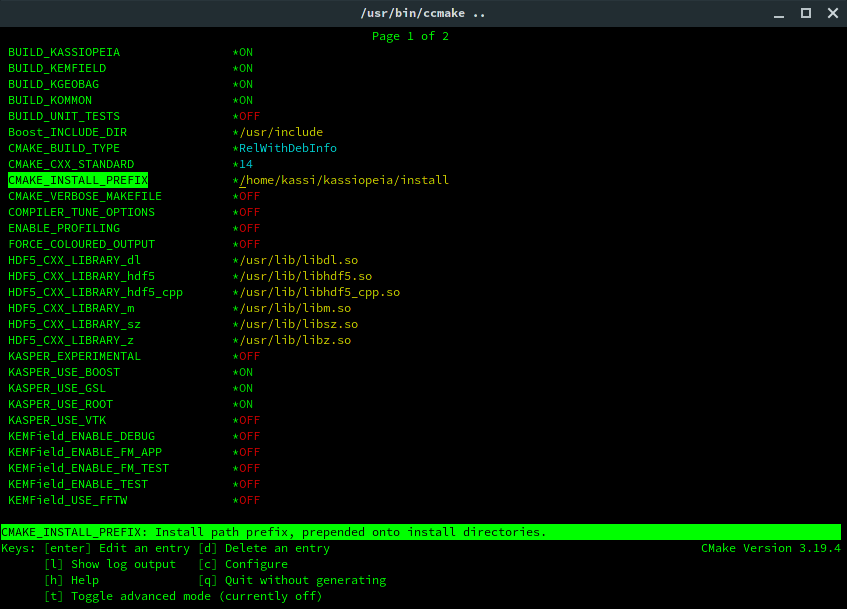

Getting starting with Kassiopiea
**********************************

.. contents:: On this page
    :local:
    :depth: 2

Downloading the code
====================

The most recent version of *Kassiopeia* and its accompanying libraries can be found on its public github page:

    https://github.com/KATRIN-Experiment/Kassiopeia

To obtain the code, you may either download a .zip file containing the compressed source files from:

    https://github.com/KATRIN-Experiment/Kassiopeia/archive/master.zip

or, alternatively, use git to clone the repository with the following command:

.. code-block:: bash

    git clone https://github.com/KATRIN-Experiment/Kassiopeia.git

The use of git is generally the preferred method as this will allow you to easily obtain updates and bug fixes without
needing to download a fresh copy of the source. This can be done simply by executing the command:

.. code-block:: bash

    git pull

from within the source directory. For a quick-start guide to git, please refere to the GitHub documentation:

    https://docs.github.com/en/github/getting-started-with-github

Supported operating systems and hardware requirements
=====================================================

*Kassiopeia* is supported and intended to run on systems running either Linux or MacOS X. Currently, it has been
compiled and tested to run on fresh installations of the Linux distributions Fedora 31 and Ubuntu 20.04 LTS. It is also
expected to compile and run on other Linux distributions, however this has not been tested, and the steps needed to
compile *Kassiopeia* may deviate from what is outlined here.

For minimal functionality and the ability to run the included example programs and simulations the following
computer specifications or better are recommended:

- Architecture: x86-64
- CPU: Intel Core i3 @ 2.0 GHz
- RAM: 4 GB
- Free Disk Space: 10 GB

Docker image
============

The section below outlines the necessary steps to build *Kassiopeia* on a local Linux/MacOS system. Due the the number
of external dependencies that may conflict with what is available, it is often more feasible to use the Docker_ image
that is provided for the recent *Kassiopeia* releases. The images can be downloaded from one of the two locations:

    https://hub.docker.com/r/katrinexperiment/kassiopeia

    https://github.com/orgs/KATRIN-Experiment/packages

If you have Docker_ installed on your system, you can simply pull the image:

.. code-block:: bash

    sudo docker pull katrinexperiment/kassiopeia

and open a shell inside the container from where you can run *Kassiopeia* or other commands:

.. code-block:: bash

    sudo docker run --rm -it katrinexperiment/kassiopeia /bin/bash

Please note that by default, changes inside the container are not saved and will be lost once the container is closed.
In order to use the Docker_ image for scientific simulations, some additional steps are necessary.

For instructions on how to use Docker containers and how to set up persistent storage, refer to the Docker manual:

    https://docs.docker.com/

Required software dependencies
==============================

*Kassiopeia* has been designed with an eye towards keeping reliance on external software packages and libraries to a
minimum. That being said, there are a few packages which are required in order to build the software.

The first and most obvious is a C/C++ compiler which is new enough to support the C++14 standard. The two recommended
compilers are GCC and Clang. The minimum required versions are gcc 5.0 and clang 3.4.

Secondly, in order to build *Kassiopeia*, CMake version 3.13 or greater is needed, along with a suitable build tool such
as GNU make or Ninja. The *Kassiopeia* build system is based on the flexible CMake system which can be configured by
the command line. However, it is extremely useful to install the command line curses-based CMake GUI interface (ccmake)
in order to easily configure optional dependencies.

Thirdly, *Kassiopeia* requires the Boost_ framework to be available for extended compilation features. It is not
possible to compile *Kassiopeia* without a recent version of Boost_! The minimum required version is 1.61.

Minimum requirements
--------------------

On a Debian/Ubuntu Linux system the minimum software packages required by the Kassiopiea
build system can be installed through the use of the package manager through the following command:

.. code-block:: bash

    apt-get update -y && apt-get install -y \
        build-essential cmake cmake-curses-gui \
        libboost-all-dev libfftw3-dev libgsl0-dev libhdf5-dev liblog4cxx-dev libomp-dev libopenmpi-dev \
        libpcl-dev libsqlite3-dev libssl-dev libvtk6-dev libxml2-dev ocl-icd-opencl-dev zlib1g-dev

On a RedHat/Fedora Linux system, the packages can be installed through the command:

.. code-block:: bash

    dnf install -y \
        @development-tools cmake cmake-gui \
        root-core root-io-xmlparser root-minuit2 root-spectrum \
        vtk vtk-qt vtk-java \
        boost-devel fftw-devel gsl-devel hdf5-devel libomp-devel libxml2-devel log4cxx-devel \
        ocl-icd-devel openmpi-devel openssl-devel pcl-devel sqlite-devel vtk-devel zlib-devel

Required dependencies
---------------------

- CMake_ version 3.13 or higher
- g++ version 6.1 or higher (if compiling with GCC_)
- clang++ version 3.4 or higher (if compiling with Clang_)
- GSL_
- ROOT_ version 6.16 or higher

Optional dependencies
---------------------

- Boost_ version 1.61 or higher
- FFTW_ version 3.3.4 or higher
- HDF5_
- LibXml2_
- Log4CXX_
- OpenMPI_ or MPICH_
- OpenCL_ or CUDA_, installation details depend on your system
- PCL_
- PETSc_
- TBB_
- VTK_
- ZLIB_
- DoxyGen_ for building the documentation

External libraries
------------------

Beyond the build system, there are only two software packages which could be considered absolutely required
dependencies, GSL_ and ROOT_ (though this is not strictly true, if the user only wishes to compile *KEMField*).

The GNU scientific library (GSL_) is a collection of useful numerical routines. In the commands shown above, GSL_ was
already installed through the package manager. It is also possible to install GSL_ from source.

The second required dependency is the ROOT_ software from CERN. While ROOT_ is not strictly required (e.g. if you are
only interested in using *Kassiopeia* as a library for some external application), it does feature quite heavily as a
means of saving simulation output data. Therefore, if you plan on saving the results and performing any analysis of
*Kassiopeia* simulation results you will need to install ROOT_.

It is recommended that you install ROOT_ by downloading and compiling the source code according
to the instructions on the CERN website. *Kassiopeia* requires ROOT_ to be built with XML support,
and ROOT_ itself requires the X11, Xft, Xpm, and Xext development libraries.

You may install the development packages needed by ROOT on Debian/Ubuntu Linux by running the following command:

.. code-block:: bash

    sudo apt-get install -y libqt4-dev libx11-dev libxext-dev libxft-dev libxpm-dev

On RedHat/Fedora Linux, ROOT_ can be installed through the package manager:

.. code-block:: bash

    dnf install -y root-core root-io-xmlparser root-minuit2 root-spectrum

Instead of building the ROOT_ libraries yourself, you can also download the binary release for your corresponding
Linux distribution. The download links can be found on the CERN website.

After compiling and installing ROOT, in order to compile *Kassiopeia* on Linux, your ``$PATH`` and ``$LD_LIBRARY_PATH``
environmental variables should be configured such that you can run the executables ``root`` and ``root-config`` from the
command line.

The configuration of these environmental variables is typically handled in a way to ensure that the script
``thisroot.sh`` (distributed with the ROOT source code) is executed upon login. On Linux this an be done by adding the
following (with the appropriate change to the file path) to your login script (``~/.bashrc`` file or similar):

.. code-block:: bash

    #Set up the ROOT environmental variables
    source <path-to-ROOT-install>/bin/thisroot.sh

Once you have GSL_ and ROOT_ installed, if you do not require any additional features, you can then proceed with
configuring and compiling *Kassiopeia*.

A third important dependency, which however is completely optional, is VTK_. The VTK_ libraries are used to provide
visualization methods directly in *Kassiopeia*, and to write output files that can be used with external software.
On most platforms, VTK_ can be easily installed through the package manager, as shown above.

Compiling the code using CMake
==============================

After installing the required dependencies, compiling a basic plain-vanilla version of *Kassiopeia*, with no extra
features is a relatively simple process. For the sake of simplicity, this guide will assume that the *Kassiopeia* source
code is located in the user's home directory in ``~/kassiopeia``.

To start, first ``cd`` into Kassiopeia's source directory and create a ``build`` folder to hold the temporary files that
will be created during compilation by executing the commands:

.. code-block:: bash

    cd ~/kassiopeia
    mkdir ./build
    cd ./build

Before running CMake, consider if you have a preference for which compiler is used. You may select the compiler by
setting the environmental variables ``CXX`` and ``CC``. For example, for Clang you should set them to:

.. code-block:: bash

    export CXX=clang++  CC=clang

while for the GCC toolchain use:

.. code-block:: bash

    export CXX=g++ CC=gcc

Once you are within the build directory, you may bring up the cmake configuration GUI by typing:

.. code-block:: bash

    ccmake ..

You will be presented with screen which looks like this:

Hit ``c`` to configure the build, after which you will see some output messages from cmake:

The cmake output might contain important information about your build configuration and its dependencies. Look at
the messages carefully. Then press ``e`` to go back to the menu, this will lead to a screen as below.

At this point you may either accept the default values or use the arrow keys to select which option you wish to change.
Press the ``enter`` key to activate/deactive an option for modification. The installation directory for the *Kassiopeia*
software can be specified by setting the value of the option ``CMAKE_INSTALL_PREFIX``. Once the configuration variables
are set (or if you accept the defaults), hit ``c`` to configure again, then ``g`` to generate the build files and exit.

Once the build files are generated, you can compile and install *Kassiopeia* by simply executing:

.. code-block:: bash

    make && make install

or using the corresponding command for the build tool of your choice (e.g. ``ninja``).

As compilation can take some time, you may use multiple CPU cores to accelerate the compilation (e.g run
``make -j 4 install`` to compile using four CPU cores).

Environment variables
---------------------

After the compilation is completed and *Kassiopeia* has been installed to the installation directory, it is useful to
set up some environment variables that allow you ton run ``Kassiopeia`` and other commands from any location. A script
is provided that provides a similar functionality to the ``thisroot.sh`` script explained above. To set up *Kassiopeia*
with the script, copy the following lines to your ``~/.bashrc`` (or similar), then logout and login again:

.. code-block:: bash

    #Set up the Kassiopeia environmental variables
    source ~/kassiopeia/install/bin/kasperenv.sh

The script will define a few environment variables that can be used outside of *Kassiopeia*:

- KASPERSYS - the location of *Kassiopeia* binaries, libraries and configuration files.
- KEMFIELD_CACHE - the location of the *KEMField* cache directory
- KASPER_SOURCE - the location of the *Kassiopeia* source directory
- KASPER_INSTALL - the location of the *Kassiopeia* installation directory

The ``KASPERSYS`` and ``KEMFIELD_CACHE`` can, in principle, be changed to different locations before running
simulations. This is intended to allow more flexible configurations on multi-user systems, or when multiple independent
instances of the *Kassiopeia* software are installed. For the typical user, the variables can be left as they are.

Directory structure and environmental variables
===============================================

Once compiled, the complete set of *Kassiopiea* executables and configuration files will be found in the specified
installation directory. The installation directory is broken down into several components, these are:

- bin
- cache
- config
- data
- doc
- include
- lib
- log
- output
- scratch

The *Kassiopeia* executable can be found under the ``bin`` directory. Also in this directory is the script
``kasperenv.sh`` that was mentioned above.

The ``bin`` directory also contains other executables useful for interacting with the sub-components of *Kassiopeia*
such as the *KEMField* or *KGeoBag* libraries. This included tools for generating particles without running a full
simulation, for calculating electromagnetic fields, or for visualizing the simulation geometry.

The ``lib`` directory contains all of the compiled libraries, as well as cmake and pkgconfig modules to enable linking
against *Kassiopeia* by external programs. The ``include`` directory contains all of the header files of the compiled
programs and libraries.

The other directories: ``cache``, ``config``, ``data``, ``doc``, ``log``, ``output``, and ``scratch`` are all further
sub-divided into parts which relate to each sub-module of the code: *Kassiopeia*, *Kommon*, *KGeoBag*, or *KEMField*.
The ``cache`` and ``scratch`` directories are responsible for storing temporary files needed during run time for later
reuse. The ``data`` directory contains raw data distributed with *Kassiopeia* needed for certain calculations (e.g.
molecular hydrogen scattering cross sections). The ``log`` directory provides space to collect logging output from
simulations, while the ``output`` directory is where simulation output is saved, unless otherwise specified.

Executing Kassiopeia
--------------------

Once you have finished installing *Kassiopeia* and setting up the appropriate environmental variables you can attempt to
run it (without arguments) by executing:

.. code-block:: bash

    cd ~/kassiopeia/install/bin/
    ./Kassiopeia

The output of which should be::

    usage: ./Kassiopeia <config_file_one.xml> [<config_file_one.xml> <...>] [ -r variable1=value1 variable2=value ... ]

If you receive error (either immediately, or at some later time) starting with the following::

    [INITIALIZATION ERROR MESSAGE] variable <KASPERSYS> is not defined

then you need to (re)execute the ``kasperenv.sh`` script to ensure the environmental variables are set up properly.

Configuring optional dependencies
=================================

*Kassiopeia* has a plethora of optional dependencies which provide additional capabilities and enhance the performance
of the software. This optional dependencies are configurable through the cmake GUI interface. However, some of these
optional settings require additional libraries or special hardware in order to operate.

The use of some external libraries, (e.g. ROOT_ and VTK_) is collectively toggled for all sub-modules at once. The
*Kassiopeia* simulation software can link against these libraries using the *Kasper* flags outlined in the table below:

+---------------------------------------------------------------------------------------------------------+
| Collective options                                                                                      |
+--------------------+---------------------------------------+--------------------------------------------+
| CMake option name  | Required software                     | Description                                |
+====================+=======================================+============================================+
| KASPER_EXPERIMENTAL| None                                  | Enable experimental code. Use with care!   |
+--------------------+---------------------------------------+--------------------------------------------+
| KASPER_USE_BOOST   | Boost_ developer libraries            | Build Boost dependent extensions.          |
+--------------------+---------------------------------------+--------------------------------------------+
| KASPER_USE_GSL     | The GNU scientific library (GSL_)     | Build GSL dependent extensions             |
+--------------------+---------------------------------------+--------------------------------------------+
| KASPER_USE_ROOT    | The CERN ROOT_ libraries              | Build ROOT dependent extensions.           |
+--------------------+---------------------------------------+--------------------------------------------+
| KASPER_USE_TBB     | Intel (TBB_) thread building blocks   | Build TBB based parallel processing tools. |
+--------------------+---------------------------------------+--------------------------------------------+
| KASPER_USE_VTK     | Kitware's visualization toolkit VTK_  | Build advanced tools for visualization.    |
+--------------------+---------------------------------------+--------------------------------------------+

By default, the ``KASPER_USE_ROOT`` and ``KASPER_USE_GSL`` flags are turned on, reflecting their importance for the
default configuration of *Kassiopeia*. The ``KASPER_USE_BOOST`` flag cannot be turned off when building *Kassiopeia*,
although it is not required for *KEMField*.

The ``KASPER_USE_VTK`` flag enables the use of VTK_ for additional visualization tools. It should be noted that if you
have any interest in visualizing the data output from a Kassiopiea simulation, the use of VTK_ is highly recommended.

Toggling of additional optional dependencies is very granular and may be enabled/disabled for the individual
sub-modules. It is important to note changes in one sub-module may affect others since there is some interdependence
between optional features across sub-modules. This is automatically accounted for by the CMake system in order to
prevent situations where prerequisites are missing. To summarize the possible optional dependencies that are available,
they have been divided according to the sub-module(s) which they modify.

For performance reasons, all of the sub-modules explicitly allow the toggling of debugging messages (which are disabled
by default). If the corresponding flags (see below) are turned on, the software may run at reduced speed, but allows
to enable printing of additional messages during execution. This is mostly useful for in-depth debugging.

Build options
-------------

The following options control the overall build process:

+--------------------------------------------------------------------------------------------------------------+
| Build options                                                                                                |
+-------------------------+---------------------------------------+--------------------------------------------+
| CMake option name       | Required sub-modules                  | Description                                |
+=========================+=======================================+============================================+
| BUILD_KASSIOPEIA        | Kommon, KGeoBag, KEMField             | Build the *Kassiopeia* sub-module.         |
+-------------------------+---------------------------------------+--------------------------------------------+
| BUILD_KEMFIELD          | Kommon, KGeoBag                       | Build the *KEMField* sub-module.           |
+-------------------------+---------------------------------------+--------------------------------------------+
| BUILD_KGEOBAG           | Kommon                                | Build the *KGeoBag* sub-module.            |
+-------------------------+---------------------------------------+--------------------------------------------+
| BUILD_KOMMON            | None                                  | Build the *Kommon* sub-module.             |
+-------------------------+---------------------------------------+--------------------------------------------+
| BUILD_UNIT_TESTS        | (Any active)                          | Build unit tests for active sub-modules.   |
+-------------------------+---------------------------------------+--------------------------------------------+

The ``BUILD_UNIT_TESTS`` flag enables the compilation of additional unit tests for some parts of the code. The tests
only built for the active sub-modules. The unit tests uses the GoogleTest_ suite, which is embedded in the sources
so that not external dependencies are required.

Kassiopeia module
~~~~~~~~~~~~~~~~~

The *Kassiopeia* sub-module has a rather limited set of additional options, which is:

+--------------------------------------------------------------------------------------------------------------+
| Kassiopeia options                                                                                           |
+-------------------------+---------------------------------------+--------------------------------------------+
| CMake option name       | Required software                     | Description                                |
+=========================+=======================================+============================================+
| Kassiopeia_ENABLE_DEBUG | None                                  | Enable Kassiopeia debugging messages.      |
+-------------------------+---------------------------------------+--------------------------------------------+

KEMField module
~~~~~~~~~~~~~~~

KEMField has a rather extensive set of additional compiler options so that it maybe adapted for
use on special purpose machines (computing clusters, GPUs, etc.) for field solving tasks.
These are listed as follows:

+-----------------------------------------------------------------------------------------------------------------------------------+
| KEMField options                                                                                                                  |
+-------------------------------+-------------------------------------------------+-------------------------------------------------+
| CMake option name             | Required software                               | Description                                     |
+===============================+=================================================+=================================================+
| KEMField_ENABLE_DEBUG         | None                                            | Enable KEMField debugging messages.             |
+-------------------------------+-------------------------------------------------+-------------------------------------------------+
| KEMField_ENABLE_FM_APP        | None                                            | Build fast-multipole library applications.      |
+-------------------------------+-------------------------------------------------+-------------------------------------------------+
| KEMField_ENABLE_FM_TEST       | None                                            | Build fast-multipole developter tests.          |
+-------------------------------+-------------------------------------------------+-------------------------------------------------+
| KEMField_ENABLE_TEST          | None                                            | Build developer tests.                          |
+-------------------------------+-------------------------------------------------+-------------------------------------------------+
| KEMField_USE_CUDA             | The CUDA_ developer toolkit                     | Enable CUDA extensions for NVidia GPUs.         |
+-------------------------------+-------------------------------------------------+-------------------------------------------------+
| KEMField_USE_FFTW             | The FFTW_ fast Fourier transform library        | Enable use of FFTW (conflicts with OpenCL).     |
+-------------------------------+-------------------------------------------------+-------------------------------------------------+
| KEMField_USE_GSL              | The GNU scientific library (GSL_)               | Enable GSL dependent extensions, enables CBLAS. |
+-------------------------------+-------------------------------------------------+-------------------------------------------------+
| KEMField_USE_MPI              | An MPI implementation (e.g. OpenMPI_ or MPICH_) | Enable multi-processing using MPI.              |
+-------------------------------+-------------------------------------------------+-------------------------------------------------+
| KEMField_USE_OPENCL           | The OpenCL_ headers and library                 | Enable use of GPU/Accelerator devices.          |
+-------------------------------+-------------------------------------------------+-------------------------------------------------+
| KEMField_USE_ZLIB             | The ZLIB_ compression library                   | Use ZLIB for compression, default is miniz_.    |
+-------------------------------+-------------------------------------------------+-------------------------------------------------+

KGeoBag module
~~~~~~~~~~~~~~

The additional optional dependencies of the *KGeoBag* module are as follows:

+----------------------------------------------------------------------------------------------------------+
| KGeoBag options                                                                                          |
+---------------------+---------------------------------------+--------------------------------------------+
| CMake option name   | Required software                     | Description                                |
+=====================+=======================================+============================================+
| KGeoBag_ENABLE_DEBUG| None                                  | Enable KGeoBag debugging messages.         |
+---------------------+---------------------------------------+--------------------------------------------+
| KGeoBag_ENABLE_TEST | None                                  | Build developer test executables.          |
+---------------------+---------------------------------------+--------------------------------------------+

Kommon module
~~~~~~~~~~~~~

The optional dependencies the *Kommon* sub-module are given in the following table:

+---------------------------------------------------------------------------------------------------------+
| Kommon options                                                                                          |
+--------------------+---------------------------------------+--------------------------------------------+
| CMake option name  | Required software                     | Description                                |
+====================+=======================================+============================================+
| Kommon_ENABLE_DEBUG| None                                  | Enable Kommon debugging messages.          |
+--------------------+---------------------------------------+--------------------------------------------+
| Kommon_USE_Log4CXX | Apache Log4CXX_ library               | Enable enhanced logging tools.             |
+--------------------+---------------------------------------+--------------------------------------------+

Miscellaneous options
~~~~~~~~~~~~~~~~~~~~~

Some of the miscellaneous not specific to a sub-module are given below:

+-----------------------------------------------------------------------------------------------------------+
| Miscellaneous options                                                                                     |
+----------------------+-----------------------------+------------------------------------------------------+
| CMake option name    | Default setting             | Description                                          |
+======================+=============================+======================================================+
| CMAKE_BUILD_TYPE     | RelWithDebInfo              | Build type; other options are Debug or Release.      |
+----------------------+-----------------------------+------------------------------------------------------+
| CMAKE_INSTALL_PREFIX | <path-to-source-dir>/install| Target directory for the installation.               |
+----------------------+-----------------------------+------------------------------------------------------+
| ENABLE_PROFILING     | OFF                         | Allow code profiling with the gperftools_ framework. |
+----------------------+-----------------------------+------------------------------------------------------+
| COMPILER_TUNE_OPTIONS| OFF                         | Activate some compiler flags to improve performance. |
+----------------------+-----------------------------+------------------------------------------------------+

The ``COMPILER_TUNE_OPTIONS`` flag activates the compiler options:

    ``-march=native -mfpmath=sse -funroll-loops``.

Since this produces code compiled for the current CPU, this option should not be used on a computing cluster or other
architectures where compiled code is shared between different machines. Be aware that this option is largely untested.

.. _CMake: https://www.cmake.org/
.. _GCC: https://gcc.gnu.org/
.. _Clang: https://clang.llvm.org/
.. _HDF5: https://support.hdfgroup.org/HDF5/
.. _LibXml2: https://www.xmlsoft.org/
.. _PCL: https://www.pointclouds.org/
.. _PETSc: https://mcs.anl.gov/petsc/
.. _DoxyGen: https://www.doxygen.nl/
.. _GSL: https://www.gnu.org/software/gsl/
.. _ROOT: https://root.cern.ch/
.. _Boost: http://www.boost.org/
.. _Log4CXX: https://logging.apache.org/log4cxx/latest_stable/
.. _TBB: https://www.threadingbuildingblocks.org/
.. _VTK: http://www.vtk.org/
.. _OpenMPI: https://www.open-mpi.org/
.. _MPICH: http://www.mpich.org/
.. _FFTW: http://www.fftw.org/
.. _CUDA: https://developer.nvidia.com/cuda-toolkit
.. _OpenCL: https://www.khronos.org/opencl/
.. _ZLIB: http://www.zlib.net/
.. _miniz: https://code.google.com/archive/p/miniz/
.. _Docker: https://www.docker.com/
.. _GoogleTest: https://github.com/google/googletest/
.. _gperftools: https://github.com/gperftools/gperftools/
