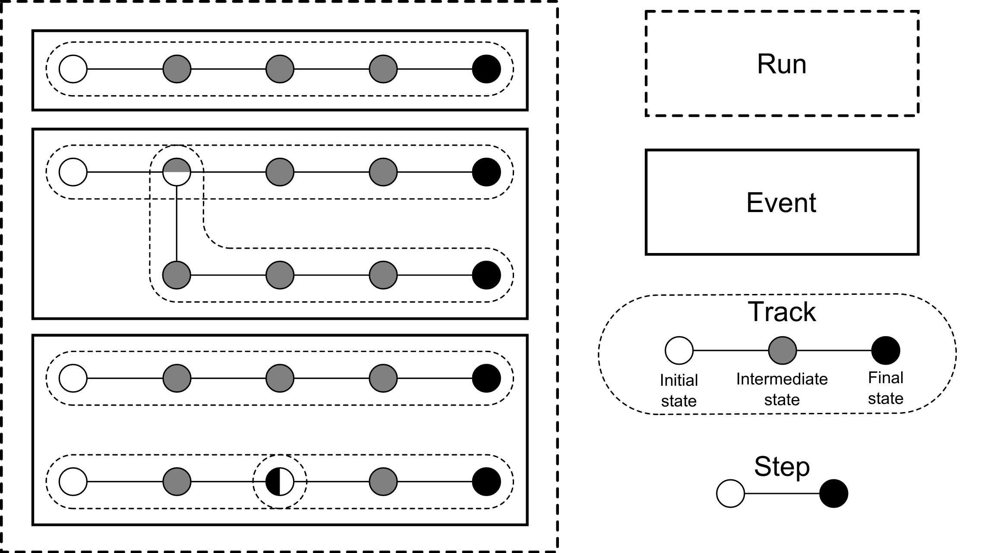
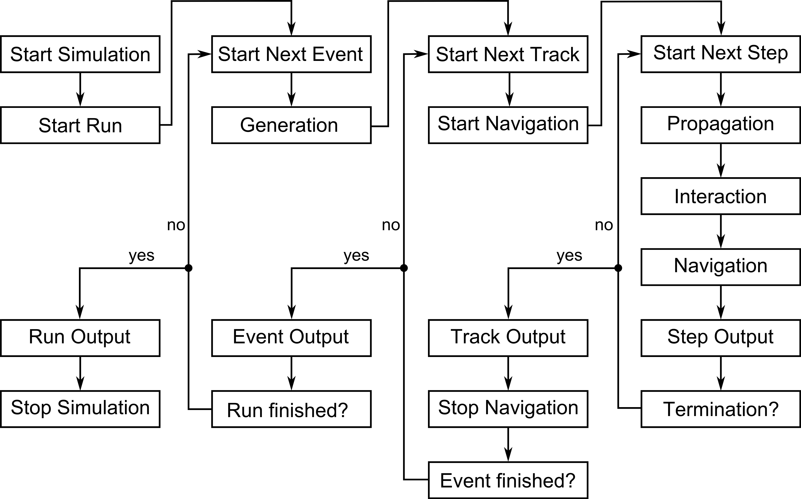

.. _Kassiopeia-element: 

Kassiopeia (particles) - <kassiopeia>
====================

.. contents:: On this page
    :local:
    :depth: 2

The remaining elements for the simulation all live within the *Kassiopeia* element and must be placed with start and end
tags of the form:

.. code-block:: xml

    <kassiopeia>
        <!-- complete description of the kassiopeia simulation element here -->
    </kassiopeia>

The elements which must be described within the *Kassiopeia* namespace include the specification of the particle
generation, termination, propagation, interactions, navigation, output, and simulation. The different parts will be
outlined below.

To understand the basics of *Kassiopeia*, it is important to note that the simulation is organized into four levels:
run, event, track, and step. At the `step` level, the actual calculation of the particle trajectory takes place. When
a new particle is generated, a `track` is initiated that holds all steps belonging to that particle. The track ends
upon termination. The generation of a particle by a user-defined generator is associated with an `event`, which again
holds all corresponding tracks. Because a particle can create secondaries and tracks can be split, one event can hold
more than one track; all belonging to one generation event. Finally, all events from a single simulation are grouped
into a `run`.

The overall relation between these levels is shown below. In this example, the run consists of three events and six
tracks. In the second event, an interaction occurs which leads to a secondary track. In the third event, the track
is split at the third step.

With this in mind, one can understand the workflow of the simulation shown below. Each step in the work flow is
associated with runs, events, tracks, and steps, and with certain modules of the simulation such as generation,
navigation, propagation etc. which will be explained futher below.

Generation
----------

The intial state of particle's to be tracked is set up using the generator mechanism. The abstract base class of all
particle generators is **KSGenerator** and many different implementations exist. When generating a particle,
there are five important initial parameters:

- `PID`: What is the particle type? For particle ID values, see the PDG_ numbering scheme. The PID can also be specified
  by a common name, such as ``e-`` for PID 11 (an electron.)
- `Energy`: What is the initial energy of the particle? The energy is usually specified in Electronvolts (eV).
- `Position`: What is the initial position of the particle?
- `Direction`: In what direction is the particle traveling?
- `Time`: How is the production of particles distributed in time during the simulation?

Each of the dynamic components (energy, position, direction, time) can be draw from a selected probability distribution.
In some scenarios a dedicated particle generator may be need which produces with a very specific and well defined
particle state as the result of some physical process (e.g. electron shake-off in Radon decay). However, as is often the
case, the user may wish to modify each dynamic component in a specific way in order to see what effect this has on the
rest of the simulation.

To draw each dynamic component from an independent distribution a composite generator is used. This type of generator
combines a set of user selected distributions to produce the initial energy, position, direction, and time parameters.
The following composite generator example is taken from the ``DipoleTrapSimulation.xml`` file:

.. code-block:: xml

    <!-- pid=11 implies that electrons will be generated -->
    <ksgen_generator_composite name="generator_uniform" pid="11">
        <energy_composite>
            <energy_fix value="1."/>
        </energy_composite>
        <position_cylindrical_composite surface="world/dipole_trap/center">
            <r_cylindrical radius_min="0." radius_max="2.0e-1"/>
            <phi_uniform value_min="0." value_max="360."/>
            <z_fix value="0."/>
        </position_cylindrical_composite>
        <direction_spherical_composite surface="world/dipole_trap/center">
            <theta_fix value="0."/>
            <phi_uniform value_min="0." value_max="360"/>
        </direction_spherical_composite>
        <time_composite>
            <time_fix value="0."/>
        </time_composite>
    </ksgen_generator_composite>

In this example of the composite generator, the initial kinetic energy of the electron is fixed to 1 eV and its position
is drawn uniformly within a cylindrical volume, defined by the parameters ``(r,phi,z)``.Its initial starting time is
fixed to zero, while its initial momentum direction is fixed along the z-axis by specifiying the corresponding angles
``(phi,theta)`` in a spherical distribution. Here the particle type is specified by the PID 11. The available particles
and their PIDs are defined at the end of the file :gh-code:`Kassiopeia/Operators/Source/KSParticleFactory.cxx`.

Choosing energy values
~~~~~~~~~~~~~~~~~~~~~~

All of the fixed values used in this composite generator may be replaced by probability distributions. The available
probability distributions depend on the quantity they are intended to generate, but include uniform, gaussian, pareto,
cosine, etc. The available distributions can be found in :gh-code:`Kassiopeia/Generators`. Also available is the ability
to generate values at fixed intervals throughout a limited range. For example this can be done for energy as follows:

.. code-block:: xml

        <energy_composite>
            <energy_set name="e_set" value_start="1" value_stop="10" value_count="3"/>
        </energy_composite>

which would generate 3 particles with energies equally spaced between 1 and 10 eV. Alternatively, as specific list of
values can also be used:

.. code-block:: xml

        <energy_composite>
            <energy_list
               add_value="11.8"
               add_value="20.5"
               add_value="33.1"
            />
        </energy_composite>

Keep in mind that if a ``list`` of ``set`` is used within a composite generator, the number of particles
produced in one generation event will be equal to multiplicative combination of all possible particle states.
For example, the following generator specification:

.. code-block:: xml

    <ksgen_generator_composite name="generator_uniform" pid="11">
        <energy_composite>
            <energy_set name="e_set" value_start="1" value_stop="200" value_count="10"/>
        </energy_composite>
        <position_cylindrical_composite surface="world/dipole_trap/center">
            <r_cylindrical radius_min="0." radius_max="2.0e-1"/>
            <phi_uniform value_min="0." value_max="360."/>
            <z_fix value="0."/>
        </position_cylindrical_composite>
        <direction_spherical_composite surface="world/dipole_trap/center">
            <theta_set name="e_set" value_start="0" value_stop="90" values_count="10"/>
            <phi_uniform value_min="0." value_max="360"/>
        </direction_spherical_composite>
        <time_composite>
            <time_fix value="0."/>
        </time_composite>
    </ksgen_generator_composite>

results in a total of 100 particles being generated per event (as a combination of possible energies and momentum
direction theta coordinate). To see other generator examples please see the included example XML files.

The table below lists the available value distributions that can be used with one of the initial parameters. Note
that the XML element name can also be adapted, so instead of ``value_gauss`` for an energy distribution one would use:

.. code-block:: xml

    <energy_composite>
        <energy_gauss mean="18600." sigma="5."/>
    </energy_composite>

Value generator types
~~~~~~~~~~~~~~~~~~~~~

The position and direction generators usually support multiple value distributions; e.g. radius (``r_gauss``),
azimuthal angle (``phi_gauss``) and z-position (``z_gauss``) for the composite cylindrical position generator.

+--------------------------------------------------------------------------------------------------------------------+
| Generator value distributions                                                                                      |
+--------------------+-------------------------------------+---------------------------------------------------------+
| Name               | XML Element                         | Description (main parameters)                           |
+====================+=====================================+=========================================================+
| Fixed              | ``value_fix``                       | Fixed value                                             |
+--------------------+-------------------------------------+---------------------------------------------------------+
| List               | ``value_list``                      | Fixed set of inidivual values                           |
+--------------------+-------------------------------------+---------------------------------------------------------+
| Set                | ``value_set``                       | Fixed set of values in range (start, stop, increment)   |
+--------------------+-------------------------------------+---------------------------------------------------------+
| Uniform            | ``value_uniform``                   | Uniform distribution (min, max)                         |
+--------------------+-------------------------------------+---------------------------------------------------------+
| Boltzmann          | ``value_boltzmann``                 | Boltzmann energy distribution (mass, `kT`)              |
+--------------------+-------------------------------------+---------------------------------------------------------+
| Gauss              | ``value_gauss``                     | Gaussian distribution (mean, sigma, min, max)           |
+--------------------+-------------------------------------+---------------------------------------------------------+
| Generalized Gauss  | ``value_generalized_gauss``         | Skewed Gaussian distrib. (mean, sigma, min, max, skew)  |
+--------------------+-------------------------------------+---------------------------------------------------------+
| Pareto             | ``value_pareto``                    | Pareto distribution (slope, cutoff, offset, min, max)   |
+--------------------+-------------------------------------+---------------------------------------------------------+
| Cylindrical Radius | ``value_radius_cylindrical``        | Cylindrical radial distribution (min, max)              |
+--------------------+-------------------------------------+---------------------------------------------------------+
| Spherical Radius   | ``value_radius_spherical``          | Spherical radial distribution (min, max)                |
+--------------------+-------------------------------------+---------------------------------------------------------+
| Fractional Radius  | ``value_radius_fraction``           | Radial distribution with ``r_max = 1``                  |
+--------------------+-------------------------------------+---------------------------------------------------------+
| Cosine Angle       | ``value_angle_cosine``              | Cosine angular distribution (min, max)                  |
+--------------------+-------------------------------------+---------------------------------------------------------+
| Spherical Angle    | ``value_angle_spherical``           | Spherical angular distribution (min, max)               |
+--------------------+-------------------------------------+---------------------------------------------------------+
| Z-Frustrum         | ``value_z_frustrum``                | Random z-value inside frustrum (z1, r1, z2, r2)         |
+--------------------+-------------------------------------+---------------------------------------------------------+
| Formula            | ``value_formula``                   | ROOT Formula (``TF1``) given as string                  |
+--------------------+-------------------------------------+---------------------------------------------------------+
| Histogram          | ``value_histogram``                 | ROOT Histogram (``TH1``) read from file                 |
+--------------------+-------------------------------------+---------------------------------------------------------+

Special creator types
~~~~~~~~~~~~~~~~~~~~~

In addition, a number of specialized generators exists. For example, the position or energy of the generated particle
can be defined in more a sophisticated way in case a particle is generated from nuclear decays (Tritium, Krypton, Radon)
or starts from a surface.

+--------------------------------------------------------------------------------------------------------------------+
| Energy generators (incomplete list)                                                                                |
+--------------------+-------------------------------------+---------------------------------------------------------+
| Name               | XML Element                         | Description                                             |
+====================+=====================================+=========================================================+
| Beta Decay         | ``energy_beta_decay``               | Energy from (tritium) beta decay                        |
+--------------------+-------------------------------------+---------------------------------------------------------+
| Beta Recoil        | ``energy_beta_recoil``              | Recoil energy from beta decay                           |
+--------------------+-------------------------------------+---------------------------------------------------------+
| Krypton            | ``energy_krypton_event``            | Energy from krypton decay (conversion/Auger)            |
+--------------------+-------------------------------------+---------------------------------------------------------+
| Lead               | ``energy_lead_event``               | Energy from lead decay (conversion/Auger)               |
+--------------------+-------------------------------------+---------------------------------------------------------+
| Radon              | ``energy_radon_event``              | Energy from radon decay (conversion/Auger/ShakeOff)     |
+--------------------+-------------------------------------+---------------------------------------------------------+
| Rydberg            | ``energy_rydberg``                  | Energy from Rydberg ionization                          |
+--------------------+-------------------------------------+---------------------------------------------------------+

+--------------------------------------------------------------------------------------------------------------------+
| Position generators (incomplete list)                                                                              |
+--------------------+-------------------------------------+---------------------------------------------------------+
| Name               | XML Element                         | Description                                             |
+====================+=====================================+=========================================================+
| Cylindrical        | ``position_cylindrical_composite``  | Cylindrical position ``(r, phi, z)``                    |
+--------------------+-------------------------------------+---------------------------------------------------------+
| Rectangular        | ``position_rectangular_composite``  | Rectangular position ``(x, y, z)``                      |
+--------------------+-------------------------------------+---------------------------------------------------------+
| Spherical          | ``position_spherical_composite``    | Spherical position ``(r, phi, theta)``                  |
+--------------------+-------------------------------------+---------------------------------------------------------+
| Flux Tube          | ``position_flux_tube``              | Cylindrical position; radius defined by flux tube       |
+--------------------+-------------------------------------+---------------------------------------------------------+
| Surface            | ``position_surface_random``         | Random position on surface (not all types supported)    |
+--------------------+-------------------------------------+---------------------------------------------------------+
| Mesh Surface       | ``position_mesh_surface_random``    | Random position on surface; needs surface mesh!         |
+--------------------+-------------------------------------+---------------------------------------------------------+
| Space              | ``position_space_random``           | Random position in space (not all types supported)      |
+--------------------+-------------------------------------+---------------------------------------------------------+

Termination
-----------

The converse to particle generation is termination. The abstract base class of all particle terminators is
**KSTerminator**. Terminators are used to stop particle tracks in situations where further simulation of the
particle is of no further interest. Terminators typically operate on very simple conditional logic. For example, a
particle track may be terminated if the particle's kinetic energy drops below some set value, if it intersects a
particular surface, or simply after a given number of steps has been reached.

An example of a terminator which stops particle tracks which exceed the number of allowed steps is given as follows:

.. code-block:: xml

    <ksterm_max_steps name="term_max_steps" steps="1000"/>

A pair of terminators which will terminate a particle that exceeds an allowed range for the z-coordinate is given in the
following example:

.. code-block:: xml

    <ksterm_max_z name="term_max_z" z="1.0"/>
    <ksterm_min_z name="term_min_z" z="-1.0"/>

There are a wide variety of terminators currently avaiable that can be found in :gh-code:`Kassiopeia/Terminators`. The
user is encouraged to peruse the XML example files as well as the source code to determine what (if any) type of
pre-existing terminator might be useful for their purpose. As will be explained later, one may enable/disable specific
terminators dynamically during the simulation. This allows a very flexible configuration of particle termination.

Propagation
-----------

The propagation section is used to describe the physical process which is associated with the movement of a particle,
and also the means by which the equations of motion are solved. The equations of motions are solved numerically with
various control methods for the time step used during integration of a specific particle trajectory. The abstract base
class of all particle trajectories is **KSTrajectory**.

There are essential five different equations of motion (trajectories) available for particle tracking in *Kassiopeia*.
These are, exact, adiabatic, electric, magnetic, and linear. These are implemented in :gh-code:`Kassiopeia/Trajectories`
and some specialized classes exist for spin particles.

Exact trajectory
~~~~~~~~~~~~~~~~

The first trajectory type is the so-called *exact* method, which solves the Lorentz equation for charged particles
exactly without any approximations. It is visualized below:

.. image:: _images/exact_step.png
   :width: 150pt

Adiabatic trajectory
~~~~~~~~~~~~~~~~~~~~

The second method is the adiabatic method, which is useful for solving charged particle motion in the presence of
smoothly varying magnetic fields. In this case, only the motion of the "guiding center" (a point on the magnetic field
line) is computed, which allows certain approximations. One may then reconcstruct the cyclotron motion of the particle
around the field line, however this is entirely optional. This method is visualized below:

.. image:: _images/adiabatic_step.png
  :width: 150pt

Electric and magnetic trajectories
~~~~~~~~~~~~~~~~~~~~~~~~~~~~~~~~~~

The next two types, electric and magnetic (not shown here), are used for tracking the field lines of static electric and
magnetic fields respectively. Finally, the linear trajectory calculates a linear motion that is independent of any
external fields.

The definition of a trajectory for the simulation is usually combined with additional parameters that define the
behavior of the simulation:

- The `integrator` is responsible for solving the differential equation (ODE) in order to perform the tracking.
  Integrators are based off the class **KSMathIntegrator**.
- An `interpolator` allows to speed up the ODE solving, by interpolating the particle's parameters over a single step.
  Typically, the ODE solver performs evaluations of the particle state in between the initial and final position,
  which is time-consuming. Interpolators are based off the class **KSMathIntegrator**.
- Additional `terms` extend the differential equation of the base trajectory. For example in case of the adiabatic
  trajectory, one may add terms for gyration or drift that are otherwise not included in the appoximation. The ODE terms
  are based off the class **KSMathDifferentiator**.
- Additional `controls` can modify the step size. Options exist for a static setting (e.g. a step size of 1 mm)
  or dynamic adjustment (e.g. a step size derived from the local magnetic field.) Step controls are based off the class
  **KSMathControl**. Multiple controls can be combined, in which case the smallest possible step is taken.

Trajectory types
~~~~~~~~~~~~~~~~

The tables below lists the available integrators, interpolators, and terms:

+-----------------------------------------------------------------------------------------------------------------------------------------------------------------------+
| Trajectory integrators                                                                                                                                                |
+--------------------+----------------------------+----------------------+----------------------+----------------------+------------------------------------------------+
| Name               | XML Element                | Solution Order       | Function evaluations | Error estimate       | Description                                    |
+====================+============================+======================+======================+======================+================================================+
| RKF54              | ``integrator_rk54``        | 5                    | 6                    | Yes                  | 5th/4th-order Runge-Kutta                      |
+--------------------+----------------------------+----------------------+----------------------+----------------------+------------------------------------------------+
| RKDP54             | ``integrator_rkdp54``      | 5                    | 7                    | Yes                  | 5th-order Runge-Kutta, 4th-order dense output  |
+--------------------+----------------------------+----------------------+----------------------+----------------------+------------------------------------------------+
| RK65               | ``integrator_rk65``        | 6                    | 8                    | Yes                  | 6th/5th-order Runge-Kutta                      |
+--------------------+----------------------------+----------------------+----------------------+----------------------+------------------------------------------------+
| RKF8               | ``integrator_rk8``         | 8                    | 13                   | No                   | 8th-order Runge-Kutta                          |
+--------------------+----------------------------+----------------------+----------------------+----------------------+------------------------------------------------+
| RK86               | ``integrator_rk86``        | 8                    | 12                   | Yes                  | 8th/6th-order Runge-Kutta                      |
+--------------------+----------------------------+----------------------+----------------------+----------------------+------------------------------------------------+
| RK87               | ``integrator_rk87``        | 8                    | 13                   | Yes                  | 8th/7th-order Runge-Kutta                      |
+--------------------+----------------------------+----------------------+----------------------+----------------------+------------------------------------------------+
| RKDP853            | ``integrator_rkdp853``     | 8                    | 16                   | Yes                  | 8th-order Runge-Kutta,  7th-order dense output |
+--------------------+----------------------------+----------------------+----------------------+----------------------+------------------------------------------------+
| Sym4               | ``integrator_sym4``        | 4                    | 4                    | No                   | 4th-order Symplectic; only for exact tracking  |
+--------------------+----------------------------+----------------------+----------------------+----------------------+------------------------------------------------+

+-----------------------------------------------------------------------------------------------------------+
| Trajectory interpolators                                                                                  |
+--------------------+-------------------------------------+------------------------------------------------+
| Name               | XML Element                         | Description                                    |
+====================+=====================================+================================================+
| Fast               | ``interpolator_fast``               | Fast linear interpolation                      |
+--------------------+-------------------------------------+------------------------------------------------+
| Hermite            | ``interpolator_hermite``            | Hermite polynomial interpolation               |
+--------------------+-------------------------------------+------------------------------------------------+
| Cont. Runge-Kutta  | ``kstraj_interpolator_crk``         | Continuous Runge-Kutta (needs dense output)    |
+--------------------+-------------------------------------+------------------------------------------------+

+--------------------------------------------------------------------------------------------------------------------+
| Trajectory terms                                                                                                   |
+--------------------+-------------------------------------+---------------------------------------------------------+
| Name               | XML Element                         | Description                                             |
+====================+=====================================+=========================================================+
| Propagation        | ``term_propagation``                | Basic particle propagation                              |
+--------------------+-------------------------------------+---------------------------------------------------------+
| Constant Force     | ``term_constant_force_propagation`` | Propagation by constant force                           |
+--------------------+-------------------------------------+---------------------------------------------------------+
| Synchrotron        | ``term_synchrotron``                | Energy loss from synchrotron radiation                  |
+--------------------+-------------------------------------+---------------------------------------------------------+
| Drift              | ``term_drift``                      | Electromagnetic field drifts, adiabatic only            |
+--------------------+-------------------------------------+---------------------------------------------------------+
| Gyration           | ``term_gyration``                   | Gyration around guiding center; adiabatic only          |
+--------------------+-------------------------------------+---------------------------------------------------------+
| Gravity            | ``term_gravity``                    | Gravity pull; exact only                                |
+--------------------+-------------------------------------+---------------------------------------------------------+

+--------------------------------------------------------------------------------------------------------------------+
| Trajectory controls                                                                                                |
+--------------------+-------------------------------------+---------------------------------------------------------+
| Name               | XML Element                         | Description                                             |
+====================+=====================================+=========================================================+
| Length             | ``control_length``                  | Fixed length                                            |
+--------------------+-------------------------------------+---------------------------------------------------------+
| Time               | ``control_time``                    | Fixed time                                              |
+--------------------+-------------------------------------+---------------------------------------------------------+
| B-Field Gradient   | ``control_B_change``                | Length scaled by relative B-field gradient              |
+--------------------+-------------------------------------+---------------------------------------------------------+
| Cyclotron          | ``control_cyclotron``               | Length scaled to length of a full cyclotron turn        |
+--------------------+-------------------------------------+---------------------------------------------------------+
| Energy             | ``control_energy``                  | Length adjusted to limit total energy violation         |
+--------------------+-------------------------------------+---------------------------------------------------------+
| Magnetic Moment    | ``control_magnetic_moment``         | Length adjusted to limit adiabaticity violation         |
+--------------------+-------------------------------------+---------------------------------------------------------+
| Momentum Error     | ``control_momentum_numerical_error``| Length adjusted to limit momentum error                 |
+--------------------+-------------------------------------+---------------------------------------------------------+
| Position Error     | ``control_position_numerical_error``| Length adjusted to limit position error                 |
+--------------------+-------------------------------------+---------------------------------------------------------+
| Spin M-Dot         | ``control_m_dot``                   | Length scaled by $\dot{M}$ (spin tracking only)         |
+--------------------+-------------------------------------+---------------------------------------------------------+
| Spin Precession    | ``control_spin_precession``         | Length scaled by precession freq. (spin tracking only)  |
+--------------------+-------------------------------------+---------------------------------------------------------+

Examples
~~~~~~~~

The exact tracking method can be used where accuracy is of the utmost importance, but requires a large number of steps
in order propagate a particle for a long time or distance. An example of its use is given below:

.. code-block:: xml

    <kstraj_trajectory_exact name="trajectory_exact" attempt_limit="8">
        <interpolator_crk name="interpolator_crk"/>
        <integrator_rkdp853 name="integrator_rkdp853"/>
        <term_propagation name="term_propagation"/>
        <control_position_error name="control_position_error" absolute_position_error="1e-12" safety_factor="0.75" solver_order="8"/>
        <control_length name="stepsizelength" length="1e-4" />
        <control_time name="stepsizetime" time="1e-6" />
    </kstraj_trajectory_exact>

In the above example, the integrator type specified ``integrator_rkdp853`` is an 8-th order Runge-Kutta integrator with
a 7-th order dense output interpolant (specified by ``interpolator_crk``). The step size control is accomplished through
the combination of three different methods. Two of them, ``control_length`` and ``control_time``, place a fixed limit on
the step size, while the third ``control_position_error`` dynamically attempts to limit the local numerical error on the
particle's position. In this case no additional terms besides basic propagation are defined, since the exact trajectory
does not make any approximations.

All of the trajectories take an optional parameter ``attempt_limit`` which limits the number of tries an integration
step will be re-attempted if a step size control determines that the step has failed. The default number of maximum
number of attempts is 32. If a trajectory makes no progress after the maximum number of allowed attempts, the track will
be terminated with a ``trajectory_fail`` flag.

An example of the adiabatic trajectory with some additional options is specified in the following:

.. code-block:: xml

    <!--  adiabatic trajectory -->
    <kstraj_trajectory_adiabatic name="trajectory_adiabatic" piecewise_tolerance="1e-6" max_segments="130" use_true_position="true" cyclotron_fraction="{1.0/64.0}" attempt_limit="8">
        <interpolator_crk name="interpolator_crk"/>
        <integrator_rkdp853 name="integrator_rkdp853"/>
        <term_propagation name="term_propagation"/>
        <term_drift name="term_drift"/>
        <term_gyration name="term_gyration"/>
        <control_time name="control_time_adiab" time="1e-6"/>
        <control_position_error name="control_position_error" absolute_position_error="1e-9" safety_factor="0.75" solver_order="8"/>
    </kstraj_trajectory_adiabatic>

In this example, both the motion of the particle's guiding center drift (``term_drift``) and the particle's local
gyration (``term_gyration``) itself are included in the equations of motion. If the second term is not present, the
adiabatic tracjectory only computes the movement of the guiding center. It is important to note that the adiabatic
trajectory cannot be used if there is no magnetic field present. Similar to the example above, the step size is
defined by a combination of two controls.

The last three trajectory types can be specfified as follows:

.. code-block:: xml

    <!--  magnetic trajectory -->
    <kstraj_trajectory_magnetic name="trajectory_magnetic" piecewise_tolerance="1e-12" max_segments="128">
        <interpolator_crk name="interpolator_crk"/>
        <integrator_rkdp54 name="integrator_rkdp54"/>
        <term_propagation name="term_propagation" direction="forward"/>
        <control_time name="control_time" time="1.e-4"/>
        <control_length name="control_length" length="1e-2"/>
    </kstraj_trajectory_magnetic>

    <!--  electric trajectory -->
    <kstraj_trajectory_electric name="trajectory_electric" piecewise_tolerance="1e-12" max_segments="128">
        <interpolator_crk name="interpolator_crk"/>
        <integrator_rkdp54 name="integrator_rkdp54"/>
        <term_propagation name="term_propagation" direction="backward"/>
        <control_time name="control_time" time="1.e-4"/>
        <control_length name="control_length" length="1e-2"/>
    </kstraj_trajectory_electric>

    <kstraj_trajectory_linear name="trajectory_linear" length="1.e-8" />

The electric and magnetic field line trajectories are useful for visualization purposes, and during the design stages of
an experiment or simulation. Note that in the above examples we have used a faster but less accurate Runge-Kutta
integrator ``integrator_rkdp54``. The property ``direction`` in ``term_propagation`` can be used to specify the
direction in which field lines are tracked (positive-to-negative or north-to-south). The linear trajectory takes no
parameters besides a fixed step length,.

In all of the trajectories (exact, adiabatic, electric, magnetic) the parameters ``piecewise_tolerance`` and
``max_segments`` are optional. They dictate how a particles trajectory (in between steps) should be approximated by
piecewise linear segments when determining surface and volume intersections. These parameters are only used when the
``ksnav_meshed_space`` navigator is in use, and determine how accurately intersections are found. The default
``ksnav_space`` navigator ignores these parameters, since it uses a faster but less accurate approximation by linearly
interpolating a particle's intermediate state and position. See below for details on navigation.

The adiabatic trajectory also takes the additional parameters ``use_true_position`` and ``cyclotron_fraction`` when the
``mesh_spaced_navigator`` is in use. The parameter ``use_true_position`` determines whether the particle or its guiding
center position is used for the purpose of finding intersections. If the particle's true position is used, then the
parameter ``cyclotron_fraction`` dictates the number of linear segments the semi-helical path is broken into.

Interactions
------------

In between generation and termination, discrete stochastic interactions involving the particle of interest may be
applied during tracking. These interactions are divided according to whether they are active in a volume, or on a
surface. In both cases, the behavior ties with the *KGeoBag* module that provides the geometric information.

Volume Interactions
~~~~~~~~~~~~~~~~~~~

Volume interactions typically involve scattering off of a gas. The abstract base class of all volume interactions is
**KSSpaceInteraction**. Simple situations where the scattering interactions is treated approximately by a
constant density and cross section can be constructed as follows:

.. code-block:: xml

    <ksint_scattering name="int_scattering" split="true">
        <density_constant temperature="300." pressure="3.e0"/>
        <calculator_constant cross_section="1.e-18"/>
    </ksint_scattering>

In this example the density is computed according to the ideal gas law from the temperature (Kelvin) and pressure
(Pascal) and the cross section is treated as a constant (independent of particle energy). Other forms of interaction
are available in :gh-code:`Kassiopeia/Interactions`. For more complicated interactions (e.g. involving differential or
energy dependent cross sections) the user may need to devise their own interaction class. Volume interactions must
always be associated with a particular volume when describing the simulation structure.

Surface Interactions
~~~~~~~~~~~~~~~~~~~~

Surface interactions are much more limited in their scope and only occur when the track of a particle passes through a
surface. The abstract base class of all surface interactions is **KSSurfaceInteraction**.

For example, to cause a particle to be reflected diffusely (Lambertian) from a surface the user can specify an
interaction of the following type:

.. code-block:: xml

    <ksint_surface_diffuse name="int_surface_diffuse" probability=".3" reflection_loss="0." transmission_loss="1."/>

Similarly, one may use the following code to employ fully specular reflection:

.. code-block:: xml

    <ksint_surface_specular name="int_surface_diffuse" probability="0." reflection_loss="0." transmission_loss="1."/>

In order for this interaction to operate on any particles it must be associated with a surface in the simulation command
structure.

Output
------

The data which is saved as output from the simulation requires two pieces: a file writer and a description of the data
to be saved. The abstract base class of all file writers is **KSWriter**.

Writers
~~~~~~~

The file writer is responsible for buffering and writing the desired information to disk. The default writer is based on
ROOT_, and stores the output in a ``TTree`` structure:

.. code-block:: xml

    <kswrite_root
        name="write_root"
        path="/path/to/desired/output/directory"
        base="my_filename.root"
    />

If *Kassiopeia* is linked against VTK_, an additional writer will be made available which can save track and step
information to a ``.vtp`` (VTK polydata) file. This data is useful for visualalization in external tools such as
Paraview_. This write may be created using the following statement:

.. code-block:: xml

    <kswrite_vtk
        name="write_vtk"
        path="/path/to/desired/output/directory"
        base="my_filename_base.vtp"
    />

Note that in principle both data formats are equivalent, but their underlying structure differs. In most cases it is
best to write output file in both formats, and delete any files that are no longer needed.

To write output in plaintext ASCII format that can be easily viewed and read into other software such as Gnuplot_,
one may use the following statement:

.. code-block:: xml

    <kswrite_ascii
        name="write_ascii"
        path="/path/to/desired/output/directory"
        base="my_filename_base.vtp"
    />

This is not recommended for large-scale simulations because the output file will quickly approach a size that will be
extremely difficult to handle.

Output description
~~~~~~~~~~~~~~~~~~

The user may tailor the data written to disk to keep precisely the quantities of interest and no more. To do this a
description of the data components to be kept at the track and step level must be given. An example of this (taken from
the ``QuadrupoleTrapSimulation.xml`` example) is shown below:

.. code-block:: xml

    <ks_component_member name="component_step_final_particle" field="final_particle" parent="step"/>
    <ks_component_member name="component_step_position" field="position" parent="component_step_final_particle"/>
    <ks_component_member name="component_step_length" field="length" parent="component_step_final_particle"/>

    <ks_component_group name="component_step_world">
        <component_member name="step_id" field="step_id" parent="step"/>
        <component_member name="continuous_time" field="continuous_time" parent="step"/>
        <component_member name="continuous_length" field="continuous_length" parent="step"/>
        <component_member name="time" field="time" parent="component_step_final_particle"/>
        <component_member name="position" field="position" parent="component_step_final_particle"/>
        <component_member name="momentum" field="momentum" parent="component_step_final_particle"/>
        <component_member name="magnetic_field" field="magnetic_field" parent="component_step_final_particle"/>
        <component_member name="electric_field" field="electric_field" parent="component_step_final_particle"/>
        <component_member name="electric_potential" field="electric_potential" parent="component_step_final_particle"/>
        <component_member name="kinetic_energy" field="kinetic_energy_ev" parent="component_step_final_particle"/>
    </ks_component_group>

    <ks_component_group name="component_step_cell">
        <component_member name="polar_angle_to_z" field="polar_angle_to_z" parent="component_step_final_particle"/>
        <component_member name="polar_angle_to_b" field="polar_angle_to_b" parent="component_step_final_particle"/>
        <component_member name="guiding_center_position" field="guiding_center_position" parent="component_step_final_particle"/>
        <component_member name="orbital_magnetic_moment" field="orbital_magnetic_moment" parent="component_step_final_particle"/>
    </ks_component_group>

    <ks_component_member name="component_track_initial_particle" field="initial_particle" parent="track"/>
    <ks_component_member name="component_track_final_particle" field="final_particle" parent="track"/>
    <ks_component_member name="component_track_position" field="position" parent="component_track_final_particle"/>
    <ks_component_member name="component_track_length" field="length" parent="component_track_final_particle"/>

    <ks_component_member name="z_length" field="continuous_length" parent="step"/>
    <ks_component_group name="component_track_world">
        <component_member name="creator_name" field="creator_name" parent="track"/>
        <component_member name="terminator_name" field="terminator_name" parent="track"/>
        <component_member name="total_steps" field="total_steps" parent="track"/>
        <component_member name="initial_time" field="time" parent="component_track_initial_particle"/>
        <component_member name="initial_position" field="position" parent="component_track_initial_particle"/>
        <component_member name="initial_momentum" field="momentum" parent="component_track_initial_particle"/>
        <component_member name="initial_magnetic_field" field="magnetic_field" parent="component_track_initial_particle"/>
        <component_member name="initial_electric_field" field="electric_field" parent="component_track_initial_particle"/>
        <component_member name="initial_electric_potential" field="electric_potential" parent="component_track_initial_particle"/>
        <component_member name="initial_kinetic_energy" field="kinetic_energy_ev" parent="component_track_initial_particle"/>
        <component_member name="initial_polar_angle_to_z" field="polar_angle_to_z" parent="component_track_initial_particle"/>
        <component_member name="initial_azimuthal_angle_to_x" field="azimuthal_angle_to_x" parent="component_track_initial_particle"/>
        <component_member name="initial_polar_angle_to_b" field="polar_angle_to_b" parent="component_track_initial_particle"/>
        <component_member name="initial_orbital_magnetic_moment" field="orbital_magnetic_moment" parent="component_track_initial_particle"/>
        <component_member name="final_time" field="time" parent="component_track_final_particle"/>
        <component_member name="final_position" field="position" parent="component_track_final_particle"/>
        <component_member name="final_momentum" field="momentum" parent="component_track_final_particle"/>
        <component_member name="final_magnetic_field" field="magnetic_field" parent="component_track_final_particle"/>
        <component_member name="final_electric_field" field="electric_field" parent="component_track_final_particle"/>
        <component_member name="final_electric_potential" field="electric_potential" parent="component_track_final_particle"/>
        <component_member name="final_kinetic_energy" field="kinetic_energy_ev" parent="component_track_final_particle"/>
        <component_member name="final_polar_angle_to_z" field="polar_angle_to_z" parent="component_track_final_particle"/>
        <component_member name="final_azimuthal_angle_to_x" field="azimuthal_angle_to_x" parent="component_track_final_particle"/>
        <component_member name="final_polar_angle_to_b" field="polar_angle_to_b" parent="component_track_final_particle"/>
        <component_member name="final_orbital_magnetic_moment" field="orbital_magnetic_moment" parent="component_track_final_particle"/>
        <component_member name="z_length_internal" field="continuous_length" parent="track"/>
        <component_integral name="z_length_integral" parent="z_length"/>
    </ks_component_group>

Let us break this down a bit. First of all, the output can be separated into three groups that each define an output
segment that will be written to the file:

- `component_step_world` is the base definition for output at the step level. It contains standard parameters of the
  particle such as its energy, position, or step index.
- `component_step_cell` defines additional output fields that are of interest in a specific region of the simulation.
  How this feature can be used will be explained below. Generally, one can define as many output groups as necessary
  to write output only where it is relevant to the simulation.
- `component_track_world` is the base definition for output at the track level. While the step output is written
  continuously while the particle trajectory is being computed, the track output is only written once after a track
  has been terminated. As such, the track output contains initial and final parameters of the particle (again, for
  example, its energy or position) and are derived from the first and last step of the track. There is also an output
  field ``z_length_integral`` that stores the integrated length of all tracks performed in the simulation.

For output fields that are not directly available at the step (``parent="step"``) or track level, a mapping has to be
defined first. This is done by the lines:

.. code-block:: xml

    <ks_component_member name="component_step_final_particle" field="final_particle" parent="step"/>

and so on. The ``field="final_particle"`` points to the final particle state after a step has been performed, i.e. this
output is written after the completion of each step. Similary, at the track level there are output fields that point
to the initial and final parameters of a track, i.e. the state at particle generation and termination.

The standard output fields for the particle are defined at the end of the file
:gh-code:`Kassiopeia/Operators/Source/KSParticle.cxx` while the step and track output fields can be found in
:gh-code:`Kassiopeia/Operators/Source/KSStep.cxx` and :gh-code:`Kassiopeia/Operators/Source/KSTrack.cxx`, respectively.
Other specialized output fields are also available for some propagation or interaction terms.

Output fields
~~~~~~~~~~~~~

Many different output fields can be used and combined in the output configuration. The table below gives an
overview of the different fields and their types.

+---------------------------------------------------------------------------------------------------------------------------------------------------------------------+
| Output fields                                                                                                                                                       |
+--------------------+-------------------------------------+------------------+----------------------------+----------------------------------------------------------+
| Name               | XML Element                         | Value Type       | Base class                 |  Description (main parameters)                           |
+====================+=====================================+==================+============================+==========================================================+
| Index Number       | ``index_number``                    | ``long``         | ``KSParticle``             | Unique index number of the current step                  |
+--------------------+-------------------------------------+------------------+----------------------------+----------------------------------------------------------+
| Parent Run ID      | ``parent_run_id``                   | ``int``          | ``KSParticle``             | Run ID of the parent step/track/event                    |
+--------------------+-------------------------------------+------------------+----------------------------+----------------------------------------------------------+
| Parent Event ID    | ``parent_event_id``                 | ``int``          | ``KSParticle``             | Event ID of the parent step/track/event                  |
+--------------------+-------------------------------------+------------------+----------------------------+----------------------------------------------------------+
| Parent Track ID    | ``parent_track_id``                 | ``int``          | ``KSParticle``             | Track ID of the parent step/track                        |
+--------------------+-------------------------------------+------------------+----------------------------+----------------------------------------------------------+
| Parent Step ID     | ``parent_step_id``                  | ``int``          | ``KSParticle``             | Step ID of the parent step                               |
+--------------------+-------------------------------------+------------------+----------------------------+----------------------------------------------------------+
| Particle ID        | ``pid``                             | ``long long``    | ``KSParticle``             | Assigned particle ID (PDG code)                          |
+--------------------+-------------------------------------+------------------+----------------------------+----------------------------------------------------------+
| Particle String ID | ``string_id``                       | ``string``       | ``KSParticle``             | Assigned particle ID (human-readable)                    |
+--------------------+-------------------------------------+------------------+----------------------------+----------------------------------------------------------+
| Particle Mass      | ``mass``                            | ``double``       | ``KSParticle``             | Mass of the particle (in kg)                             |
+--------------------+-------------------------------------+------------------+----------------------------+----------------------------------------------------------+
| Particle Charge    | ``charge``                          | ``double``       | ``KSParticle``             | Charge of the particle (in C)                            |
+--------------------+-------------------------------------+------------------+----------------------------+----------------------------------------------------------+
| Particle Spin      | ``total_spin``                      | ``double``       | ``KSParticle``             | Spin magnitude of the particle (in hbar)                 |
+--------------------+-------------------------------------+------------------+----------------------------+----------------------------------------------------------+
| Gyromagnetic Ratio | ``gyromagnetic_ratio``              | ``double``       | ``KSParticle``             | Gyromagnetic ratio of the particle (in rad/sT)           |
+--------------------+-------------------------------------+------------------+----------------------------+----------------------------------------------------------+
| Main Quantum No.   | ``n``                               | ``int``          | ``KSParticle``             | Main quantum number                                      |
+--------------------+-------------------------------------+------------------+----------------------------+----------------------------------------------------------+
| Second Quatum No.  | ``l``                               | ``int``          | ``KSParticle``             | Secondary quantum number                                 |
+--------------------+-------------------------------------+------------------+----------------------------+----------------------------------------------------------+
| Time               | ``time``                            | ``double``       | ``KSParticle``             | Time in the simulation (in s)                            |
+--------------------+-------------------------------------+------------------+----------------------------+----------------------------------------------------------+
| Wallclock Time     | ``clock_time``                      | ``double``       | ``KSParticle``             | Wallclock time (system time) at the current step         |
+--------------------+-------------------------------------+------------------+----------------------------+----------------------------------------------------------+
| Step Length        | ``length``                          | ``double``       | ``KSParticle``             | Length of the current step (in m)                        |
+--------------------+-------------------------------------+------------------+----------------------------+----------------------------------------------------------+
| Position Vector    | ``position``                        | ``KThreeVector`` | ``KSParticle``             | Position at the current step (in m)                      |
+--------------------+-------------------------------------+------------------+----------------------------+----------------------------------------------------------+
| Momentum Vector    | ``momentum``                        | ``KThreeVector`` | ``KSParticle``             | Momentum at the current step (in kg*m/s)                 |
+--------------------+-------------------------------------+------------------+----------------------------+----------------------------------------------------------+
| Velocity Vector    | ``velocity``                        | ``double``       | ``KSParticle``             | Velocity at the current step (in m/s)                    |
+--------------------+-------------------------------------+------------------+----------------------------+----------------------------------------------------------+
| Spin Vector        | ``spin``                            | ``KThreeVector`` | ``KSParticle``             | Spin at the current step (in hbar)                       |
+--------------------+-------------------------------------+------------------+----------------------------+----------------------------------------------------------+
| Index Number       | ``spin0``                           | ``double``       | ``KSParticle``             |                                                          |
+--------------------+-------------------------------------+------------------+----------------------------+----------------------------------------------------------+
| Aligned Spin       | ``aligned_spin``                    | ``double``       | ``KSParticle``             |                                                          |
+--------------------+-------------------------------------+------------------+----------------------------+----------------------------------------------------------+
| Spin Angle         | ``spin_angle``                      | ``double``       | ``KSParticle``             |                                                          |
+--------------------+-------------------------------------+------------------+----------------------------+----------------------------------------------------------+
| Speed              | ``speed``                           | ``double``       | ``KSParticle``             | Total speed at the current step (in m/s)                 |
+--------------------+-------------------------------------+------------------+----------------------------+----------------------------------------------------------+
| Lorentz Factor     | ``lorentz_factor``                  | ``double``       | ``KSParticle``             | Lorentz factor at the current step                       |
+--------------------+-------------------------------------+------------------+----------------------------+----------------------------------------------------------+
| Kinetic Energy     | ``kinetic_energy``                  | ``double``       | ``KSParticle``             | Kinetic energy at the current step (in J)                |
+--------------------+-------------------------------------+------------------+----------------------------+----------------------------------------------------------+
| Kinetic Energy     | ``kinetic_energy_ev``               | ``double``       | ``KSParticle``             | Kinetic energy at the current step (in eV)               |
+--------------------+-------------------------------------+------------------+----------------------------+----------------------------------------------------------+
| Polar Angle        | ``polar_angle_to_z``                | ``double``       | ``KSParticle``             | Polar angle relative to z-axis (in deg)                  |
+--------------------+-------------------------------------+------------------+----------------------------+----------------------------------------------------------+
| Azimuthal Angle    | ``azimuthal_angle_to_x``            | ``double``       | ``KSParticle``             | Azimuthal angle relative to x-axis (in deg)              |
+--------------------+-------------------------------------+------------------+----------------------------+----------------------------------------------------------+
| Magnetic Field     | ``magnetic_field``                  | ``KThreeVector`` | ``KSParticle``             | Magnetic field at the current step (in T)                |
+--------------------+-------------------------------------+------------------+----------------------------+----------------------------------------------------------+
| Electric Field     | ``electric_field``                  | ``KThreeVector`` | ``KSParticle``             | Electric field at the current step (in V/m)              |
+--------------------+-------------------------------------+------------------+----------------------------+----------------------------------------------------------+
| Magnetic Gradient  | ``magnetic_gradient``               | ``KThreeMatrix`` | ``KSParticle``             | Magnetic gradient at the current step (in T/m)           |
+--------------------+-------------------------------------+------------------+----------------------------+----------------------------------------------------------+
| Electric Potential | ``electric_potential``              | ``double``       | ``KSParticle``             | Electric potential at the current step (in V)            |
+--------------------+-------------------------------------+------------------+----------------------------+----------------------------------------------------------+
| Long. Momentum     | ``long_momentum``                   | ``double``       | ``KSParticle``             | Longitudinal momentum at the current step (in kg*m/s)    |
+--------------------+-------------------------------------+------------------+----------------------------+----------------------------------------------------------+
| Trans. Momentum    | ``trans_momentum``                  | ``double``       | ``KSParticle``             | Transversal momentum at the current step (in kg*m/s)     |
+--------------------+-------------------------------------+------------------+----------------------------+----------------------------------------------------------+
| Long. Velocity     | ``long_velocity``                   | ``double``       | ``KSParticle``             | Longitudinal velocity at the current step (in m/s)       |
+--------------------+-------------------------------------+------------------+----------------------------+----------------------------------------------------------+
| Trans. Velocity    | ``trans_velocity``                  | ``double``       | ``KSParticle``             | Transversal velocity at the current step (in m/s)        |
+--------------------+-------------------------------------+------------------+----------------------------+----------------------------------------------------------+
| Polar Angle to B   | ``polar_angle_to_b``                | ``double``       | ``KSParticle``             | Polar (pitch) angle relative to magnetic field (in deg)  |
+--------------------+-------------------------------------+------------------+----------------------------+----------------------------------------------------------+
| Cyclotron Freq.    | ``cyclotron_frequency``             | ``double``       | ``KSParticle``             | Cyclotron frequency at the current step (in Hz)          |
+--------------------+-------------------------------------+------------------+----------------------------+----------------------------------------------------------+
| Magnetic Moment    | ``orbital_magnetic_moment``         | ``double``       | ``KSParticle``             | Orbital magnetic moment at the current step (in A*m^2)   |
+--------------------+-------------------------------------+------------------+----------------------------+----------------------------------------------------------+
| GC Position Vector | ``guiding_center_position``         | ``KThreeVector`` | ``KSParticle``             | Guiding center position at the current step (in m)       |
+--------------------+-------------------------------------+------------------+----------------------------+----------------------------------------------------------+
| Current Space      | ``current_space_name``              | ``string``       | ``KSParticle``             | Name of the nearest space (see ``geo_space``)            |
+--------------------+-------------------------------------+------------------+----------------------------+----------------------------------------------------------+
| Current Surface    | ``current_surface_name``            | ``string``       | ``KSParticle``             | Name of the nearest surface (see ``geo_surface``)        |
+--------------------+-------------------------------------+------------------+----------------------------+----------------------------------------------------------+
| Current Side       | ``current_side_name``               | ``string``       | ``KSParticle``             | Name of the nearest side (see ``geo_side``)              |
+--------------------+-------------------------------------+------------------+----------------------------+----------------------------------------------------------+
| GC Velocity        | ``gc_velocity``                     | ``double``       | ``KSTrajTermDrift``        | Guiding center velocity (in m/s)                         |
+--------------------+-------------------------------------+------------------+----------------------------+----------------------------------------------------------+
| GC Long. Force     | ``longitudinal_force``              | ``double``       | ``KSTrajTermDrift``        | Longitudinal force added by drift terms (in N)           |
+--------------------+-------------------------------------+------------------+----------------------------+----------------------------------------------------------+
| GC Trans. Force    | ``transverse_force``                | ``double``       | ``KSTrajTermDrift``        | Transversal force added by drift terms (in N)            |
+--------------------+-------------------------------------+------------------+----------------------------+----------------------------------------------------------+
| Gy. Phase Velocity | ``phase_velocity``                  | ``double``       | ``KSTrajTermGyration``     | Phase velocity of gyration around g.c. (in rad/s)        |
+--------------------+-------------------------------------+------------------+----------------------------+----------------------------------------------------------+
| Synchrotron Force  | ``total_force``                     | ``double``       | ``KSTrajTermSynchrotron``  | Total force added by synchrotron radiation (in N)        |
+--------------------+-------------------------------------+------------------+----------------------------+----------------------------------------------------------+
| Min. Distance      | ``min_distance``                    | ``double``       | ``KSTermMinDistance``      | Distance to the nearest surface (in m)                   |
+--------------------+-------------------------------------+------------------+----------------------------+----------------------------------------------------------+
| Interaction Count  | ``step_number_of_interactions``     | ``int``          | ``KSIntCalculator``        | Number of interactions  at current step                  |
+--------------------+-------------------------------------+------------------+----------------------------+----------------------------------------------------------+
| Energy loss        | ``step_energy_loss``                | ``double``       | ``KSIntCalculator``        | Energy loss at current step (in eV)                      |
+--------------------+-------------------------------------+------------------+----------------------------+----------------------------------------------------------+
| Angular Change     | ``step_angular_change``             | ``double``       | ``KSIntCalculator``        | Angular change at current step (in deg)                  |
+--------------------+-------------------------------------+------------------+----------------------------+----------------------------------------------------------+
| Interaction Count  | ``step_number_of_decays``           | ``int``          | ``KSIntDecayCalculator``   | Number of interactions  at current step                  |
+--------------------+-------------------------------------+------------------+----------------------------+----------------------------------------------------------+
| Energy loss        | ``step_energy_loss``                | ``double``       | ``KSIntDecayCalculator``   | Energy loss at current step (in eV)                      |
+--------------------+-------------------------------------+------------------+----------------------------+----------------------------------------------------------+
| Enhancement Factor | ``enhancement_factor``              | ``double``       | ``KSModDynamicEnhancement``| Step modifier enhancement factor                         |
+--------------------+-------------------------------------+------------------+----------------------------+----------------------------------------------------------+
| Run ID             | ``run_id``                          | ``int``          | ``KSRun``                  | Run ID of current run                                    |
+--------------------+-------------------------------------+------------------+----------------------------+----------------------------------------------------------+
| Run Count          | ``run_count``                       | ``int``          | ``KSRun``                  | Total number of runs                                     |
+--------------------+-------------------------------------+------------------+----------------------------+----------------------------------------------------------+
| Total Events       | ``total_events``                    | ``unsigned int`` | ``KSRun``                  | Total number of events in run                            |
+--------------------+-------------------------------------+------------------+----------------------------+----------------------------------------------------------+
| Total Tracks       | ``total_tracks``                    | ``unsigned int`` | ``KSRun``                  | Total number of tracks in run                            |
+--------------------+-------------------------------------+------------------+----------------------------+----------------------------------------------------------+
| Total Steps        | ``total_steps``                     | ``unsigned int`` | ``KSRun``                  | Total number of steps in run                             |
+--------------------+-------------------------------------+------------------+----------------------------+----------------------------------------------------------+
| Cont. Time         | ``continuous_time``                 | ``double``       | ``KSRun``                  | Total time of all events/tracks/steps in run             |
+--------------------+-------------------------------------+------------------+----------------------------+----------------------------------------------------------+
| Cont. Length       | ``continuous_length``               | ``double``       | ``KSRun``                  | Total length of all events/tracks/steps in run           |
+--------------------+-------------------------------------+------------------+----------------------------+----------------------------------------------------------+
| Energy Change      | ``continuous_energy_change``        | ``double``       | ``KSRun``                  | Total energy change during run                           |
+--------------------+-------------------------------------+------------------+----------------------------+----------------------------------------------------------+
| Momentum Change    | ``continuous_momentum_change``      | ``double``       | ``KSRun``                  | Total momentum change during run                         |
+--------------------+-------------------------------------+------------------+----------------------------+----------------------------------------------------------+
| Secondaries Count  | ``discrete_secondaries``            | ``unsigned int`` | ``KSRun``                  | Number of secondaries created during run                 |
+--------------------+-------------------------------------+------------------+----------------------------+----------------------------------------------------------+
| Energy Change      | ``discrete_energy_change``          | ``double``       | ``KSRun``                  | Total energy change during run                           |
+--------------------+-------------------------------------+------------------+----------------------------+----------------------------------------------------------+
| Momentum Change    | ``discrete_momentum_change``        | ``double``       | ``KSRun``                  | Total momentum change during run                         |
+--------------------+-------------------------------------+------------------+----------------------------+----------------------------------------------------------+
| Number of Turns    | ``number_of_turns``                 | ``unsigned int`` | ``KSRun``                  | Number of particle turns/reflections during run          |
+--------------------+-------------------------------------+------------------+----------------------------+----------------------------------------------------------+
| Event ID           | ``event_id``                        | ``int``          | ``KSEvent``                | Event ID of current event                                |
+--------------------+-------------------------------------+------------------+----------------------------+----------------------------------------------------------+
| Event Count        | ``event_count``                     | ``int``          | ``KSEvent``                | Total number of events                                   |
+--------------------+-------------------------------------+------------------+----------------------------+----------------------------------------------------------+
| Parent Run ID      | ``parent_run_id``                   | ``int``          | ``KSEvent``                | Run ID of parent run                                     |
+--------------------+-------------------------------------+------------------+----------------------------+----------------------------------------------------------+
| Total Tracks       | ``total_tracks``                    | ``unsigned int`` | ``KSEvent``                | Total number of tracks in event                          |
+--------------------+-------------------------------------+------------------+----------------------------+----------------------------------------------------------+
| Total Steps        | ``total_steps``                     | ``unsigned int`` | ``KSEvent``                | Total number of steps in event                           |
+--------------------+-------------------------------------+------------------+----------------------------+----------------------------------------------------------+
| Cont. Time         | ``continuous_time``                 | ``double``       | ``KSEvent``                | Total time of all tracks/steps in event                  |
+--------------------+-------------------------------------+------------------+----------------------------+----------------------------------------------------------+
| Cont. Length       | ``continuous_length``               | ``double``       | ``KSEvent``                | Total length of all tracks/steps in event                |
+--------------------+-------------------------------------+------------------+----------------------------+----------------------------------------------------------+
| Energy Change      | ``continuous_energy_change``        | ``double``       | ``KSEvent``                | Total energy change during event                         |
+--------------------+-------------------------------------+------------------+----------------------------+----------------------------------------------------------+
| Momentum Change    | ``continuous_momentum_change``      | ``double``       | ``KSEvent``                | Total momentum change during event                       |
+--------------------+-------------------------------------+------------------+----------------------------+----------------------------------------------------------+
| Secondaries Count  | ``discrete_secondaries``            | ``unsigned int`` | ``KSEvent``                | Number of secondaries created during event               |
+--------------------+-------------------------------------+------------------+----------------------------+----------------------------------------------------------+
| Energy Change      | ``discrete_energy_change``          | ``double``       | ``KSEvent``                | Total energy change during event                         |
+--------------------+-------------------------------------+------------------+----------------------------+----------------------------------------------------------+
| Momentum Change    | ``discrete_momentum_change``        | ``double``       | ``KSEvent``                | Total momentum change during event                       |
+--------------------+-------------------------------------+------------------+----------------------------+----------------------------------------------------------+
| Number of Turns    | ``number_of_turns``                 | ``unsigned int`` | ``KSEvent``                | Number of particle turns/reflections during event        |
+--------------------+-------------------------------------+------------------+----------------------------+----------------------------------------------------------+
| Generator Name     | ``generator_name``                  | ``string``       | ``KSEvent``                | Name of the generator starting this event                |
+--------------------+-------------------------------------+------------------+----------------------------+----------------------------------------------------------+
| Generator Flag     | ``generator_flag``                  | ``bool``         | ``KSEvent``                | Additional flag of the used generator                    |
+--------------------+-------------------------------------+------------------+----------------------------+----------------------------------------------------------+
| Primary Count      | ``generator_primaries``             | ``unsigned int`` | ``KSEvent``                | Number of generated particles                            |
+--------------------+-------------------------------------+------------------+----------------------------+----------------------------------------------------------+
| Generator Energy   | ``generator_energy``                | ``double``       | ``KSEvent``                | Total energy of the generated particles (in eV)          |
+--------------------+-------------------------------------+------------------+----------------------------+----------------------------------------------------------+
| Generator Time     | ``generator_min_time``              | ``double``       | ``KSEvent``                | Minimum time of the generated particles (in s)           |
+--------------------+-------------------------------------+------------------+----------------------------+----------------------------------------------------------+
| Generator Time     | ``generator_max_time``              | ``double``       | ``KSEvent``                | Maximum time of the generated particles (in s)           |
+--------------------+-------------------------------------+------------------+----------------------------+----------------------------------------------------------+
| Generator Position | ``generator_location``              | ``KThreeVector`` | ``KSEvent``                | Center position of the generated particles (in m)        |
+--------------------+-------------------------------------+------------------+----------------------------+----------------------------------------------------------+
| Generator Radius   | ``generator_radius``                | ``double``       | ``KSEvent``                | Maximum radius of the generated particles (in m)         |
+--------------------+-------------------------------------+------------------+----------------------------+----------------------------------------------------------+
| Track ID           | ``event_id``                        | ``int``          | ``KSTrack``                | Track ID of current track                                |
+--------------------+-------------------------------------+------------------+----------------------------+----------------------------------------------------------+
| Track Count        | ``event_count``                     | ``int``          | ``KSTrack``                | Total number of tracks                                   |
+--------------------+-------------------------------------+------------------+----------------------------+----------------------------------------------------------+
| Parent Event ID    | ``parent_event_id``                 | ``int``          | ``KSTrack``                | Event ID of parent track                                 |
+--------------------+-------------------------------------+------------------+----------------------------+----------------------------------------------------------+
| Total Steps        | ``total_steps``                     | ``unsigned int`` | ``KSTrack``                | Total number of steps in track                           |
+--------------------+-------------------------------------+------------------+----------------------------+----------------------------------------------------------+
| Cont. Time         | ``continuous_time``                 | ``double``       | ``KSTrack``                | Total time of all steps in track                         |
+--------------------+-------------------------------------+------------------+----------------------------+----------------------------------------------------------+
| Cont. Length       | ``continuous_length``               | ``double``       | ``KSTrack``                | Total length of all steps in track                       |
+--------------------+-------------------------------------+------------------+----------------------------+----------------------------------------------------------+
| Energy Change      | ``continuous_energy_change``        | ``double``       | ``KSTrack``                | Total energy change during track                         |
+--------------------+-------------------------------------+------------------+----------------------------+----------------------------------------------------------+
| Momentum Change    | ``continuous_momentum_change``      | ``double``       | ``KSTrack``                | Total momentum change during track                       |
+--------------------+-------------------------------------+------------------+----------------------------+----------------------------------------------------------+
| Secondaries Count  | ``discrete_secondaries``            | ``unsigned int`` | ``KSTrack``                | Number of secondaries created during track               |
+--------------------+-------------------------------------+------------------+----------------------------+----------------------------------------------------------+
| Energy Change      | ``discrete_energy_change``          | ``double``       | ``KSTrack``                | Total energy change during track                         |
+--------------------+-------------------------------------+------------------+----------------------------+----------------------------------------------------------+
| Momentum Change    | ``discrete_momentum_change``        | ``double``       | ``KSTrack``                | Total momentum change during track                       |
+--------------------+-------------------------------------+------------------+----------------------------+----------------------------------------------------------+
| Number of Turns    | ``number_of_turns``                 | ``unsigned int`` | ``KSTrack``                | Number of particle turns/reflections during track        |
+--------------------+-------------------------------------+------------------+----------------------------+----------------------------------------------------------+
| Creator Name       | ``creator_name``                    | ``string``       | ``KSTrack``                | Name of the creator starting this track                  |
+--------------------+-------------------------------------+------------------+----------------------------+----------------------------------------------------------+
| Terminator Name    | ``terminator_name``                 | ``string``       | ``KSTrack``                | Name of the terminator ending this track                 |
+--------------------+-------------------------------------+------------------+----------------------------+----------------------------------------------------------+
| Initial Particle   | ``initial_particle``                | ``KSParticle``   | ``KSTrack``                | Pointer to initial particle at begin of the track        |
+--------------------+-------------------------------------+------------------+----------------------------+----------------------------------------------------------+
| Final particle     | ``final_particle``                  | ``KSParticle``   | ``KSTrack``                | Pointer to final particle at end of the track            |
+--------------------+-------------------------------------+------------------+----------------------------+----------------------------------------------------------+
| Step ID            | ``step_id``                         | ``int``          | ``KSStep``                 | Step ID of current step                                  |
+--------------------+-------------------------------------+------------------+----------------------------+----------------------------------------------------------+
| Step Count         | ``step_count``                      | ``int``          | ``KSStep``                 | Total number of steps                                    |
+--------------------+-------------------------------------+------------------+----------------------------+----------------------------------------------------------+
| Parent Track ID    | ``parent_track_id``                 | ``int``          | ``KSStep``                 | Track ID of parent track                                 |
+--------------------+-------------------------------------+------------------+----------------------------+----------------------------------------------------------+
| Cont. Time         | ``continuous_time``                 | ``double``       | ``KSStep``                 | Total time of current step                               |
+--------------------+-------------------------------------+------------------+----------------------------+----------------------------------------------------------+
| Cont. Length       | ``continuous_length``               | ``double``       | ``KSStep``                 | Total length of current step                             |
+--------------------+-------------------------------------+------------------+----------------------------+----------------------------------------------------------+
| Energy Change      | ``continuous_energy_change``        | ``double``       | ``KSStep``                 | Total energy change during step                          |
+--------------------+-------------------------------------+------------------+----------------------------+----------------------------------------------------------+
| Momentum Change    | ``continuous_momentum_change``      | ``double``       | ``KSStep``                 | Total momentum change during step                        |
+--------------------+-------------------------------------+------------------+----------------------------+----------------------------------------------------------+
| Secondaries Count  | ``discrete_secondaries``            | ``unsigned int`` | ``KSStep``                 | Number of secondaries created during step                |
+--------------------+-------------------------------------+------------------+----------------------------+----------------------------------------------------------+
| Energy Change      | ``discrete_energy_change``          | ``double``       | ``KSStep``                 | Total energy change during step                          |
+--------------------+-------------------------------------+------------------+----------------------------+----------------------------------------------------------+
| Momentum Change    | ``discrete_momentum_change``        | ``double``       | ``KSStep``                 | Total momentum change during step                        |
+--------------------+-------------------------------------+------------------+----------------------------+----------------------------------------------------------+
| Number of Turns    | ``number_of_turns``                 | ``unsigned int`` | ``KSStep``                 | Number of particle turns/reflections during step         |
+--------------------+-------------------------------------+------------------+----------------------------+----------------------------------------------------------+
| Modifier Name      | ``modifier_name``                   | ``string``       | ``KSStep``                 | Name of the step modifier at this step                   |
+--------------------+-------------------------------------+------------------+----------------------------+----------------------------------------------------------+
| Modifier Flag      | ``modifier_flag``                   | ``bool``         | ``KSStep``                 | Additional flag for the used terminator                  |
+--------------------+-------------------------------------+------------------+----------------------------+----------------------------------------------------------+
| Terminator Name    | ``terminator_name``                 | ``string``       | ``KSStep``                 | Name of the terminator ending this step                  |
+--------------------+-------------------------------------+------------------+----------------------------+----------------------------------------------------------+
| Terminator Flag    | ``terminator_flag``                 | ``bool``         | ``KSStep``                 | Additional flag for the used terminator                  |
+--------------------+-------------------------------------+------------------+----------------------------+----------------------------------------------------------+
| Trajectory Name    | ``trajectory_name``                 | ``string``       | ``KSStep``                 | Name of the trajectory at this step                      |
+--------------------+-------------------------------------+------------------+----------------------------+----------------------------------------------------------+
| Trajectory Center  | ``trajectory_center``               | ``KThreeVector`` | ``KSStep``                 | Position of the trajectory bounding sphere (in m)        |
+--------------------+-------------------------------------+------------------+----------------------------+----------------------------------------------------------+
| Trajectory Radius  | ``trajectory_radius``               | ``double``       | ``KSStep``                 | Radius of the trajectory bounding sphere (in m)          |
+--------------------+-------------------------------------+------------------+----------------------------+----------------------------------------------------------+
| Trajectory Step    | ``trajectory_step``                 | ``double``       | ``KSStep``                 | Time of the particle propagation                         |
+--------------------+-------------------------------------+------------------+----------------------------+----------------------------------------------------------+
| Interaction Name   | ``space_interaction_name``          | ``string``       | ``KSStep``                 | Space name of the interaction at this step               |
+--------------------+-------------------------------------+------------------+----------------------------+----------------------------------------------------------+
| Interaction Flag   | ``space_interaction_flag``          | ``bool``         | ``KSStep``                 | Additional flag for the space interaction                |
+--------------------+-------------------------------------+------------------+----------------------------+----------------------------------------------------------+
| Interaction Step   | ``space_interaction_step``          | ``double``       | ``KSStep``                 | Time of the space interaction                            |
+--------------------+-------------------------------------+------------------+----------------------------+----------------------------------------------------------+
| Navigation Name    | ``space_navigation_name``           | ``string``       | ``KSStep``                 | Space name of the navigation at this step                |
+--------------------+-------------------------------------+------------------+----------------------------+----------------------------------------------------------+
| Navigation Flag    | ``space_navigation_flag``           | ``bool``         | ``KSStep``                 | Additional flag for the space navigation                 |
+--------------------+-------------------------------------+------------------+----------------------------+----------------------------------------------------------+
| Navigation Step    | ``space_navigation_step``           | ``double``       | ``KSStep``                 | Time of the space navigation                             |
+--------------------+-------------------------------------+------------------+----------------------------+----------------------------------------------------------+
| Interaction Name   | ``surface_interaction_name``        | ``string``       | ``KSStep``                 | Surface name of the interaction at this step             |
+--------------------+-------------------------------------+------------------+----------------------------+----------------------------------------------------------+
| Interaction Flag   | ``surface_interaction_flag``        | ``bool``         | ``KSStep``                 | Additional flag for the surface interaction              |
+--------------------+-------------------------------------+------------------+----------------------------+----------------------------------------------------------+
| Navigation Name    | ``surface_navigation_name``         | ``string``       | ``KSStep``                 | Surface name of the navigation at this step              |
+--------------------+-------------------------------------+------------------+----------------------------+----------------------------------------------------------+
| Navigation Flag    | ``surface_navigation_flag``         | ``bool``         | ``KSStep``                 | Additional flag for the surface navigation               |
+--------------------+-------------------------------------+------------------+----------------------------+----------------------------------------------------------+
| Initial Particle   | ``initial_particle``                | ``KSParticle``   | ``KSStep``                 | Pointer to initial particle at begin of the step         |
+--------------------+-------------------------------------+------------------+----------------------------+----------------------------------------------------------+
| Finale Particle    | ``final_particle``                  | ``KSParticle``   | ``KSStep``                 | Pointer to initial particle at begin of the step         |
+--------------------+-------------------------------------+------------------+----------------------------+----------------------------------------------------------+
| Intermed. Particle | ``interaction_particle``            | ``KSParticle``   | ``KSStep``                 | Pointer to initial particle before interaction           |
+--------------------+-------------------------------------+------------------+----------------------------+----------------------------------------------------------+
| Intermed. Particle | ``navigation_particle``             | ``KSParticle``   | ``KSStep``                 | Pointer to initial particle before navigation            |
+--------------------+-------------------------------------+------------------+----------------------------+----------------------------------------------------------+
| Intermed. Particle | ``terminator_particle``             | ``KSParticle``   | ``KSStep``                 | Pointer to initial particle before termination           |
+--------------------+-------------------------------------+------------------+----------------------------+----------------------------------------------------------+
| Intermed. Particle | ``trajectory_particle``             | ``KSParticle``   | ``KSStep``                 | Pointer to initial particle before propagation           |
+--------------------+-------------------------------------+------------------+----------------------------+----------------------------------------------------------+

Vector and matrix type can be accessed by their components in the written output data. For example, when the ``position``
element is used, the corresponding fields in the output data can be found under the names ``position_x``, ``position_y``,
and ``position_z`. For matrix types, the rows are treated as 3-vectors themselves. Hence, the first element in a matrix
field named ``gradient`` can be found under ``gradient_x_x``, and so on.

The following suffixes are available for the vector and matrix types.

+-----------------------------------------------------------------------------+
| Output field suffixes                                                       |
+--------------------+-------------------------------------+------------------+
| Name               | XML Element Suffix                  | Base Type        |
+====================+=====================================+==================+
| X Component        | ``x``                               | ``KThreeVector`` |
+--------------------+-------------------------------------+------------------+
| Y Component        | ``y``                               | ``KThreeVector`` |
+--------------------+-------------------------------------+------------------+
| Z Component        | ``z``                               | ``KThreeVector`` |
+--------------------+-------------------------------------+------------------+
| Vector Magnitude   | ``magnitude``                       | ``KThreeVector`` |
+--------------------+-------------------------------------+------------------+
| Squared Magnitude  | ``magnitude_squared``               | ``KThreeVector`` |
+--------------------+-------------------------------------+------------------+
| Radial Component   | ``perp``                            | ``KThreeVector`` |
+--------------------+-------------------------------------+------------------+
| Squared Radial     | ``perp_squared``                    | ``KThreeVector`` |
+--------------------+-------------------------------------+------------------+
| Polar Angle        | ``polar_angle``                     | ``KThreeVector`` |
+--------------------+-------------------------------------+------------------+
| Azimuthal Angle    | ``azimuthal_angle``                 | ``KThreeVector`` |
+--------------------+-------------------------------------+------------------+
| Determinant        | ``determinant``                     | ``KThreeMatrix`` |
+--------------------+-------------------------------------+------------------+
| Trace              | ``trace``                           | ``KThreeMatrix`` |
+--------------------+-------------------------------------+------------------+

Navigation
----------

Surfaces navigation
~~~~~~~~~~~~~~~~~~~

The navigation of a particle is split into two components, surface navigation and space navigation. Surface navigation
is very simple and only takes place when a particle has intersected an active surface. The surface navigator determines
whether the state of the particle is modified on the surface and whether it is reflected or transmitted. It can be made
available for use with the declaration:

.. code-block:: xml

    <ksnav_surface name="nav_surface" transmission_split="false" reflection_split="false"/>

As this navigator is very simple, it does not take many additional parameters. The parameters ``transmission_split`` and
``reflection_split`` determine whether or not a track is split in two (for the purposes of output/saving data) upon
transmission through or reflection off a geometric surface.

Space navigation
~~~~~~~~~~~~~~~~

The space navigator is more complex since it is responsible for determine the location of the particle and any possible
intersections it may have with real of virtual boundaries. It is also responsible for ensuring that the current
simulation state matches the configuration specified by the user. The spaces that the navigator considers may be real
objects (such as a vacuum chamber wall) or virtual (which only modify the state of the simulation, e.g. exchanging a
trajectory method). The latter case allows to dynamically reconfigure the simulation over a track.

For space navigation there are two options. The first is the default ``ksnav_space`` navigator which can be specified as
below:

.. code-block:: xml

    <ksnav_space name="nav_space" enter_split="false" exit_split="false"/>

As this navigator is also very simple, it does not take many additional parameters. The parameters ``enter_split`` and
``exit_split`` determine whether or not a track is split in two  upon entrance or exit of a geometric space.

Meshed space navigation
~~~~~~~~~~~~~~~~~~~~~~~

A more complex behavior is achieved by the ``ksnav_meshed_space`` navigator, which is intended to be used in highly
detailed three-dimensional geometries where it has better performance over the default navigator. An example of this is
shown in the ``PhotoMultplierTube.xml`` file. Its configuration is more complicated as it performs the navigations on
the meshed boundaries of spaces and surfaces. It requires the construction of an octree spatial partition (which may be
cached for later re-use). The user must specify the depth of the octree (``max_octree_depth``) and the number of
elements allowed in a octree node before a subdivision is required (``n_allowed_elements``). In addition, the root of
the geometry tree must also be specified with the parameter ``root_space``, which is typically the world volume:

.. code-block:: xml

    <ksnav_meshed_space name="nav_meshed_space" root_space="space_world" max_octree_depth="9" n_allowed_elements="1"/>

Though they are not shown here (they default to false), the exit and entrance split parameters may also be set for the
``ksnav_meshed_space`` navigator. Because the ``ksnav_meshed_space`` navigator requires a boundary mesh in order to
operate, all geometric objects (spaces, sufaces) which have navigation commands attached to them must also have a mesh
extension in the geometry specification. Furthermore, since ``ksnav_meshed_space`` requires access to the root space
``space_world`` and all of the navigation commands associated with the shapes it contains, it must be declared after the
definition of the simulation command structure element ``ksgeo_space`` (see below).

The mesh navigator can also be used together with geometry from exernal files, as shown in the ``MeshSimulation.xml``
example.

Navigation and Commands
-----------------------

For dyanmic configuration, *Kassiopeia* allows certain commands to be used during the calculation of a particle
trajectory. The commands are associated with particular surfaces and spaces and are what effectively governs the state
of the simulation as a particle is tracked. They are declared through the specification of a ``ksgeo_space``. A very
simple example of the declaration of the command structure can be seen in the DipoleTrapSimulation.xml as shown below:

.. code-block:: xml

    <ksgeo_space name="space_world" spaces="world">
        <add_terminator parent="root_terminator" child="term_max_steps"/>
        <remove_terminator parent="root_terminator" child="term_world"/>
        <add_track_output parent="write_root" child="component_track_world"/>
        <comadd_step_outputmand parent="write_root" child="component_step_world"/>

        <geo_surface name="surface_upstream_target" surfaces="world/dipole_trap/upstream_target">
            <add_terminator parent="root_terminator" child="term_upstream_target"/>
        </geo_surface>

        <geo_surface name="surface_downstream_target" surfaces="world/dipole_trap/downstream_target">
            <add_terminator parent="root_terminator" child="term_downstream_target"/>
        </geo_surface>

        <geo_surface name="surface_center" surfaces="world/dipole_trap/center"/>
    </ksgeo_space>

Note that in some configuration files, you may find alternative declarations such as:

.. code-block:: xml

    <command parent="root_terminator" field="add_terminator" child="term_max_steps"/>
    <command parent="root_terminator" field="add_terminator" child="term_upstream_target"/>

which are eequivalent to the commands shown above.

Again, let us break down this example:

- First we create a ``ksgeo_space`` navigation space using the ``world`` volume (a geometric object holding all other
  elements.) Inside of this world volume we declare a series of command which will be executed any time a particle
  enters or is initialized within the world volume.
- The first two commands add and remove specific terminators, while the next two declare what sort of output should be
  written to disk while the particle is inside the world volume.
- Following that, there are commands which are attached to specific surfaces which are present in the geometry, and
  handled by the navigator. For example in the first block, attaching the terminator ``term_upstream_target`` ensures
  that a particle impinging on the surface ``surface_upstream_target`` will be terminated immediately.
- The last surface does not have any associated commands, but will still be considered for navigation. For example,
  if ``transmission_split`` was set in the navigator, the track will be split if the particle crosses the surface.

Commands can used to change the active field calculation method, swap trajectory types, or add/remove termsna and
interactions, define terminators, etc. Various spaces and their associated commands can be nested within each other
allowing for a very flexible and dynamic simulation configuration. For best results, it is important that the
structure of the ``geo_space`` and ``geo_surface`` elements follows the structure of the *KGeoBag* geometry tree, i.e.
nesting of the navigation elements should follow the same order as the underlying geometry.

Simulation
----------

The final object to be declared within ``<kassiopeia>`` is the simulation element. This describes the simulation object
**KSSimulation**, which is then executed by **KSRoot**. The simulation element specifies the global
and initial properties of the simulation as a whole. For example in the ``QuadrupoleTrapSimulation.xml`` example, the
simulation element is declared as follows:

.. code-block:: xml

    <ks_simulation
        name="quadrupole_trap_simulation"
        run="1"
        seed="51385"
        events="10"
        magnetic_field="field_electromagnet"
        electric_field="field_electrostatic"
        space="space_world"
        generator="generator_uniform"
        trajectory="trajectory_exact"
        space_navigator="nav_space"
        surface_navigator="nav_surface"
        writer="write_root"
    />

The ``run`` is simply a user provided identifier. The ``seed`` is the value provided to the global (singleton) random
number generator. Simulations with the same configuration and same seed should provide identical results. If the user is
interested in running *Kassiopeia* on many machines in order to achieve high throughput particle tracking (Monte Carlo),
care must be taken to ensure that the ``seed`` value is different for each run of the simulation.

The parameter ``events`` determines the total number of times that the generator is run (however this is not necessarily
the number of particles that will be tracked, e.g. if lists or sets are used in the generator of if secondary particles
are created). The remaining parameters ``magnetic_field``, ``space``, ``generator``, etc. all specify the default
objects to be used for the initial state of the simulation; where commands specified within ``ksgeo_space`` may
modify the actual objects used during the course of a simulation.

Following the declaration of ``ks_simulation``, the closing tag ``</kassiopeia>`` is placed to complete the simulation
configuration. When this tag is encountered by the XML parser, it triggers the simulation to run.

.. _kassiopeia-visualization:

Visualization
-------------

The *Kassiopieia* module provides a set of stand-alone visualization tools that are described under :ref:`tools-label`.
The user may also specify visualization elements in the configuration file, which may be combined with the viewers
provided by *KGeoBag*. In fact this is often needed, if one wants to see e.g. the simulated trajectories within
the simulation geometry.

Using VTK
~~~~~~~~~

Below is an example that combines the VTK_ geometry painter of *KGeoBag* with a visualization of the simulated tracks
(``vtk_track_painter``) and the track terminator positions (``vtk_track_terminator_painter``). 

.. note::

    In order to use visualizations of simulation data, a ROOT_ output file has to exist.

.. code-block:: xml

    <vtk_window
            name="vtk_window"
            enable_display="true"
            enable_write="true"
            frame_title="KGeoBag Visualization"
            frame_size_x="1024"
            frame_size_y="768"
            frame_color_red=".2"
            frame_color_green=".2"
            frame_color_blue=".2"
            view_angle="45"
            eye_angle="0.5"
            multi_samples="4"
            depth_peeling="10"
        >
        <vtk_geometry_painter
            name="geometry_painter"
            path="[output_path]"
            file="DipoleTrapGeometry.vtp"
            surfaces="world/dipole_trap/#"
        />
        <vtk_track_painter
                name="track_painter"
                path="[output_path]"
                file="DipoleTrapSimulation.root"
                point_object="component_step_world"
                point_variable="position"
                color_object="component_step_world"
                color_variable="polar_angle_to_b"
        />
        <vtk_track_terminator_painter
                name="terminator_painter"
                path="[output_path]"
                file="DipoleTrapSimulation.root"
                point_object="component_track_world"
                point_variable="final_position"
                terminator_object="component_track_world"
                terminator_variable="terminator_name"
                add_terminator="term_upstream_target"
                add_color="0 255 0"
                add_terminator="term_downstream_target"
                add_color="0 255 0"
                add_terminator="term_max_steps"
                add_color="255 0 0"
        />
    </vtk_window>

The options ``enable_display`` and ``enable_write`` of the ``<vtk_window>`` element specify if a viewer window should be
shown, and if an output file should be written. The output files can be viewed e.g. in the ParaView_ software. There
also exists a ``<vtk_generator_painter>`` element that is intended to visualize configured generators in the simulation. 
By adding the ``vtk_window`` element at the end of the configuration file, we activate a VTK window that will open when
the simulation is complete.

.. note::

    The visualization window must be placed outside of the ``<kassiopeia>``...``</kassiopiea>`` environment tags.

Using ROOT
~~~~~~~~~~~~

A similar 2D visualization can be achieved using the ROOT_ visualization elements. 
In constrast to VTK_, which displays three-dimensional geometry, the ROOT_ visualization is limited to two dimensions. 
The example below will present a view of the 3D geometry projected onto the Z-X plane.

.. code-block:: xml

    <root_window
        name="Kassiopeia Visualization"
        canvas_width="1000"
        canvas_height="600"
        active="active"
    >
        <root_pad name="toppad" xlow="0.02" ylow="0.98" xup="0.98" yup="0.98">
            <root_geometry_painter
                name="root_geometry_painter"
                surfaces="world/dipole_trap/#"
                plane_normal="0 1 0"
                plane_point="0 0 0"
                swap_axis="false"
            />
            <root_track_painter
                name="root_track_painter"
                path="[output_path]"
                base="DipoleTrapSimulation.root"
                plane_normal="0 1 0"
                plane_point="0 0 0"
                swap_axis="false"
                x_axis="z"
                y_axis="x"
                step_output_group_name="component_step_world"
                position_name="position"
                color_mode="track"
                color_variable="track_id"
            />
        </root_pad>
    </root_window>

It is possible to combine multiple such views into a single window by using the ``<root_pad>`` elements with
corresponding parameters. The projection mode has to be adjusted for the individual geometry painters. Another element,
``<root_zonal_harmonic_painter>``, can visualize the convergence radius and source points of the zonal harmonic
approximation that can be used for electric and magnetic field solving.

Using Python
~~~~~~~~~~~~

The track painters export VTK_ output files that can be visualized in Python with the PyVista_ module, as shown in :ref:`kgeobag-visualization`.

.. _TFormula: http://root.cern.ch/root/htmldoc/TFormula.html
.. _TMath: http://root.cern.ch/root/htmldoc/TMath.html
.. _PDG: http://pdg.lbl.gov/mc_particle_id_contents.html
.. _Paraview: http://www.paraview.org/
.. _ROOT: https://root.cern.ch/
.. _VTK: http://www.vtk.org/
.. _MKS: https://scienceworld.wolfram.com/physics/MKS.html
.. _XML: https://www.w3.org/TR/xml11/
.. _Xpath: https://www.w3.org/TR/xpath-10/
.. _TinyExpr: https://github.com/codeplea/tinyexpr/
.. _Log4CXX: https://logging.apache.org/log4cxx/
.. _Gnuplot: http://www.gnuplot.info/
.. _PyVista: https://www.pyvista.org/

.. rubric:: Footnotes

[1] Daniel Lawrence Furse. Techniques for direct neutrino mass measurement utilizing tritium [beta]-decay. PhD thesis, Massachusetts Institute of Technology, 2015.

[2] Thomas Corona. Methodology and application of high performance electrostatic field simulation in the KATRIN experiment. PhD thesis, University of North Carolina, Chapel Hill, 2014.

[3] John P. Barrett. A Spatially Resolved Study of the KATRIN Main Spectrometer Using a Novel Fast Multipole Method. PhD thesis, Massachusetts Institute of Technology, 2016.
