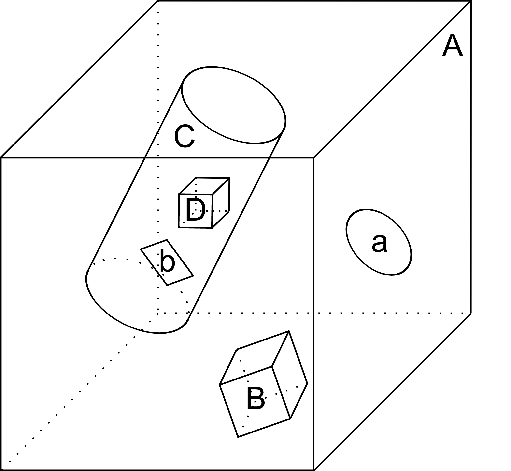
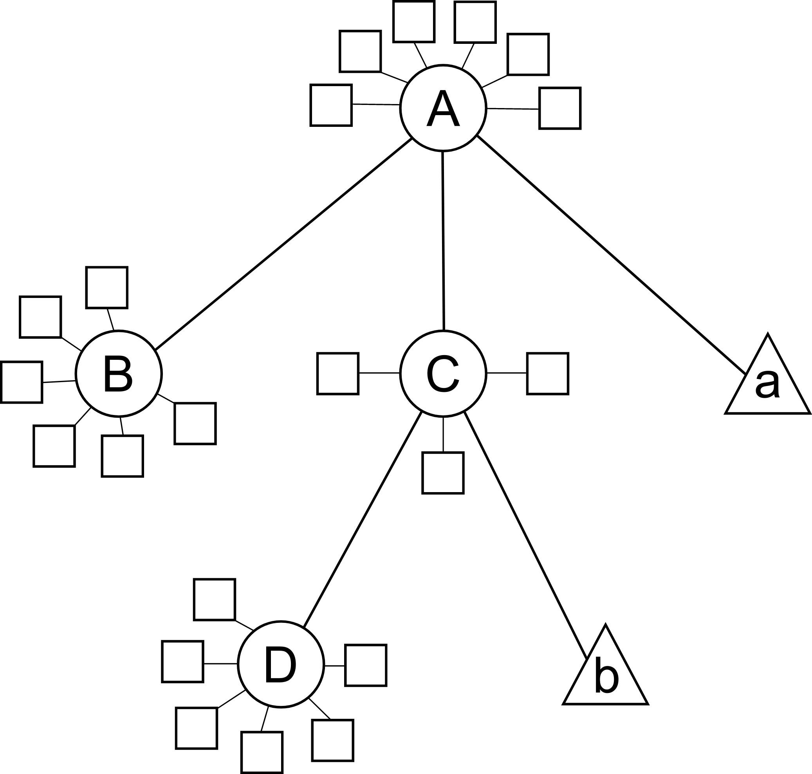

KGeoBag (geometry) - <geometry>
*****************************

.. _KGeoBag:

.. contents:: On this page
    :local:
    :depth: 2

Geometry section
=================

The geometry section of the configuration file is the first piece needed in order to assemble a simulation. At its first
and most basic level it is responsible for defining all the different shapes that will be used, and placing them with
respect to one another in order to construct the arrangement (often called `assembly`) that is needed.

For a full a description of all of the shape objects (surfaces and spaces) which maybe constructed in *KGeoBag* see
:ref:`basic-kgeobag-label` and :ref:`complex-kgeobag-label`. The abstract base classes which serve as the interface
between *KGeoBag* and *Kassiopeia* are ``KSSpace``, ``KSSurface``, and ``KSSide`` (see :gh-code:`Kassiopeia/Operators`).

The geometry section is also responsible for adding "extended" information to the defined geometry elements. These
extensions can be properties such as colors for visualization, or boundary conditions and meshing details for the
electromagnetic simulations.

Every relevant to the geometry description is processed by *KGeoBag* and must appear between the start and end brackets:

.. code-block:: xml

    <geometry>
        <!-- fill in geometry description here -->
    </geometry>

It should be noted, that the full description of the geometry need not lie within the same pair of ``<geometry>`` and
``</geometry>`` brackets. This facilitates the description of separate geometry pieces in different files, which may
then be included and used in the final assembly.

Shapes and assemblies
---------------------

To understand the basics of *KGeoBag*, let us look at a simple  example. A typical simulation geometry may look like
the image below, where multiple spaces (B-D) and surfaces (a-b) are assembled and placed in a "world" space A:

Internally, *KGeoBag* manages its geometric elements and their relations as a stree structure:

Now, to understand how this works in practice, we'll look at one of the example files provided with *Kassiopeia*. Of
the example files provided, the ``DipoleTrapSimulation.xml`` has the simplest geometry. It will be explained in detail
below, in order to walk you through a typical geometry configuration.

The geometry section starts off with a description of each shapes involved:

.. code-block:: xml

    <!-- world -->

    <cylinder_space name="world_space" z1="-2." z2="2." r="2."/>

    <!-- solenoid -->

    <tag name="magnet_tag">
        <cylinder_tube_space
            name="solenoid_space"
            z1="-1.e-2"
            z2="1.e-2"
            r1="0.5e-2"
            r2="1.5e-2"
            radial_mesh_count="30"
        />
    </tag>

    <!-- ring -->

    <tag name="electrode_tag">
        <cylinder_surface
            name="ring_surface"
            z1="-2.0e-2"
            z2="2.0e-2"
            r="2.5e-1"
            longitudinal_mesh_count="200"
            longitudinal_mesh_power="3."
            axial_mesh_count="128"
        />
    </tag>

    <!-- tube -->

    <tag name="electrode_tag">
        <cylinder_surface
            name="tube_surface"
            z1="-1.e-2"
            z2="1.e-2"
            r="0.5e-2"
            longitudinal_mesh_count="200"
            longitudinal_mesh_power="3."
            axial_mesh_count="128"
        />
    </tag>

    <!-- target -->

    <tag name="target_tag">
        <disk_surface name="target_surface" r="1.0e-2" z="0."/>
    </tag>

    <!-- center -->

    <tag name="center_tag">
        <disk_surface name="center_surface" r="2.5e-1" z="0."/>
    </tag>

The individual shapes are defined by elements of the common structure:

.. code-block:: xml

    <some_space name="my_space"/>
    <some_surface name="my_surface"/>

where each element is given a name, which it can be referenced with, and additional parameters dependeing on the shape.
For example, the disk surface is defined by only two parameters `r` and `z`, while other shapes differ.

Tagging system
--------------

The tagging system is used to group different elements together, for example by distinguishng between magnet and
electrode shapes. These tags will be used later to retrieve elements and pass them to the *KEMField* module. The
general syntax is:

.. code-block:: xml

    <tag name="my_tag" name="another_tag">
        <shape name="my_shape"/>
    </tag>

and tags can be freely combined or re-used.

Assembling elements
-------------------

The defined shapes are then placed into an assembly of the experiment geometry. Geometric objects are placed by
referencing each shape by its given (and *unique*) name and placing it inside a space. This can be combined with
specifying a transformation (relative to the assembly origin) defining the location and orientation of each object. The
available transformation types are displacements (defined by a 3-vector), and rotations (defined by an axis-angle
pair, or a series of Euler angles using the *Z-Y'-Z''* convention):

.. code-block:: xml

    <space name="dipole_trap_assembly">
        <surface name="ring" node="ring_surface"/>
        <surface name="center" node="center_surface"/>
        <space name="downstream_solenoid" node="solenoid_space">
            <transformation displacement="0. 0. -0.5"/>
        </space>
        <surface name="downstream_tube" node="tube_surface">
            <transformation displacement="0. 0. -0.5"/>
        </surface>
        <surface name="upstream_target" node="target_surface">
            <transformation displacement="0. 0. -0.48"/>
        </surface>
        <space name="upstream_solenoid" node="solenoid_space">
            <transformation displacement="0. 0. 0.5"/>
        </space>
        <surface name="upstream_tube" node="tube_surface">
            <transformation displacement="0. 0. 0.5"/>
        </surface>
        <surface name="downstream_target" node="target_surface">
            <transformation displacement="0. 0. 0.48"/>
        </surface>
    </space>

Here the individual named shapes that were defined earlier are referenced, using the general syntax:

.. code-block:: xml

    <space name="my_assembly">
        <space name="my_placed_space" node="my_space"/>
    </space>

and spaces can be freely nested, which is one of the key features of *KGeoBag*. Note the difference between the first
space, which does not refer to any shape and just holds the child elements, and the second space which refers to the
shape named ``my_space`` through the `node` attribute. The ``my_assembly`` space can be though of as a "virtual space",
without any reference to a real geometric object.

Finally in the ``DipoleTrapSimulation.xml`` file, the full assembly is placed within the world volume:

.. code-block:: xml

    <space name="world" node="world_space">
        <space name="dipole_trap" tree="dipole_trap_assembly"/>
    </space>

The world volume is a crucial part of any geometry, since it defines the outermost "root" space in which all other
elements must be placed. Note that in this case, the space named ``dipole_trap_assembly`` is referenced through the
`tree` attribute (and not `node`, as you might expect.) This is due to the fact that the assembly is a "virtual" space
that just holds its child elements, but does not refer to an actual object. Make sure to keep this in mind for your
own geometry configurations!

Transformations
---------------

It should be noted that transformations applied to an assembly are collectively applied to all of the geometric elements
within the assembly. For example, placing the dipole trap assembly within the world volume as:

.. code-block:: xml

    <space name="world" node="world_space">
        <space name="dipole_trap" tree="dipole_trap_assembly">
            <transformation rotation_euler="90. 0. 0." displacement="0 0 1.0"/>
        </space>
    </space>

would rotate the whole assembly by 90 degrees about the z-axis, and then displace it by 1 meter along the z-axis.

Assemblies may be nested within each other, and the coordinate transformations which are associated with the placement
of each assembly will be appropriately applied to all of the elements they contain. This makes it very intuitive to
create complex geometries with multiple displacements and rotations, because it resembles the behavior of real-world
objects (i.e. turning an assemble object by some amount will also turn all parts inside by the same amount, relative
to the outside coordinate system.)

Especially for rotations, it should be noted that it makes a difference if they are applied in the assembly before or
after placing child elements. Consider the following example:

.. code-block:: xml

    <disk_surface name="disk_surface" r="1.0" z="0."/>

    <space name="world">
        <space name="assembly_1">
            <surface name="placed_disk" node="disk_surface"/>
            <transformation rotation_euler="0. 30. 0." displacement="0 0 -1.0"/>
        </space>
        <space name="assembly_2">
            <transformation rotation_euler="0. 30. 0." displacement="0 0 1.0"/>
            <surface name="placed_disk" node="disk_surface"/>
        </space>
    </space>

In this case, the ``placed_disk`` in in the first assembly will be tilted relative to the world volume, while the
disk in the second assembly will not! This can be verified easily with one of the geometry viewers, which are explained
in section  :ref:`kgeobag-visualization`. The reason for this behavior is that in the second case, the rotation was
applied before placing the surface inside the assembly, and so it is not propagated to the shape. This is on purpose,
because it allows to transform the origin and orientation of the reference system before assembling elements.

It is best to think of the ``<transformation>`` elements as commands that are executed during XML initialization, while
the geometry is assembled. It should be clear then that the two example assemblies yield different results.

Extensions
-----------

In order to give physical properties to the geometry elements that have been constructed and placed, they must be
associated with extensions. The currently available extensions are *meshing* (axially or rotationally symmetric, or
non-symmetric), *visualization* properties, electrostatic *boundary conditions* (Dirichlet or Neumann surfaces), and
magnetostatic properties of *solenoids and coils* (current density and number of windings.)

A simple extension example is specifying the color and opacity of a shape for its display in a VTK_ visualization window
as follows:

.. code-block:: xml

    <appearance name="app_magnet" color="0 255 127 127" arc="72" surfaces="world/dipole_trap/@magnet_tag"/>

This example tells the visualization that any shape given the tag ``magnet_tag`` should be colored with an RGBA color
value of (0,255,127,127), where all values are given in the range 0..255 and the fourth value defines the shape's
opacity. If you have VTK enabled you may wish to experiment with the changes introduced by modifying these parameters.
When using the ROOT_ visualization, the appearance settings will be ignored.

In the line above, you also find an example of referencing tags throught the ``@tag_name`` syntax. Generally the
placed shapes can be referenced through a XPath_-like syntax that defines the location in the geometry tree, starting
at the "root" volume (which is typically called `world`.) This usually works with all `spaces` and `surfaces`
attributes of the XML elements.

The tagging feature is very useful for applying properties to many different elements at once. To do this, each element
which is to receive the same extension must share the same tag. There is no limit to the number of tags an geometric
element may be given. For example, given the dipole trap geometry as specified, one may associate an axially symmetric
mesh with all elements that share the tag ``electrode_tag`` with the line:

.. code-block:: xml

    <axial_mesh name="mesh_electrode" surfaces="world/dipole_trap/@electrode_tag"/>

This specifies that any geometric shape with the tag ``electrode_tag`` that is found within the ``world/dipole_trap``
space should be giving an axial mesh extension (i.e. it will be divided into a collection of axially symmetric objects
like cones, cylinders, etc.) This axial mesh will be later used by the field solving routines in *KEMField*. However, a
tag is not strictly necessary to apply an extension. For example, if we wished to generate an axial mesh for everything
within the world volume we would write:

.. code-block:: xml

    <axial_mesh name="mesh_electrode" surfaces="world/#"/>

or, if we wished to single out the ``ring_surface`` shape by specifying its full path we would write:

.. code-block:: xml

     <axial_mesh name="mesh_electrode" surfaces="world/dipole_trap/ring"/>

Meshing is critical for any problem with involves electrostatic fields. The type of mesh depends on the symmetry of the
geometry. For completely axially-symmetric geometries, the ``axial_mesh`` is recommended so that the zonal harmonics
field computation method may be used. For completely non-symmetric (3D) geometries, the mesh type would be specified as
follows:

.. code-block:: xml

    <mesh name="mesh_electrode" surfaces="world/dipole_trap/@electrode_tag"/>

Because of the very shape-specific nature of the deterministic meshing which is provided by *KGeoBag*, parameters
(``mesh_count`` and ``mesh_power``) describing how the mesh is to be constructed are given when specifying the shapes
themselves. That being said, the mesh associated with a specific shape will not be constructed unless the extension
statement is present.

It is possible to define multiple meshes side by side, e.g. if the simulation can be configured axially-symmetric or
non-symmetric. In this case, both meshes will be available for *KEMField* calculations regardless of the symmetry
setting. Note that the axial mesh cannot handle any non-symmetric elements, and these will be simply ignored.

Another important extension for field calculations is the specification of boundary conditions. For example, when
solving the Laplace boundary value problem via *KEMField*, one may specify that a particular surface exhibit Dirichlet
boundary conditions where a particular voltage is applied to the surface through the use of the following extension:

.. code-block:: xml

    <electrostatic_dirichlet name="electrode_ring" surfaces="world/dipole_trap/ring" value="-10."/>

Where ``value="-10"`` signifies that this surface has a potential of -10 volts. This is the standard case for defining
(metallic) electrode surfaces in a simulation, and a typical scenario for the boundary-element method (BEM). It is also
possible to define Neumann boundary conditions, which are typically used for insulating materials.

Similar to the electrode setup, one can define a magnet system that provides a magnetostatic field for the simulation.
For example, one may specify a solenoid electromagnet with the appropriate parameters:

.. code-block:: xml

    <electromagnet name="electromagnet_upstream_solenoid" spaces="world/dipole_trap/upstream_solenoid" current="{22.3047 * 20000}"/>

which references a space named ``upstream_solenoid`` with a total current of 22.3047 amps times 20000 turns. The
electric current and the number of turns can also be specified separately for added clarity:

.. code-block:: xml

    <electromagnet name="electromagnet_upstream_solenoid" spaces="world/dipole_trap/upstream_solenoid" current="22.3047" num_turns="20000"/>

The cylinder tube space is one of the supported shapes for electromagnets and describes a solenoid geometry. Other
supported shapes are the cylinder surface, describing a simple coil, and the rod space, describing a single wire.

For further demonstrations of the possible geometry extensions please see the provided example XML files located
at :gh-code:`KGeoBag/Source/XML/Examples`.

KGeoBag shapes
===============

See the following two chapters for an overview over simple and more advanced shapes:

.. toctree::
     :maxdepth: 1
     

     kgeobag_simple_shapes
     kgeobag_complex_shapes

.. _kgeobag-visualization:

KGeoBag Visualization
=====================

The *KGeoBag* module provides a set of stand-alone visualization tools that are described under :ref:`tools-label`. These
are suited to display the simulation geometry and other geometric elements, such as the mesh used for field calculation
and/or navigation.

In addition, the geometry visualization can also be defined in the configuration file. In this case, output files
may be produced before or after performing the simulation, and a visualization window can be shown as well. Note that
the visualization window blocks the application until it is closed, so it is not advised to use this feature in a
scripted environment. The examples in this section are based on the ``DipoleTrapSimulation.xml`` file, which may be extended accordingly to
test the features explained here and in the corresponding sections :ref:`KEMField visualisation <kemfield-visualization>` and
:ref:`Kassiopeia visualisation <kassiopeia-vizualisation>` The commandline option ``-b`` (or ``-batch``) will prevent 
any visualization windows to appear regardless of the setting in the configuration file, e.g.:

.. code-block:: bash

    Kassiopeia -b DipoleTrapSimulation.xml

Geometry visualization
----------------------

The *KGeoBag* module provides painter classes for the geometry which are covered below in the *Kassiopeia* section.
In addition, the mesh geometry can be viewed as well:

.. code-block:: xml

    <vtk_window
            name="vtk_window"
            enable_display="true"
            enable_write="true"
            frame_title="KGeoBag Visualization"
        >
        <vtk_axial_mesh_painter
            name="vtk_axial_mesh_painter"
            surfaces="world/dipole_trap/@electrode_tag"
            color_mode="area"
        />
    </vtk_window>

The axial mesh painter needs a defined mesh (``<axial_mesh>`` XML element, see :ref:`Configuring Your Own Simulation <configuration-label>`). An
``<vtk_mesh_painter>`` exists as well, to be used with an asymmetric mesh (defined via ``<mesh>``).

Using Python
~~~~~~~~~~~~

It is possible to draw a geometry visualization in Python. This is especially useful if you run your analysis in Python as well (see :ref:`output-label` for examples.)

The PyVista_ Python package makes it easy to operate on the VTK_ output files that are produced by *KGeoBag* and the 
other *Kasper* modules. (Note that this method only works if VTK_ was enabled at build time.) In the XML snippets above, 
the different VTK painters will produce output files if the ``enable_write`` attribute is set. These files contain the 
3D geometry in the `vtp` format and can be read in Python. In order to get a 2D view of the geometry, one also needs to 
create a slice that transforms the 3D surfaces into 2D lines.

.. code-block:: python

    import pyvista as pv
    import matplotlib as mpl
    import matplotlib.pyplot as plt

    # Open geometry file
    dataset = pv.read('geometry_painter.vtp')

    # Produce a slice along the x-z axis
    mesh = dataset.slice(normal=[0,1,0])

    # Draw lines in each slice cell
    plt.figure()
    xlim, ylim = (0,0), (0,0)
    for ind in range(mesh.n_cells):
        x, y, z = mesh.cell_points(ind).T

        if mesh.cell_type(ind) == 3:  # VTK_LINE
            line = mpl.lines.Line2D(z, x, lw=2, c='k')
            plt.gca().add_artist(line)
            xlim = (min(xlim[0],z.min()), max(xlim[1],z.max()))
            ylim = (min(ylim[0],x.min()), max(ylim[1],x.max()))
    plt.xlim(xlim)
    plt.ylim(ylim)

.. _TFormula: http://root.cern.ch/root/htmldoc/TFormula.html
.. _TMath: http://root.cern.ch/root/htmldoc/TMath.html
.. _PDG: http://pdg.lbl.gov/mc_particle_id_contents.html
.. _Paraview: http://www.paraview.org/
.. _ROOT: https://root.cern.ch/
.. _VTK: http://www.vtk.org/
.. _MKS: https://scienceworld.wolfram.com/physics/MKS.html
.. _XML: https://www.w3.org/TR/xml11/
.. _Xpath: https://www.w3.org/TR/xpath-10/
.. _TinyExpr: https://github.com/codeplea/tinyexpr/
.. _Log4CXX: https://logging.apache.org/log4cxx/
.. _PyVista: https://www.pyvista.org/

.. rubric:: Footnotes

[1] Daniel Lawrence Furse. Techniques for direct neutrino mass measurement utilizing tritium [beta]-decay. PhD thesis, Massachusetts Institute of Technology, 2015.

[2] Thomas Corona. Methodology and application of high performance electrostatic field simulation in the KATRIN experiment. PhD thesis, University of North Carolina, Chapel Hill, 2014.

[3] John P. Barrett. A Spatially Resolved Study of the KATRIN Main Spectrometer Using a Novel Fast Multipole Method. PhD thesis, Massachusetts Institute of Technology, 2016.
