KGeoBag - geometry definition
*****************************

.. _KGeoBag:

.. contents:: On this page
    :local:
    :depth: 2

Geometry
=========

The geometry section of the configuration file is the first piece needed in order to assemble a simulation. At its first
and most basic level it is responsible for defining all the different shapes that will be used, and placing them with
respect to one another in order to construct the arrangement (often called `assembly`) that is needed.

For a full a description of all of the shape objects (surfaces and spaces) which maybe constructed in *KGeoBag* see
:ref:`basic-kgeobag-label` and :ref:`complex-kgeobag-label`. The abstract base classes which serve as the interface
between *KGeoBag* and *Kassiopeia* are ``KSSpace``, ``KSSurface``, and ``KSSide`` (see :gh-code:`Kassiopeia/Operators`).

The geometry section is also responsible for adding "extended" information to the defined geometry elements. These
extensions can be properties such as colors for visualization, or boundary conditions and meshing details for the
electromagnetic simulations.

Every relevant to the geometry description is processed by *KGeoBag* and must appear between the start and end brackets:

.. code-block:: xml

    <geometry>
        <!-- fill in geometry description here -->
    </geometry>

It should be noted, that the full description of the geometry need not lie within the same pair of ``<geometry>`` and
``</geometry>`` brackets. This facilitates the description of separate geometry pieces in different files, which may
then be included and used in the final assembly.

Shapes and assemblies
---------------------

To understand the basics of *KGeoBag*, let us look at a simple  example. A typical simulation geometry may look like
the image below, where multiple spaces (B-D) and surfaces (a-b) are assembled and placed in a "world" space A:

.. image:: _images/geometry_picture.png
   :width: 250pt

Internally, *KGeoBag* manages its geometric elements and their relations as a stree structure:

.. image:: _images/geometry_tree.png
   :width: 250pt

Now, to understand how this works in practice, we'll look at one of the example files provided with *Kassiopeia*. Of
the example files provided, the ``DipoleTrapSimulation.xml`` has the simplest geometry. It will be explained in detail
below, in order to walk you through a typical geometry configuration.

The geometry section starts off with a description of each shapes involved:

.. code-block:: xml

    <!-- world -->

    <cylinder_space name="world_space" z1="-2." z2="2." r="2."/>

    <!-- solenoid -->

    <tag name="magnet_tag">
        <cylinder_tube_space
            name="solenoid_space"
            z1="-1.e-2"
            z2="1.e-2"
            r1="0.5e-2"
            r2="1.5e-2"
            radial_mesh_count="30"
        />
    </tag>

    <!-- ring -->

    <tag name="electrode_tag">
        <cylinder_surface
            name="ring_surface"
            z1="-2.0e-2"
            z2="2.0e-2"
            r="2.5e-1"
            longitudinal_mesh_count="200"
            longitudinal_mesh_power="3."
            axial_mesh_count="128"
        />
    </tag>

    <!-- tube -->

    <tag name="electrode_tag">
        <cylinder_surface
            name="tube_surface"
            z1="-1.e-2"
            z2="1.e-2"
            r="0.5e-2"
            longitudinal_mesh_count="200"
            longitudinal_mesh_power="3."
            axial_mesh_count="128"
        />
    </tag>

    <!-- target -->

    <tag name="target_tag">
        <disk_surface name="target_surface" r="1.0e-2" z="0."/>
    </tag>

    <!-- center -->

    <tag name="center_tag">
        <disk_surface name="center_surface" r="2.5e-1" z="0."/>
    </tag>

The individual shapes are defined by elements of the common structure:

.. code-block:: xml

    <some_space name="my_space"/>
    <some_surface name="my_surface"/>

where each element is given a name, which it can be referenced with, and additional parameters dependeing on the shape.
For example, the disk surface is defined by only two parameters `r` and `z`, while other shapes differ.

Tagging system
--------------

The tagging system is used to group different elements together, for example by distinguishng between magnet and
electrode shapes. These tags will be used later to retrieve elements and pass them to the *KEMField* module. The
general syntax is:

.. code-block:: xml

    <tag name="my_tag" name="another_tag">
        <shape name="my_shape"/>
    </tag>

and tags can be freely combined or re-used.

Assembling elements
-------------------

The defined shapes are then placed into an assembly of the experiment geometry. Geometric objects are placed by
referencing each shape by its given (and *unique*) name and placing it inside a space. This can be combined with
specifying a transformation (relative to the assembly origin) defining the location and orientation of each object. The
available transformation types are displacements (defined by a 3-vector), and rotations (defined by an axis-angle
pair, or a series of Euler angles using the *Z-Y'-Z''* convention):

.. code-block:: xml

    <space name="dipole_trap_assembly">
        <surface name="ring" node="ring_surface"/>
        <surface name="center" node="center_surface"/>
        <space name="downstream_solenoid" node="solenoid_space">
            <transformation displacement="0. 0. -0.5"/>
        </space>
        <surface name="downstream_tube" node="tube_surface">
            <transformation displacement="0. 0. -0.5"/>
        </surface>
        <surface name="upstream_target" node="target_surface">
            <transformation displacement="0. 0. -0.48"/>
        </surface>
        <space name="upstream_solenoid" node="solenoid_space">
            <transformation displacement="0. 0. 0.5"/>
        </space>
        <surface name="upstream_tube" node="tube_surface">
            <transformation displacement="0. 0. 0.5"/>
        </surface>
        <surface name="downstream_target" node="target_surface">
            <transformation displacement="0. 0. 0.48"/>
        </surface>
    </space>

Here the individual named shapes that were defined earlier are referenced, using the general syntax:

.. code-block:: xml

    <space name="my_assembly">
        <space name="my_placed_space" node="my_space"/>
    </space>

and spaces can be freely nested, which is one of the key features of *KGeoBag*. Note the difference between the first
space, which does not refer to any shape and just holds the child elements, and the second space which refers to the
shape named ``my_space`` through the `node` attribute. The ``my_assembly`` space can be though of as a "virtual space",
without any reference to a real geometric object.

Finally in the ``DipoleTrapSimulation.xml`` file, the full assembly is placed within the world volume:

.. code-block:: xml

    <space name="world" node="world_space">
        <space name="dipole_trap" tree="dipole_trap_assembly"/>
    </space>

The world volume is a crucial part of any geometry, since it defines the outermost "root" space in which all other
elements must be placed. Note that in this case, the space named ``dipole_trap_assembly`` is referenced through the
`tree` attribute (and not `node`, as you might expect.) This is due to the fact that the assembly is a "virtual" space
that just holds its child elements, but does not refer to an actual object. Make sure to keep this in mind for your
own geometry configurations!

Transformations
---------------

It should be noted that transformations applied to an assembly are collectively applied to all of the geometric elements
within the assembly. For example, placing the dipole trap assembly within the world volume as:

.. code-block:: xml

    <space name="world" node="world_space">
        <space name="dipole_trap" tree="dipole_trap_assembly">
            <transformation rotation_euler="90. 0. 0." displacement="0 0 1.0"/>
        </space>
    </space>

would rotate the whole assembly by 90 degrees about the z-axis, and then displace it by 1 meter along the z-axis.

Assemblies may be nested within each other, and the coordinate transformations which are associated with the placement
of each assembly will be appropriately applied to all of the elements they contain. This makes it very intuitive to
create complex geometries with multiple displacements and rotations, because it resembles the behavior of real-world
objects (i.e. turning an assemble object by some amount will also turn all parts inside by the same amount, relative
to the outside coordinate system.)

Especially for rotations, it should be noted that it makes a difference if they are applied in the assembly before or
after placing child elements. Consider the following example:

.. code-block:: xml

    <disk_surface name="disk_surface" r="1.0" z="0."/>

    <space name="world">
        <space name="assembly_1">
            <surface name="placed_disk" node="disk_surface"/>
            <transformation rotation_euler="0. 30. 0." displacement="0 0 -1.0"/>
        </space>
        <space name="assembly_2">
            <transformation rotation_euler="0. 30. 0." displacement="0 0 1.0"/>
            <surface name="placed_disk" node="disk_surface"/>
        </space>
    </space>

In this case, the ``placed_disk`` in in the first assembly will be tilted relative to the world volume, while the
disk in the second assembly will not! This can be verified easily with one of the geometry viewers, which are explained
in section  :ref:`visualization-label`. The reason for this behavior is that in the second case, the rotation was
applied before placing the surface inside the assembly, and so it is not propagated to the shape. This is on purpose,
because it allows to transform the origin and orientation of the reference system before assembling elements.

It is best to think of the ``<transformation>`` elements as commands that are executed during XML initialization, while
the geometry is assembled. It should be clear then that the two example assemblies yield different results.

Extensions
-----------

In order to give physical properties to the geometry elements that have been constructed and placed, they must be
associated with extensions. The currently available extensions are *meshing* (axially or rotationally symmetric, or
non-symmetric), *visualization* properties, electrostatic *boundary conditions* (Dirichlet or Neumann surfaces), and
magnetostatic properties of *solenoids and coils* (current density and number of windings.)

A simple extension example is specifying the color and opacity of a shape for its display in a VTK_ visualization window
as follows:

.. code-block:: xml

    <appearance name="app_magnet" color="0 255 127 127" arc="72" surfaces="world/dipole_trap/@magnet_tag"/>

This example tells the visualization that any shape given the tag ``magnet_tag`` should be colored with an RGBA color
value of (0,255,127,127), where all values are given in the range 0..255 and the fourth value defines the shape's
opacity. If you have VTK enabled you may wish to experiment with the changes introduced by modifying these parameters.
When using the ROOT_ visualization, the appearance settings will be ignored.

In the line above, you also find an example of referencing tags throught the ``@tag_name`` syntax. Generally the
placed shapes can be referenced through a XPath_-like syntax that defines the location in the geometry tree, starting
at the "root" volume (which is typically called `world`.) This usually works with all `spaces` and `surfaces`
attributes of the XML elements.

The tagging feature is very useful for applying properties to many different elements at once. To do this, each element
which is to receive the same extension must share the same tag. There is no limit to the number of tags an geometric
element may be given. For example, given the dipole trap geometry as specified, one may associate an axially symmetric
mesh with all elements that share the tag ``electrode_tag`` with the line:

.. code-block:: xml

    <axial_mesh name="mesh_electrode" surfaces="world/dipole_trap/@electrode_tag"/>

This specifies that any geometric shape with the tag ``electrode_tag`` that is found within the ``world/dipole_trap``
space should be giving an axial mesh extension (i.e. it will be divided into a collection of axially symmetric objects
like cones, cylinders, etc.) This axial mesh will be later used by the field solving routines in *KEMField*. However, a
tag is not strictly necessary to apply an extension. For example, if we wished to generate an axial mesh for everything
within the world volume we would write:

.. code-block:: xml

    <axial_mesh name="mesh_electrode" surfaces="world/#"/>

or, if we wished to single out the ``ring_surface`` shape by specifying its full path we would write:

.. code-block:: xml

     <axial_mesh name="mesh_electrode" surfaces="world/dipole_trap/ring"/>

Meshing is critical for any problem with involves electrostatic fields. The type of mesh depends on the symmetry of the
geometry. For completely axially-symmetric geometries, the ``axial_mesh`` is recommended so that the zonal harmonics
field computation method may be used. For completely non-symmetric (3D) geometries, the mesh type would be specified as
follows:

.. code-block:: xml

    <mesh name="mesh_electrode" surfaces="world/dipole_trap/@electrode_tag"/>

Because of the very shape-specific nature of the deterministic meshing which is provided by *KGeoBag*, parameters
(``mesh_count`` and ``mesh_power``) describing how the mesh is to be constructed are given when specifying the shapes
themselves. That being said, the mesh associated with a specific shape will not be constructed unless the extension
statement is present.

It is possible to define multiple meshes side by side, e.g. if the simulation can be configured axially-symmetric or
non-symmetric. In this case, both meshes will be available for *KEMField* calculations regardless of the symmetry
setting. Note that the axial mesh cannot handle any non-symmetric elements, and these will be simply ignored.

Another important extension for field calculations is the specification of boundary conditions. For example, when
solving the Laplace boundary value problem via *KEMField*, one may specify that a particular surface exhibit Dirichlet
boundary conditions where a particular voltage is applied to the surface through the use of the following extension:

.. code-block:: xml

    <electrostatic_dirichlet name="electrode_ring" surfaces="world/dipole_trap/ring" value="-10."/>

Where ``value="-10"`` signifies that this surface has a potential of -10 volts. This is the standard case for defining
(metallic) electrode surfaces in a simulation, and a typical scenario for the boundary-element method (BEM). It is also
possible to define Neumann boundary conditions, which are typically used for insulating materials.

Similar to the electrode setup, one can define a magnet system that provides a magnetostatic field for the simulation.
For example, one may specify a solenoid electromagnet with the appropriate parameters:

.. code-block:: xml

    <electromagnet name="electromagnet_upstream_solenoid" spaces="world/dipole_trap/upstream_solenoid" current="{22.3047 * 20000}"/>

which references a space named ``upstream_solenoid`` with a total current of 22.3047 amps times 20000 turns. The
electric current and the number of turns can also be specified separately for added clarity:

.. code-block:: xml

    <electromagnet name="electromagnet_upstream_solenoid" spaces="world/dipole_trap/upstream_solenoid" current="22.3047" num_turns="20000"/>

The cylinder tube space is one of the supported shapes for electromagnets and describes a solenoid geometry. Other
supported shapes are the cylinder surface, describing a simple coil, and the rod space, describing a single wire.

For further demonstrations of the possible geometry extensions please see the provided example XML files located
at :gh-code:`KGeoBag/Source/XML/Examples`.

.. _basic-kgeobag-label:

Basic Shapes in KGeoBag
==========================

This section is a description of the basic spaces and surfaces which can be constructed using *KGeoBag*. All of the
following shapes can be displayed by the executables ``MeshViewer`` and ``GeometryViewer`` (see :ref:`visualization-label`).
These executables are built and installed along with *KGeoBag* when it is linked against VTK_.

Geometry visualization
-----------------------

In order to view a geometry you can execute ``GeometryViewer`` from the directory ``$KASPERSYS/install/bin`` with the
path to your geometry file (.xml) and the name of the geometry element you want to display as the arguments:

.. code-block:: bash

    ./GeometryViewer ../config/TheBag/Examples/ExampleShapes.xml example_rotated_surface

An example of the geometry view is shown below:

.. image:: _images/geometryviewer.png
   :width: 400pt

To visualized the mesh of a geometric element execute MeshViewer in ``$KASPERSYS/install/bin`` with the path to your
geometry file (.xml) and the name of the geometry element you want to display:

.. code-block:: bash

    ./MeshViewer <../config/TheBag/Examples/ExampleShapes.xml> <example_rotated_surface>

There is also an ``AxialMeshViewer`` available, which displays the axial mesh (if defined) in the same way. The
geometric element can be a specific element or several elements collected into a group. To display a single element use
its name, to show a tagged group the argument is written as ``@tag_group``. An example of the mesh viewer being used on
a rod surface is shown below:

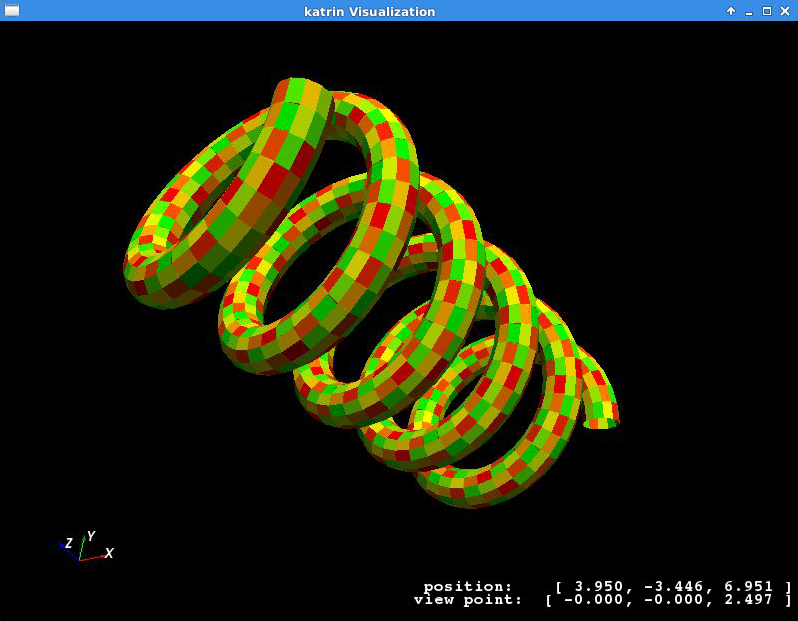

The ``GeometryViewer`` and ``MeshViewer`` will also produce a VTK poly-data file (.vtp) which can then be open in the
external application Paraview_ for more advanced visualization.

The parameters specifying the method by which a geometric element is meshed must be given in the geometry file when the
shape is described. If no mesh is desired for some object, the mesh parameters may be ignored and the defaults will be
used. The commands above may also be tried with one of the *Kassiopeia* simulation examples.

The mesh parameters vary for each object, but essentially describe two properties (for each meshable dimension). These
are the ``mesh_count`` and the ``mesh_power``. If the ``mesh_power`` is set equal to 1.0, then the ``mesh_count`` simply
specifies the number of equally sized segments that a shape will be chopped into, along a particular dimension. If the
``mesh_power`` is greater than 1.0, then the density of segments will increase towards the edges of the shape while
keeping the number of elements the same. The ``mesh_power`` property is useful for tailoring the accuracy of mesh
descriptions for Laplace boundary value problems, where quantities such as charge density may vary considerably near the
sharp edges of an object. Therefore, this parameter is mainly used for electrode meshes.

The following sections provide examples and brief descriptions of some basic shapes available for use in *KGeoBag*.

Basic elements
--------------

The following elements (poly-loop and poly-line) are internal descriptors. They can't be used by themselves outside a
geometry element. This section serves as a brief explanation for the structure of these shapes.

Poly-loop
~~~~~~~~~~

A poly-loop is a closed sequence consisting of several lines and/or arcs that form a polygonal shape. The aequence
starts with ``<start_point ...>`` and ends with ``<last_line ...>`` or ``<last_arc ...>``, and multiple ``<next_line
...>`` or ``<next_arc ...>`` elements can be put in between. An example of a poly-loop element is as follows:

.. code-block:: xml

    <poly_loop>
        <start_point x="0." y="0."/>
        <next_line x="0.4" y="-0.1" line_mesh_count="10" line_mesh_power="2.5"/>
        <next_arc x="-0.1" y="0.4" radius="0.6" right="true" short="false" arc_mesh_count="256"/>
        <last_line line_mesh_count="10" line_mesh_power="2.5"/>
    </poly_loop>

which creates a line from (0,0) to (0.4,-0.1) followed by an arc to (-0.1,0.4), and then the loop is closed by a line
back to the starting point. Note that poly-loop and poly-line are two-dimensional objects that operate in (x,y)
coordinates. Any line that is created by a ``<next_...>`` command goes from the end-point of the previous line to the
specified coordinate. The directive ``<last_line ...>`` or ``<last_arc ...>`` connects the first and last points with
the specified segment type.

The arc elements are described with the boolean parameters ``right`` and ``short``, as shown here:

.. image:: _images/short_true_false.png

where ``right="true"`` means that the circle segment will be drawn clockwise, and vice versa. ``short="true"`` means
that the arc will be the shorter one of the two possiblities.

Poly-line
~~~~~~~~~~

This element is desribed using the same procedure as in poly-loop. However, the first and last points are not
necessarily connected. An XML example is below:

.. code-block:: xml

    <poly_line>
        <start_point x="0.2" y="0.3"/>
        <next_line x="0.1" y="0.1" line_mesh_count="36" line_mesh_power="4.5"/>
        <next_arc x="-0.1" y="0.1" radius="0.2" right="true" short="true" arc_mesh_count="96"/>
        <next_line x="-0.2" y="0.2" line_mesh_count="36" line_mesh_power="1."/>
        <next_line x="-0.3" y="0.1" line_mesh_count="24" line_mesh_power="4.5"/>
    </poly_line>

In this case, the sequence progresses through five (x,y) points but does not connect back to the starting point. Hence,
it does not form a closed loop like the poly-loop element does, and does not need a ``<last_...>`` command. Otherwise,
the parameters for poly-line are the same as for poly-loop.

Surfaces
-----------

Flat surfaces
~~~~~~~~~~~~~~

Flattened circle surface
"""""""""""""""""""""""""""

A flattened circle surface is just a surface with circular shape, where (x,y,z) are the coordinates for the center of
the circle and r is the radius:

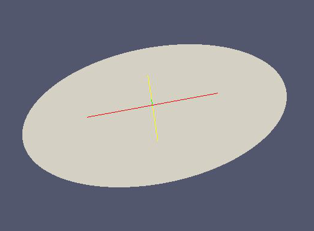

- Works with MeshViewer: Yes.
- Works with GeometryViewer: Yes.

An XML example is as follows:

.. code-block:: xml

    <flattened_circle_surface name="flattened_circle_surface" z="0." flattened_mesh_count="10" flattened_mesh_power="4.">
        <circle x="0.1" y="0.2" radius="0.5" circle_mesh_count="128"/>
    </flattened_circle_surface>

Flattened poly-loop surface
"""""""""""""""""""""""""""""

A flattened poly loop surface is a surface consisting of several lines, arcs or both, creating a polygon of your desired
shape. The first line and the last line are connected automatically. By using the features of the poly-loop outlined
above, this provides a very flexible method of designing surface elements.

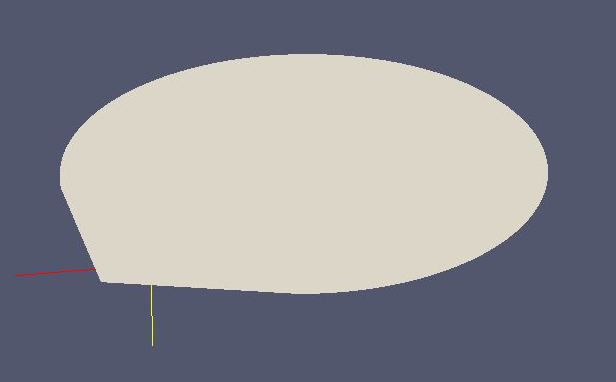

- Works with MeshViewer: Yes.
- Works with GeometryViewer: Yes.

An XML example is as follows:

.. code-block:: xml

    <flattened_poly_loop_surface name="flattened_poly_loop_surface" z="0.1" flattened_mesh_count="10" flattened_mesh_power="4.">
        <poly_loop>
            <start_point x="0." y="0."/>
            <next_line x="0.4" y="-0.1" line_mesh_count="10" line_mesh_power="2.5"/>
            <next_arc x="-0.1" y="0.4" radius="0.6" right="true" short="false" arc_mesh_count="256"/>
            <last_line line_mesh_count="10" line_mesh_power="2.5"/>
        </poly_loop>
    </flattened_poly_loop_surface>

Rotated Surfaces
~~~~~~~~~~~~~~~~~~

All rotated surfaces are constructed from lines, arcs, poly-lines, or poly-loops which are then rotated around the local
x-axis.

Rotated line segment surface
"""""""""""""""""""""""""""""""

This type generates the surface of revolution formed by a line that is rotated around the x-axis.

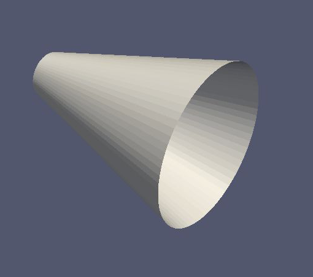

- Works with MeshViewer: Yes.
- Works with GeometryViewer: Yes.

An XML example is as follows:

.. code-block:: xml

    <rotated_line_segment_surface name="rotated_line_segment_forward_surface" rotated_mesh_count="96">
        <line_segment x1="0.15" y1="0.1" x2="-0.1" y2="0.05" line_mesh_count="36" line_mesh_power="2.2"/>
    </rotated_line_segment_surface>

Rotated arc segment surface
"""""""""""""""""""""""""""""

This type generates the surface of revolution formed by an arc that is rotated around the x-axis.

.. image:: _images/kgeobag_rotated_arc_segment_surface_model.png
   :width: 400pt

- Works with MeshViewer: Yes.
- Works with GeometryViewer: Yes.

An XML example is as follows:

.. code-block:: xml

    <rotated_arc_segment_surface name="rotated_arc_segment_right_short_surface" rotated_mesh_count="128">
        <arc_segment x1="0.15" y1="0.1" x2="-0.1" y2="0.05" radius="0.3" right="true" short="true" arc_mesh_count="64"/>
    </rotated_arc_segment_surface>

Rotated poly-line surface
"""""""""""""""""""""""""""

This type generates the surface of revolution created by rotating a poly-line around the local x-axis.

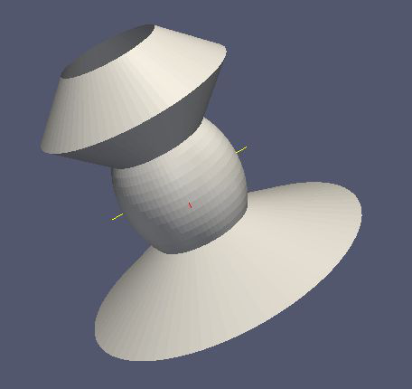

- Works with MeshViewer: Yes.
- Works with GeometryViewer: Yes.

An XML example is as follows:

.. code-block:: xml

    <rotated_poly_line_surface name="rotated_poly_line_forward_surface" rotated_mesh_count="64">
        <poly_line>
            <start_point x="0.2" y="0.3"/>
            <next_line x="0.1" y="0.1" line_mesh_count="36" line_mesh_power="4.5"/>
            <next_arc x="-0.1" y="0.1" radius="0.2" right="true" short="true" arc_mesh_count="96"/>
            <next_line x="-0.2" y="0.2" line_mesh_count="36" line_mesh_power="1."/>
            <next_line x="-0.3" y="0.1" line_mesh_count="24" line_mesh_power="4.5"/>
        </poly_line>
    </rotated_poly_line_surface>

Rotated circle surface
"""""""""""""""""""""""

This type generates the surface of revolution created by rotating a circle around the local x-axis. This shape is
essentially or torus, or a section of a torus.

.. image:: _images/kgeobag_rotated_circle_surface_model.png
   :width: 400pt

- Works with MeshViewer: Yes.
- Works with GeometryViewer: Yes.

An XML example is as follows:

.. code-block:: xml

    <rotated_circle_surface name="rotated_circle_surface" rotated_mesh_count="32">
        <circle x="0.1" y="0.5" radius="0.3" circle_mesh_count="32"/>
    </rotated_circle_surface>

Rotated poly loop surface
"""""""""""""""""""""""""""

This type generates the surface of revolution created by rotating a poly-loop around the local x-axis.

.. image:: _images/kgeobag_rotated_poly_loop_surface_model.png
   :width: 400pt

- Works with MeshViewer: Yes.
- Works with GeometryViewer: Yes.

An XML example is as follows:

.. code-block:: xml

    <rotated_poly_loop_surface name="rotated_poly_loop_surface" rotated_mesh_count="64">
        <poly_loop>
            <start_point x="0.3" y="0.3"/>
            <next_line x="0.3" y="0.5" line_mesh_count="36" line_mesh_power="2.5"/>
            <next_arc x="0.1" y="0.7" radius="0.25" right="false" short="true" arc_mesh_count="64"/>
            <next_line x="-0.1" y="0.7" line_mesh_count="36" line_mesh_power="2.5"/>
            <next_arc x="-0.3" y="0.5" radius="0.25" right="false" short="true" arc_mesh_count="64"/>
            <next_line x="-0.3" y="0.3" line_mesh_count="36" line_mesh_power="2.5"/>
            <next_arc x="-0.1" y="0.1" radius="0.25" right="false" short="true" arc_mesh_count="64"/>
            <next_line x="0.1" y="0.1" line_mesh_count="36" line_mesh_power="2.5"/>
            <last_arc radius="0.25" right="false" short="true" arc_mesh_count="64"/>
        </poly_loop>
    </rotated_poly_loop_surface>

Shell Surfaces
~~~~~~~~~~~~~~~~~

All shell surfaces are lines, arcs or surfaces that are rotated around the x-axis between a given start angle
(angle_start) and stop angle (angle_stop).

Shell line segment surface
"""""""""""""""""""""""""""

This produces an angularly limited portion of a surface of revolution from a line that is rotated around the local
x-axis.

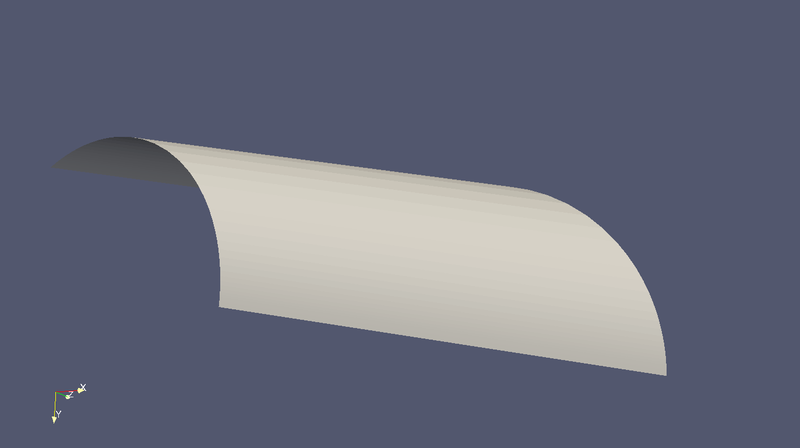

- Works with MeshViewer: Yes.
- Works with GeometryViewer: Yes.

An XML example is as follows:

.. code-block:: xml

    <shell_line_segment_surface name="shell_line_segment_forward_surface" angle_start="240" shell_mesh_count="96" shell_mesh_power="6">
        <line_segment x1="0.15" y1="0.1" x2="-0.1" y2="0.05" line_mesh_count="36" line_mesh_power="2.2"/>
    </shell_line_segment_surface>

Shell arc segment surface
"""""""""""""""""""""""""""

This produces an angularly limited portion of a surface of revolution from an arc that is rotated around the local
x-axis.

.. image:: _images/kgeobag_shell_arc_segment_surface_model.png
   :width: 400pt

- Works with MeshViewer: Yes.
- Works with GeometryViewer: Yes.

An XML example is as follows:

.. code-block:: xml

    <shell_arc_segment_surface name="shell_arc_segment_right_short_surface" shell_mesh_count="128" shell_mesh_power="6">
        <arc_segment x1="0.15" y1="0.1" x2="-0.1" y2="0.05" radius="0.3" right="true" short="true" arc_mesh_count="64"/>
    </shell_arc_segment_surface>

Shell poly-line surface
"""""""""""""""""""""""""

This produces an angularly limited portion of a surface of revolution from a poly-line that is rotated around the local
x-axis.

.. image:: _images/kgeobag_shell_poly_line_surface_model.png
   :width: 400pt

- Works with MeshViewer: Yes.
- Works with GeometryViewer: Yes.

An XML example is as follows:

.. code-block:: xml

    <shell_poly_line_surface name="shell_poly_line_forward_surface" angle_start="270" angle_stop="120" shell_mesh_count="64" shell_mesh_power="6">
        <poly_line>
            <start_point x="0.2" y="0.3"/>
            <next_line x="0.1" y="0.1" line_mesh_count="36" line_mesh_power="4.5"/>
            <next_arc x="-0.1" y="0.1" radius="0.2" right="true" short="true" arc_mesh_count="96"/>
            <next_line x="-0.2" y="0.2" line_mesh_count="36" line_mesh_power="1."/>
            <next_line x="-0.3" y="0.1" line_mesh_count="24" line_mesh_power="4.5"/>
        </poly_line>
    </shell_poly_line_surface>

Shell circle surface
"""""""""""""""""""""

This produces an angularly limited portion of a surface of revolution from a circle that is rotated around the local
x-axis.

.. image:: _images/kgeobag_shell_circle_surface_model.png
   :width: 400pt

- Works with MeshViewer: Yes.
- Works with GeometryViewer: Yes.

An XML example is as follows:

.. code-block:: xml

   <shell_circle_surface name="shell_circle_surface" angle_start="200" angle_stop="130" shell_mesh_count="32" shell_mesh_power="6">
        <circle x="0.1" y="0.5" radius="0.3" circle_mesh_count="32"/>
    </shell_circle_surface>

Shell poly-loop surface
"""""""""""""""""""""""""

This produces an angularly limited portion of a surface of revolution from a poly-loop that is rotated around the local
x-axis.

.. image:: _images/kgeobag_shell_poly_loop_surface_model.png
   :width: 400pt

- Works with MeshViewer: Yes.
- Works with GeometryViewer: Yes.

An XML example is as follows:

.. code-block:: xml

    <shell_poly_loop_surface name="shell_poly_loop_surface"  angle_start="30" angle_stop="360" shell_mesh_count="64" shell_mesh_power="6">
        <poly_loop>
            <start_point x="0.3" y="0.3"/>
            <next_line x="0.3" y="0.5" line_mesh_count="64" line_mesh_power="2.5"/>
            <next_arc x="0.1" y="0.7" radius="0.25" right="false" short="true" arc_mesh_count="64"/>
            <next_line x="-0.1" y="0.7" line_mesh_count="64" line_mesh_power="2.5"/>
            <next_arc x="-0.3" y="0.5" radius="0.25" right="false" short="true" arc_mesh_count="64"/>
            <next_line x="-0.3" y="0.3" line_mesh_count="64" line_mesh_power="2.5"/>
            <next_arc x="-0.1" y="0.1" radius="0.25" right="false" short="true" arc_mesh_count="64"/>
            <next_line x="0.1" y="0.1" line_mesh_count="64" line_mesh_power="2.5"/>
            <last_arc radius="0.25" right="false" short="true" arc_mesh_count="64"/>
        </poly_loop>
    </shell_poly_loop_surface>

Extruded Surfaces
~~~~~~~~~~~~~~~~~~~

Extruded surfaces are surfaces that are extruded along the direction of the local z-axis from a minimum z-position
(zmin) to a maximum z-position (zmax).

Extruded poly-line surface
"""""""""""""""""""""""""""

This generates a surface by extruding a poly-line.

An XML example is as follows:

.. code-block:: xml

    <extruded_poly_line_surface name="extruded_poly_line_surface" zmin="-0.3" zmax="0.2" extruded_mesh_count="96" extruded_mesh_power="6.3">
        <poly_line>
            <start_point x="-0.3" y="0.1"/>
            <next_line x="-0.2" y="0.2" line_mesh_count="24" line_mesh_power="4.5"/>
            <next_line x="-0.1" y="0.1" line_mesh_count="36" line_mesh_power="1."/>
            <next_arc x="0.1" y="0.1" radius="0.2" right="false" short="true" arc_mesh_count="96"/>
            <next_line x="0.2" y="0.3" line_mesh_count="36" line_mesh_power="4.5"/>
        </poly_line>
    </extruded_poly_line_surface>

Extruded circle surface
"""""""""""""""""""""""""

This generates the surfaced produced by extruding a circle (this is the same as a cylinder).

.. image:: _images/kgeobag_extruded_circle_space_model.png
   :width: 400pt

- Works with MeshViewer: Yes.
- Works with GeometryViewer: Yes.

An XML example is as follows:

.. code-block:: xml

    <extruded_circle_surface name="extruded_circle_surface" zmin="-0.1" zmax="0.1" extruded_mesh_count="32" extruded_mesh_power="1">
        <circle x="0.1" y="0.5" radius="0.3" circle_mesh_count="128"/>
    </extruded_circle_surface>

Extruded poly-loop surface
"""""""""""""""""""""""""""

This generates a surface by extruding a poly-loop.

.. image:: _images/kgeobag_extruded_poly_loop_surface_model.png
   :width: 400pt

- Works with MeshViewer: Yes.
- Works with GeometryViewer: Yes.

An XML example is as follows:

.. code-block:: xml

    <extruded_poly_loop_surface name="extruded_poly_loop_surface" zmin="-0.3" zmax="0.3" extruded_mesh_count="37" extruded_mesh_power="6.3">
        <poly_loop>
            <start_point x="0.3" y="0.3"/>
            <next_line x="0.3" y="0.5" line_mesh_count="36" line_mesh_power="2.5"/>
            <next_arc x="0.1" y="0.7" radius="0.25" right="false" short="true" arc_mesh_count="64"/>
            <next_line x="-0.1" y="0.7" line_mesh_count="36" line_mesh_power="2.5"/>
            <next_arc x="-0.3" y="0.5" radius="0.25" right="false" short="true" arc_mesh_count="64"/>
            <next_line x="-0.3" y="0.3" line_mesh_count="36" line_mesh_power="2.5"/>
            <next_arc x="-0.1" y="0.1" radius="0.25" right="false" short="true" arc_mesh_count="64"/>
            <next_line x="0.1" y="0.1" line_mesh_count="36" line_mesh_power="2.5"/>
            <last_arc radius="0.25" right="false" short="true" arc_mesh_count="64"/>
        </poly_loop>
    </extruded_poly_loop_surface>

Special Surfaces
~~~~~~~~~~~~~~~~~

These surfaces are just specific cases of the more general surface types already listed. However, since their use is
extremely common, they have been made available as unique, special types. For many simple simulations, it is possible
to design the geometry entirely using these elements.

Disk surface
"""""""""""""

This produces a disk centered on the local z-axis.

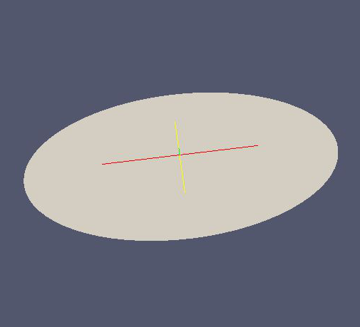

- Works with MeshViewer: Yes.
- Works with GeometryViewer: Yes.

An XML example is as follows:

.. code-block:: xml

    <disk_surface name="disk_surface" z=".01" r=".35" radial_mesh_count="14" radial_mesh_power="5" axial_mesh_count="20"/>

The parameters are:

- z: z-position in meters
- r: radius in meters
- radial_mesh_count: radial mesh parameter (default is 1)
- radial_mesh_power: radial meshing power (default is 1.)
- axial_mesh_count: axial mesh parameter (default is 16)

Annulus surface
"""""""""""""""""
This produces an annulus centered on the z axis.

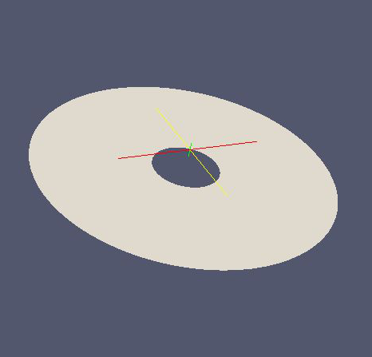

- Works with MeshViewer: Yes.
- Works with GeometryViewer: Yes.

An XML example is as follows:

.. code-block:: xml

    <annulus_surface name="annulus_surface" z="-.01" r1="0.1" r2="0.45" radial_mesh_count="22" radial_mesh_power="1.5" axial_mesh_count="32"/>

The parameters are:

- z: z-position in meters
- r1: the first of the radii in meters
- r2: the second radius in meters
- radial_mesh_count: radial mesh parameter (default is 1)
- radial_mesh_power: radial meshing power (default is 1.)
- axial_mesh_count: axial mesh parameter (default is 16)

Cylinder surface
"""""""""""""""""

Generates a cylinder centered on the z axis.

.. image:: _images/kgeobag_cylinder_surface_model.png
   :width: 400pt

- Works with MeshViewer: Yes.
- Works with GeometryViewer: Yes.

An XML example is as follows:

.. code-block:: xml

    <cylinder_surface name="cylinder_surface" z1="-0.3" z2="0.4" r="0.55" longitudinal_mesh_count="15" longitudinal_mesh_power="2." axial_mesh_count="32"/>

The parameters are:

- z1: the first z position in meters
- z2: the second z position in meters
- r: radius in meters
- longitudinal_mesh_count: longitudinal mesh parameter (default is 1)
- longitudinal_mesh_power: longitudinal meshing power (default is 1.)
- axial_mesh_count: axial mesh parameter (default is 16)

Cone Surface
"""""""""""""""

Generates a cone centered on the z axis.

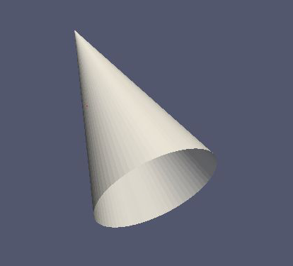

- Works with MeshViewer: Yes.
- Works with GeometryViewer: Yes.

An XML example is as follows:

.. code-block:: xml

    <cone_surface name="cone_surface" za="-0.4" zb="0.4" rb="0.25" longitudinal_mesh_count="48" longitudinal_mesh_power="1." axial_mesh_count="72"/>

The parameters are:

- za: apex z position in meters
- zb: base z position in meters
- rb: base radius in meters
- longitudinal_mesh_count: longitudinal mesh parameter (default is 1)
- longitudinal_mesh_power: longitudinal meshing power (default is 1.)
- axial_mesh_count: axial mesh parameter (default is 16)

Cut Cone Surface
"""""""""""""""""

Produces a truncated cone centered on the local z-axis.

.. image:: _images/kgeobag_cut_cone_surface_model.png
   :width: 400pt

- Works with MeshViewer: Yes.
- Works with GeometryViewer: Yes.

An XML example is as follows:

.. code-block:: xml

    <cut_cone_surface name="cut_cone_surface" z1="0.5" r1="0.6" z2="-0.1" r2="0.2" longitudinal_mesh_count="23" longitudinal_mesh_power="4." axial_mesh_count="48"/>

The parameters are:

- z1: the first z coordinates in meters
- r1: the first r coordinates in meters
- z2: the second z coordinate in meters
- r2: the second r coordinate in meters
- longitudinal_mesh_count: longitudinal mesh parameter (default is 1)
- longitudinal_mesh_power: longitudinal meshing power (default is 1.)
- axial_mesh_count: axial mesh parameter (default is 16)

Torus Surface
"""""""""""""""

Generates a torus centered on the local z axis.

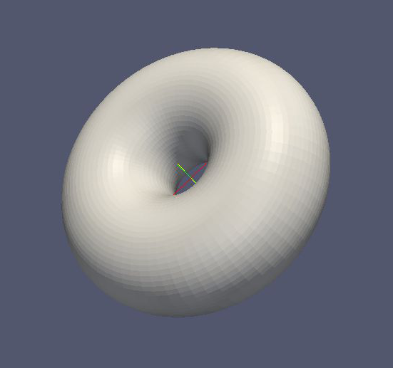

- Works with MeshViewer: Yes.
- Works with GeometryViewer: Yes.

An XML example is as follows:

.. code-block:: xml

    <cut_torus_surface name="cut_torus_surface" z1="0.3" r1="0.1" z2="-0.1" r2="0.2" radius="0.3" right="true" short="true" toroidal_mesh_count="128" axial_mesh_count="256"/>

The parameters are:

- z: z coordinate of the center in meters
- r: r coordinate of the center in meters
- radius: the toroidal radius in meters
- toroidal_mesh_count: toroidal mesh parameter (default is 64)
- axial_mesh_count: axial mesh parameter (default is 64)

Cut Torus Surface
"""""""""""""""""""

Produces an angularly limited toroidal section centered on the z axis.

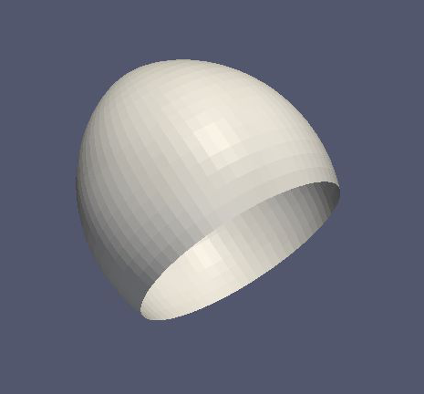

- Works with MeshViewer: Yes.
- Works with GeometryViewer: Yes.

An XML example is as follows:

.. code-block:: xml

    <torus_surface name="torus_surface" z="0.2" r="0.5" radius="0.35" toroidal_mesh_count="256" axial_mesh_count="512"/>

The parameters are:

- z1: the first z coordinate in meters
- r1: the first r coordinate in meters
- z2: the second z coordinate in meters
- r2: the second r coordinate in meters
- radius: the toroidal radius in meters
- right: is the arc on the right side of the directed line connecting point 1 to point 2?
- short: does the arc subtend less than pi radians?
- toroidal_mesh_count: toroidal mesh parameter (default is 64)
- axial_mesh_count: axial mesh parameter (default is 64)

Spaces
--------

Spaces are considered distinct from surfaces as they are (water-tight) volumes. The cannot be open or have holes which
puncture their boundaries. In the *Kassiopeia* interface, spaces are treated very differently than surfaces and have
different features on purposes.

Extruded Spaces
~~~~~~~~~~~~~~~~

Extruded spaces are from in a manner similar to extruded surfaces, the only difference being that they also provide
planar caps to fully enclose a central volume.

Extruded Circle Space
"""""""""""""""""""""""""

Generates a volume by extruding a cycle (cynlinder).

.. image:: _images/kgeobag_extruded_circle_space_model.png
   :width: 400pt

- Works with MeshViewer: Yes.
- Works with GeometryViewer: Yes.

An XML example is as follows:

.. code-block:: xml

    <extruded_circle_space name="extruded_circle_space" zmin="-0.1" zmax="0.1" extruded_mesh_count="32" extruded_mesh_power="1" flattened_mesh_count="28" flattened_mesh_power="1.4">
        <circle x="0.1" y="0.5" radius="0.3" circle_mesh_count="128"/>
    </extruded_circle_space>

Extruded Poly-Loop Space
"""""""""""""""""""""""""""

Generates a volume by extruding a poly-loop.

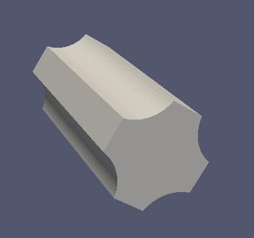

- Works with MeshViewer: Yes.
- Works with GeometryViewer: Yes.

An XML example is as follows:

.. code-block:: xml

    <extruded_poly_loop_space name="extruded_poly_loop_space" zmin="-0.7" zmax="0.7" extruded_mesh_count="37" extruded_mesh_power="6.3" flattened_mesh_count="28" flattened_mesh_power="1.4">
        <poly_loop>
            <start_point x="0.3" y="0.3"/>
            <next_line x="0.3" y="0.5" line_mesh_count="36" line_mesh_power="2.5"/>
            <next_arc x="0.1" y="0.7" radius="0.25" right="false" short="true" arc_mesh_count="64"/>
            <next_line x="-0.1" y="0.7" line_mesh_count="36" line_mesh_power="2.5"/>
            <next_arc x="-0.3" y="0.5" radius="0.25" right="false" short="true" arc_mesh_count="64"/>
            <next_line x="-0.3" y="0.3" line_mesh_count="36" line_mesh_power="2.5"/>
            <next_arc x="-0.1" y="0.1" radius="0.25" right="false" short="true" arc_mesh_count="64"/>
            <next_line x="0.1" y="0.1" line_mesh_count="36" line_mesh_power="2.5"/>
            <last_arc radius="0.25" right="false" short="true" arc_mesh_count="64"/>
        </poly_loop>
    </extruded_poly_loop_space>

Rotated Spaces
~~~~~~~~~~~~~~~~

Rotated Line Segment
"""""""""""""""""""""

Generates a volume enclosed by a surface of revolution produced from rotating a line segement.

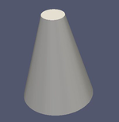

- Works with GeometryViewer: Yes.
- Works with MeshViewer: Yes.

An XML example is as follows:

.. code-block:: xml

    <rotated_line_segment_space name="rotated_line_segment_space" rotated_mesh_count="100" flattened_mesh_count="10" flattened_mesh_power="2.2">
        <line_segment x1="0.15" y1="0.1" x2="-0.1" y2="0.05" line_mesh_count="10" line_mesh_power="2.2"/>
    </rotated_line_segment_space>

Rotated Arc Segment
"""""""""""""""""""""

Generates a volume enclosed by a surface of revolution produced from rotating an arc segment.

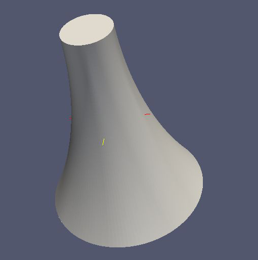

- Works with GeometryViewer: Yes.
- Works with MeshViewer: Yes.

An XML example is as follows:

.. code-block:: xml

    <rotated_arc_segment_space name="rotated_arc_segment_space" rotated_mesh_count="128" flattened_mesh_count="10" flattened_mesh_power="1.5">
        <arc_segment x1="0.15" y1="0.1" x2="-0.1" y2="0.03" radius="0.5" right="true" short="true" arc_mesh_count="64"/>
    </rotated_arc_segment_space>

Rotated Poly-Line Space
"""""""""""""""""""""""""

Generates a volume enclosed by a surface of revolution produced from rotating a poly-line.

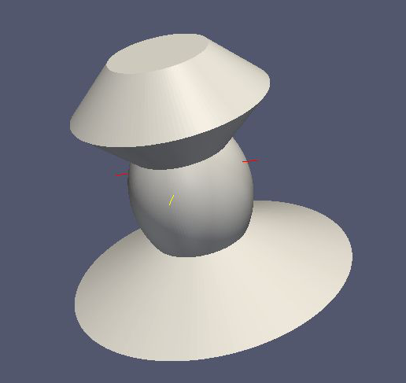

- Works with GeometryViewer: Yes.
- Works with MeshViewer: Yes.

An XML example is as follows:

.. code-block:: xml

    <rotated_poly_line_space name="rotated_poly_line_reverse_space" rotated_mesh_count="128" flattened_mesh_count="36" flattened_mesh_power="3.8">
        <poly_line>
            <start_point x="-0.1" y="0.1"/>
            <next_arc x="-0.3" y="0.3" radius="0.315" right="false" short="true" arc_mesh_count="24"/>
            <next_line x="0.2" y="0.4" line_mesh_count="52" line_mesh_power="3.5"/>
            <next_line x="0.1" y="0.1" line_mesh_count="24" line_mesh_power="2."/>
        </poly_line>
    </rotated_poly_line_space>

Rotated Circle Space
"""""""""""""""""""""

Generates a volume by rotating a circle (torus).

.. image:: _images/kgeobag_rotated_circle_space_model.png
   :width: 400pt

- Works with GeometryViewer: Yes.
- Works with MeshViewer: Yes.

An XML example is as follows:

.. code-block:: xml

    <rotated_circle_space name="rotated_circle_space" rotated_mesh_count="128">
        <circle x="0.1" y="0.5" radius="0.3" circle_mesh_count="128"/>
    </rotated_circle_space>

Rotated Poly-Loop Space
"""""""""""""""""""""""""

Generates a volume enclosed by a surface of revolution produced from rotating a poly-loop

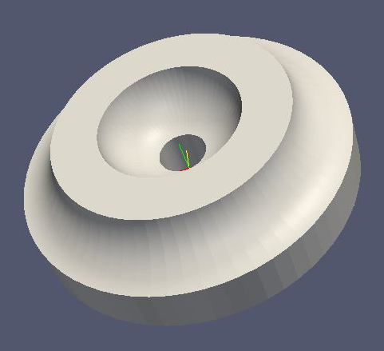

- Works with GeometryViewer: No.
- Works with MeshViewer: Yes.

An XML example is as follows:

.. code-block:: xml

    <rotated_poly_loop_space name="rotated_poly_loop_space" rotated_mesh_count="64">
        <poly_loop>
            <start_point x="0.3" y="0.3"/>
            <next_line x="0.3" y="0.5" line_mesh_count="36" line_mesh_power="2.5"/>
            <next_arc x="0.1" y="0.7" radius="0.25" right="false" short="true" arc_mesh_count="64"/>
            <next_line x="-0.1" y="0.7" line_mesh_count="36" line_mesh_power="2.5"/>
            <next_arc x="-0.3" y="0.5" radius="0.25" right="false" short="true" arc_mesh_count="64"/>
            <next_line x="-0.3" y="0.3" line_mesh_count="36" line_mesh_power="2.5"/>
            <next_arc x="-0.1" y="0.1" radius="0.25" right="false" short="true" arc_mesh_count="64"/>
            <next_line x="0.1" y="0.1" line_mesh_count="36" line_mesh_power="2.5"/>
            <last_arc radius="0.25" right="false" short="true" arc_mesh_count="64"/>
        </poly_loop>
    </rotated_poly_loop_space>

Special Spaces
~~~~~~~~~~~~~~~~

These spaces are just specific cases of the more general space types already listed. They have been made separately
available because of their common use. As with the special surfaces, these elements may be used to design a simple
simulation geometry.

Cylinder Space
"""""""""""""""

Produces a cylinder space centered on the local z axis.

.. image:: _images/kgeobag_cylinder_space_model.png
   :width: 400pt

- Works with MeshViewer: Yes.
- Works with GeometryViewer: Yes.

An XML example is as follows:

.. code-block:: xml

    <cylinder_space name="cylinder_space" z1="-0.4" z2="0.4" r="0.3" longitudinal_mesh_count="32" longitudinal_mesh_power="2." radial_mesh_count="24" radial_mesh_power="1.5" axial_mesh_count="32"/>

The parameters are:
    - z1: the first z coordinate in meters
    - z2: the second z coordinate in meters
    - r: the radius in meters
    - longitudinal_mesh_count: longitudinal mesh parameter (default is 1)
    - longitudinal_mesh_power: longitudinal meshing power (default is 1.)
    - radial_mesh_count: radial mesh parameter (default is 1)
    - radial_mesh_power: radial meshing power (default is 1.)
    - axial_mesh_count: axial mesh parameter (default is 16)

Cone Space
"""""""""""""

Generates a conical space centered on the local z axis.

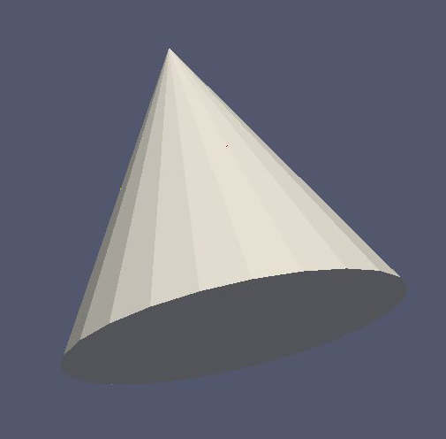

- Works with MeshViewer: Yes.
- Works with GeometryViewer: Yes.

An XML example is as follows:

.. code-block:: xml

    <cone_space name="cone_space" za="-0.1" zb="0.65" rb="0.4" longitudinal_mesh_count="28" longitudinal_mesh_power="1.8" radial_mesh_count="56" radial_mesh_power="1." axial_mesh_count="24"/>

The parameters are:

- za: apex z position in meters
- zb: base z position in meters
- rb: base radius in meters
- longitudinal_mesh_count: longitudinal mesh parameter (default is 1)
- longitudinal_mesh_power: longitudinal meshing power (default is 1.)
- radial_mesh_count: radial mesh parameter (default is 1)
- radial_mesh_power: radial meshing power (default is 1.)
- axial_mesh_count: axial mesh parameter (default is 16)

Cut Cone Space
"""""""""""""""

Produces a cut cone volume (frustrum).

.. image:: _images/kgeobag_cut_cone_space_model.png
   :width: 400pt

- Works with MeshViewer: Yes.
- Works with GeometryViewer: Yes.

An XML example is as follows:

.. code-block:: xml

    <cut_cone_space name="cut_cone_space" z1="-0.3" r1="0.4" z2="0.2" r2="0.2" longitudinal_mesh_count="88" longitudinal_mesh_power="1." radial_mesh_count="28" radial_mesh_power="1.6" axial_mesh_count="50"/>

The parameters are:

- z1: the first  z coordinate in meters
- r1: the first r coordinate in meters
- z2: the second z coordinate in meters
- r2: the second r coordinate in meters
- longitudinal_mesh_count: longitudinal mesh parameter (default is 1)
- longitudinal_mesh_power: longitudinal meshing power (default is 1.)
- radial_mesh_count: radial mesh parameter (default is 1)
- radial_mesh_power: radial meshing power (default is 1.)
- axial_mesh_count: axial mesh parameter (default is 16)

- Works with MeshViewer: Yes.
- Works with GeometryViewer: Yes.

Torus Space
"""""""""""""

Produces a torus centered on the local z axis.

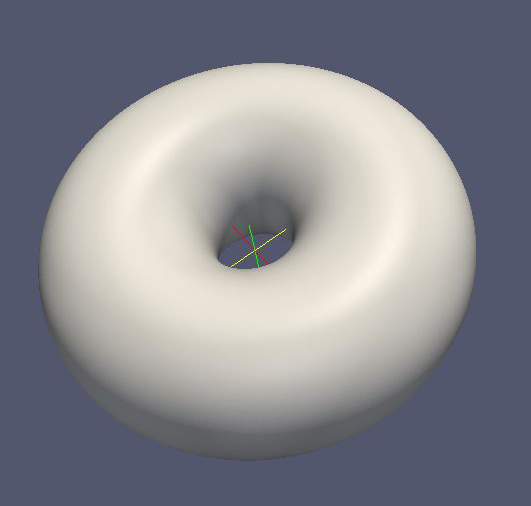

- Works with MeshViewer: Yes.
- Works with GeometryViewer: Yes.

An XML example is as follows:

.. code-block:: xml

    <torus_space name="torus_space" z="0.2" r="0.5" radius="0.35" toroidal_mesh_count="256" axial_mesh_count="512"/>

The parameters are:

- z: z coordinate of the center in meters
- r: r coordinate of the center in meters
- radius: the toroidal radius in meters
- toroidal_mesh_count: toroidal mesh parameter (default is 64)
- axial_mesh_count: axial mesh parameter (default is 64)

Cylinder Tube Space
"""""""""""""""""""""

Creates a tube, (a hollow cylinder with finite wall thickness).

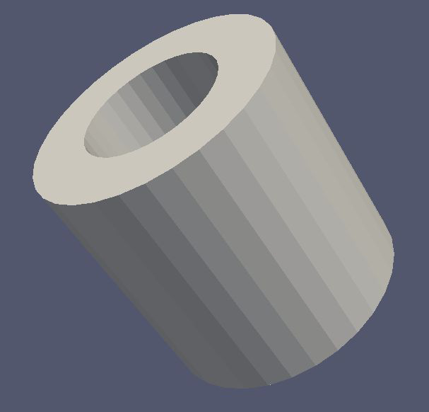

- Works with MeshViewer: Yes.
- Works with GeometryViewer: Yes.

An XML example is as follows:

.. code-block:: xml

    <cylinder_tube_space name="cylinder_tube_space" z1="-0.45" r1="0.25" z2="0.45" r2="0.45" longitudinal_mesh_count="32" longitudinal_mesh_power="2." radial_mesh_count="24" radial_mesh_power="1.5" axial_mesh_count="32"/>

The parameters are:

- z1: the first z position in meters
- z2: the second z position in meters
- r1: the first radius in meters
- r2: the second radius in meters
- longitudinal_mesh_count: longitudinal mesh parameter (default is 1)
- longitudinal_mesh_power: longitudinal meshing power (default is 1.)
- radial_mesh_count: radial mesh parameter (default is 1)
- radial_mesh_power: radial meshing power (default is 1.)
- axial_mesh_count: axial mesh parameter (default is 16)

Cut Cone Tube Space
"""""""""""""""""""""

Generates a tubular frustrum (a cut cone with central axially symmetric void).

.. image:: _images/kgeobag_cut_cone_tube_space_model.png
   :width: 400pt

- Works with MeshViewer: Yes.
- Works with GeometryViewer: Yes.

An XML example is as follows:

.. code-block:: xml

    <cut_cone_tube_space name="cut_cone_tube_space" z1="-0.3" z2="0.3" r11="0.3" r12="0.48" r21="0.1" r22="0.18" longitudinal_mesh_count="32" longitudinal_mesh_power="2." radial_mesh_count="24" radial_mesh_power="1.5" axial_mesh_count="32"/>

The parameters are:

- z1: the first side's z position in meters
- z2: the second side's z position in meters
- r11: one of the side's first radius in meters
- r12: the other side's first radius in meters
- r21: one of the side's second radius in meters
- r22: the other side' second radius in meters
- longitudinal_mesh_count: longitudinal mesh parameter (default is 1)
- longitudinal_mesh_power: longitudinal meshing power (default is 1.)
- radial_mesh_count: radial mesh parameter (default is 1)
- radial_mesh_power: radial meshing power (default is 1.)
- axial_mesh_count: axial mesh parameter (default is 16)

Box Space
"""""""""""""

Produces an axis aligned rectangular prism.

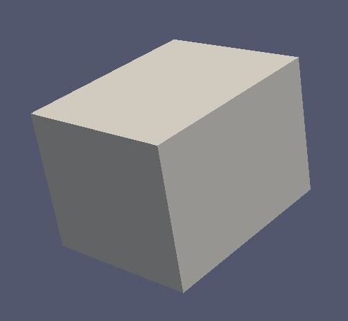

- Works with MeshViewer: No.
- Works with GeometryViewer: Yes.

An XML example is as follows:

.. code-block:: xml

    <box_space name="box_space" xa="0.1" xb="0.65" x_mesh_count="1000" x_mesh_power="5.5" ya="-0.4" yb="0.3" y_mesh_count="100" y_mesh_power="1.8" za="0.4" zb="-0.1" z_mesh_count="10" z_mesh_power="1."/>

The parameters are:

- xa: one of the x extrema in meters
- xb: the other x extremum in meters
- x_mesh_count: x mesh count
- x_mesh_power: x mesh power
- ya: one of the y extrema in meters
- yb: the other y extremum in meters
- y_mesh_count: y mesh count
- y_mesh_power: y mesh power
- za: one of the z extrema in meters
- zb: the other z extremum in meters
- z_mesh_count: z mesh count
- z_mesh_power: z mesh power

.. _complex-kgeobag-label:

Complex Shapes in KGeoBag
=========================

This section describes the more complicated shapes available in *KGeoBag*. Since as of yet, *KGeoBag* lacks the ability
to perform boolean operations on solids (constructive solid geometry), shapes which cannot be represented as an assembly
of basic shapes must be explicitly defined in C++. However, to augment the basic shapes, *KGeoBag* provides some
additional complex shapes that are commonly encountered in experimental structures such as vacuum chambers, etc.

Some of the examples in this section make use of the the more advanced features of the XML parser, including loops,
conditional statements, and equation evaluation.

Surfaces
----------

Pump Port Surface
~~~~~~~~~~~~~~~~~~

The shape creates a tube-like surface with circular or rectangular pump ports (e.g. for vacuum chambers). The
coordinates (x,y,z) are the end points of the ports. The ports can only be created in radial direction.

- Works with MeshViewer: Yes.
- Works with GeometryViewer: No.

An XML example is as follows:

.. code-block:: xml

    <port_housing_surface name="example_port_housing_surface">
        <port_housing x1="0." y1="0." z1="-1." x2="0." y2="0." z2="1." radius="0.4" longitudinal_mesh_count="50" axial_mesh_count="50">
            <circular_port x="1.5" y="1.5" z="-.3" radius="0.33"/>
            <rectangular_port x="0." y="1." z=".3" length="0.3" width=".15"/>
            <circular_port x="-1./sqrt(2.)" y="-1./sqrt(2.)" z="-.5" radius="0.053"/>
        </port_housing>
    </port_housing_surface>

Conic Section Pump Port Surface
~~~~~~~~~~~~~~~~~~~~~~~~~~~~~~~~~

This shape is a cut cone surface with circular ports. The ports can be created either orthogonal to the surface or
parallel to the cone axis (paraxial). The coordinates (x,y,z) are the end points of the port.

- Works with MeshViewer: Yes.
- Works with GeometryViewer: No.

An XML example is as follows:

.. code-block:: xml

    <conic_section_port_housing_surface name="example_conic_section_port_housing_surface">
      <conic_section_port_housing r1="2.75" z1="-1.79675" r2="0.25" z2="-0.067" longitudinal_mesh_count="100" axial_mesh_count="100">
    <define name="offset" value="2."/>
    <define name="nPorts" value="6"/>
    <loop variable="i" start="0" end="{[nPorts]-1}" step="1">
      <if condition="{([i] mod 2) eq 0}">
        <orthogonal_port x="{[offset]*TMath::Cos(2.*TMath::Pi()*[i]/[nPorts])}" y="{[offset]*TMath::Sin(2.*TMath::Pi()*[i]/[nPorts])}" z=".5" radius="{.05 + .05*([i]+1)}"/>
      </if>
      <if condition="{([i] mod 2) eq 1}">
        <paraxial_port x="{[offset]*TMath::Cos(2.*TMath::Pi()*[i]/[nPorts])}" y="{[offset]*TMath::Sin(2.*TMath::Pi()*[i]/[nPorts])}" z=".5" radius="{.05 + .05*([i]+1)}"/>
      </if>
    </loop>
      </conic_section_port_housing>
    </conic_section_port_housing_surface>

Beam Surface
~~~~~~~~~~~~~~

A beam creates a pipe which connects two polygons at each end. The polygons must have the same number of vertices but
may lie in planes which are not parallel to each other. For the description of the parameters involved see the images
below.

In the following example, the variable ``[poly]`` dictates the the number of vertexes in each polygon at the ends of the
beam.

- Works with MeshViewer: Yes.
- Works with GeometryViewer: No.

An XML example is as follows:

.. code-block:: xml

    <beam_surface name="example_beam_surface">
        <beam longitudinal_mesh_count="20" axial_mesh_count="20">
            <define name="poly" value="50"/>
            <define name="radius" value=".5"/>
            <define name="z_start_max" value="-.25"/>
            <define name="z_start_min" value="-.75"/>
            <define name="z_end_max" value=".75"/>
            <define name="z_end_min" value=".25"/>
            <loop variable="i" start="0" end="[poly]" step="1">
            <start_line x1="{[radius]*TMath::Cos(2.*TMath::Pi()*[i]/[poly])}" y1="{[radius]*TMath::Sin(2.*TMath::Pi()*[i]/[poly])}" z1="{([z_start_max]+[z_start_min])*.5 + ([z_start_max]-[z_start_min])*TMath::Cos(2.*TMath::Pi()*[i]/[poly])}" x2="{[radius]*TMath::Cos(2.*TMath::Pi()*(([i]+1) mod [poly])/[poly])}" y2="{[radius]*TMath::Sin(2.*TMath::Pi()*(([i]+1) mod [poly])/[poly])}" z2="{([z_start_max]+[z_start_min])*.5 + ([z_start_max]-[z_start_min])*TMath::Cos(2.*TMath::Pi()*(([i]+1) mod [poly])/[poly])}"/>
                <end_line x1="{[radius]*TMath::Cos(2.*TMath::Pi()*[i]/[poly])}" y1="{[radius]*TMath::Sin(2.*TMath::Pi()*[i]/[poly])}" z1="{([z_end_max]+[z_end_min])*.5 + ([z_end_max]-[z_end_min])*TMath::Cos(2.*TMath::Pi()*[i]/[poly])}" x2="{[radius]*TMath::Cos(2.*TMath::Pi()*(([i]+1) mod [poly])/[poly])}" y2="{[radius]*TMath::Sin(2.*TMath::Pi()*(([i]+1) mod [poly])/[poly])}" z2="{([z_end_max]+[z_end_min])*.5 + ([z_end_max]-[z_end_min])*TMath::Cos(2.*TMath::Pi()*(([i]+1) mod [poly])/[poly])}"/>
            </loop>
        </beam>
    </beam_surface>

Multi-cut surfaces
"""""""""""""""""""

The beam shape can also be used to create more complex objects, such as a cut cone with two more cuts at both ends.

An XML example is as follows:

.. code-block:: xml

    <beam_surface name="example_multicut_surface">
        <beam longitudinal_mesh_count="60" axial_mesh_count="60">
            <define name="z_start" value="-1."/>
            <define name="z_end" value="1."/>
            <define name="radius_start" value="2."/>
            <define name="radius_end" value="1."/>
            <define name="phi_start" value="0."/>
            <define name="theta_start" value="30."/>
            <define name="phi_end" value="90."/>
            <define name="theta_end" value="30."/>
            <define name="poly" value="100"/>
            <loop variable="i" start="0" end="[poly]" step="1">
                <start_line x1="{[radius_start]*(cos(2.*TMath::Pi()*([i]/[poly]-[phi_start]/360.))*cos([phi_start]/180.*TMath::Pi()) - sin(2.*TMath::Pi()*([i]/[poly]-[phi_start]/360.))*sin([phi_start]/180.*TMath::Pi()))}"
                                y1="{[radius_start]*cos([theta_start]/180.*TMath::Pi())*(cos(2.*TMath::Pi()*([i]/[poly]-[phi_start]/360.))*sin([phi_start]/180.*TMath::Pi()) +sin(2.*TMath::Pi()*([i]/[poly]-[phi_start]/360.))*cos([phi_start]/180.*TMath::Pi()))}"
                                z1="{[radius_start]*sin([theta_start]/180.*TMath::Pi())*(cos(2.*TMath::Pi()*([i]/[poly]-[phi_start]/360.))*sin([phi_start]/180.*TMath::Pi()) +sin(2.*TMath::Pi()*([i]/[poly]-[phi_start]/360.))*cos([phi_start]/180.*TMath::Pi()))+[z_start]}"
                                x2="{[radius_start]*(cos(2.*TMath::Pi()*((([i]+1) mod [poly])/[poly]-[phi_start]/360.))*cos([phi_start]/180.*TMath::Pi()) -sin(2.*TMath::Pi()*((([i]+1) mod [poly])/[poly]-[phi_start]/360.))*sin([phi_start]/180.*TMath::Pi()))}"
                                y2="{[radius_start]*cos([theta_start]/180.*TMath::Pi())*(cos(2.*TMath::Pi()*((([i]+1) mod [poly])/[poly]-[phi_start]/360.))*sin([phi_start]/180.*TMath::Pi()) +sin(2.*TMath::Pi()*((([i]+1) mod [poly])/[poly]-[phi_start]/360.))*cos([phi_start]/180.*TMath::Pi()))}"
                                z2="{[radius_start]*sin([theta_start]/180.*TMath::Pi())*(cos(2.*TMath::Pi()*((([i]+1) mod [poly])/[poly]-[phi_start]/360.))*sin([phi_start]/180.*TMath::Pi()) + sin(2.*TMath::Pi()*((([i]+1) mod [poly])/[poly]-[phi_start]/360.))*cos([phi_start]/180.*TMath::Pi()))+[z_start]}"
                />
                <end_line x1="{[radius_end]*(cos(2.*TMath::Pi()*([i]/[poly]-[phi_end]/360.))*cos([phi_end]/180.*TMath::Pi()) -sin(2.*TMath::Pi()*([i]/[poly]-[phi_end]/360.))*sin([phi_end]/180.*TMath::Pi()))}"
                          y1="{[radius_end]*cos([theta_end]/180.*TMath::Pi())*(cos(2.*TMath::Pi()*([i]/[poly]-[phi_end]/360.))*sin([phi_end]/180.*TMath::Pi()) + sin(2.*TMath::Pi()*([i]/[poly]-[phi_end]/360.))*cos([phi_end]/180.*TMath::Pi()))}"
                          z1="{[radius_end]*sin([theta_end]/180.*TMath::Pi())*(cos(2.*TMath::Pi()*([i]/[poly]-[phi_end]/360.))*sin([phi_end]/180.*TMath::Pi()) +sin(2.*TMath::Pi()*([i]/[poly]-[phi_end]/360.))*cos([phi_end]/180.*TMath::Pi()))+[z_end]}"
                          x2="{[radius_end]*(cos(2.*TMath::Pi()*((([i]+1) mod [poly])/[poly]-[phi_end]/360.))*cos([phi_end]/180.*TMath::Pi()) - sin(2.*TMath::Pi()*((([i]+1) mod [poly])/[poly]-[phi_end]/360.))*sin([phi_end]/180.*TMath::Pi()))}"
                          y2="{[radius_end]*cos([theta_end]/180.*TMath::Pi())*(cos(2.*TMath::Pi()*((([i]+1) mod [poly])/[poly]-[phi_end]/360.))*sin([phi_end]/180.*TMath::Pi()) + sin(2.*TMath::Pi()*((([i]+1) mod [poly])/[poly]-[phi_end]/360.))*cos([phi_end]/180.*TMath::Pi()))}"
                          z2="{[radius_end]*sin([theta_end]/180.*TMath::Pi())*(cos(2.*TMath::Pi()*((([i]+1) mod [poly])/[poly]-[phi_end]/360.))*sin([phi_end]/180.*TMath::Pi()) + sin(2.*TMath::Pi()*((([i]+1) mod [poly])/[poly]-[phi_end]/360.))*cos([phi_end]/180.*TMath::Pi()))+[z_end]}"
                />
            </loop>
        </beam>
    </beam_surface>

Rod Surface
~~~~~~~~~~~~~

The rod element can be used to create a rod like structure along a series of linear segments in three dimensional space.
The rod has a circular cross section which is approximated by a polygon (governed by the ``axial_mesh_count``
parameter). This shape is defined by a radius (thickness of the rod) and a piecewise linear path specified by a by a
list of in-order vertexes.

- Works with MeshViewer: Yes.
- Works with GeometryViewer: No.

The following XML example creates a helix shaped rod surface, as follows:

.. code-block:: xml

    <rod_surface name="example_rod_surface">
        <rod radius="0.2" longitudinal_mesh_count="100" axial_mesh_count="12">
            <define name="n_turns" value="5"/>
            <define name="n_segments_per_turn" value="36"/>
            <define name="coil_radius" value="1."/>
            <define name="height_per_turn" value="1."/>
            <loop variable="i" start="0" end="{[n_turns]*[n_segments_per_turn]}" step="1">
                <vertex x="{[coil_radius]*TMath::Cos(2.*TMath::Pi()*([i] mod [n_segments_per_turn])/[n_segments_per_turn])}" y="{[coil_radius]*TMath::Sin(2.*TMath::Pi()*([i] mod [n_segments_per_turn])/[n_segments_per_turn])}" z="{[i]*[height_per_turn]/[n_segments_per_turn]}"/>
            </loop>
        </rod>
    </rod_surface>

Extruded Surfaces with holes
~~~~~~~~~~~~~~~~~~~~~~~~~~~~~~

With this element it is possible to create an extruded surface (from a poly-loop like curve) with arbitrary holes in it.
The commands ``<inner_...>`` and ``<outer_...>`` define whether the extruded path will produce an outer or an inner
surface. Therefore, they define if there will be a hole in the surface and its shape.

- Works with MeshViewer: Yes.
- Works with GeometryViewer: No.

An XML example is as follows:

.. code-block:: xml

    <extruded_surface name="example_extruded_surface">
        <extruded_object z_min="-1." z_max="1." longitudinal_mesh_count="40" longitudinal_mesh_power="2." closed_form="1">
        <inner_line x1="-.5" y1="-.5" x2="-.5" y2=".5"/>
            <inner_arc x1="-.5" y1=".5" x2=".5" y2=".5" radius="1." positive_orientation="0"/>
            <inner_arc x1=".5" y1=".5" x2=".5" y2="-.5" radius="1." positive_orientation="1"/>
            <inner_arc x1=".5" y1="-.5" x2="-.5" y2="-.5" radius="1." positive_orientation="0"/>
            <outer_arc x1="-1." y1="-1." x2="-1." y2="1." radius="{TMath::Sqrt(2.)}" positive_orientation="0"/>
            <outer_line x1="-1." y1="1." x2="1." y2="1."/>
            <outer_line x1="1." y1="1." x2="1." y2="-1."/>
            <outer_line x1="1." y1="-1." x2="-1." y2="-1."/>
        </extruded_object>
    </extruded_surface>

Rotated Surface
~~~~~~~~~~~~~~~~~~~~

This shape is very similar to rotated poly-line surface in :ref:`basic-kgeobag-label` but with other variables. The
coordinates in use in this shape are cylindrical. (z,r)

- Works with MeshViewer: Yes.
- Works with GeometryViewer: No.

An XML example is as follows:

.. code-block:: xml

    <rotated_surface name="example_rotated_surface">
        <rotated_object longitudinal_mesh_count_start="10" longitudinal_mesh_count_end="20" longitudinal_mesh_power="2.">
            <line z1="-1." r1="0." z2="-1." r2="1.5"/>
            <line z1="-1." r1="1.5" z2="0." r2="1.5"/>
            <line z1="0." r1="1.5" z2="0." r2=".5"/>
            <line z1="0." r1=".5" z2="1." r2=".5"/>
            <arc z1="1." r1=".5" z2="1." r2="1." radius=".5" positive_orientation="0"/>
            <line z1="1." r1="1." z2="2." r2="1."/>
            <arc z1="2." r1="1." z2="0." r2="2." radius="2" positive_orientation="1"/>
        </rotated_object>
    </rotated_surface>

Spaces
--------

These elements generate volume (filled) objects. The for the following geometries is not supported at the moment. For
the definition of the variables see the corresponding surfaces above.

Pump Port Space
~~~~~~~~~~~~~~~~~~

For visualization, see the above pump port surface.

- Works with GeometryViewer: No.
- Works with MeshViewer: No.

An XML example is as follows:

.. code-block:: xml

    <port_housing_space name="example_port_housing_space">
        <port_housing x1="0." y1="0." z1="-1." x2="0." y2="0." z2="1." radius="0.4" longitudinal_mesh_count="50" axial_mesh_count="50">
            <circular_port x="1.5" y="1.5" z="-.3" radius="0.33"/>
            <rectangular_port x="0." y="1." z=".3" length="0.3" width=".15"/>
            <circular_port x="-1./sqrt(2.)" y="-1./sqrt(2.)" z="-.5" radius="0.053"/>
        </port_housing>
    </port_housing_space>

Conic Section Pump Port Space
~~~~~~~~~~~~~~~~~~~~~~~~~~~~~~~~~

For visualization, see the above conic section pump port surface.

- Works with GeometryViewer: No.
- Works with MeshViewer: No.

An XML example is as follows:

.. code-block:: xml

    <conic_section_port_housing_space name="example_conic_section_port_housing_space">
        <conic_section_port_housing r1="2.75" z1="-1.79675" r2="0.25" z2="-0.067" longitudinal_mesh_count="100" axial_mesh_count="100">
            <define name="offset_" value="2."/>
            <define name="nPorts_" value="6"/>
            <loop variable="i" start="0" end="{[nPorts_]-1}" step="1">
                <if condition="{([i] mod 2) eq 0}">
                    <orthogonal_port x="{[offset_]*TMath::Cos(2.*TMath::Pi()*[i]/[nPorts_])}" y="{[offset_]*TMath::Sin(2.*TMath::Pi()*[i]/[nPorts_])}" z=".5" radius="{.05 + .05*([i]+1)}"/>
                </if>
                <if condition="{([i] mod 2) eq 1}">
                    <paraxial_port x="{[offset_]*TMath::Cos(2.*TMath::Pi()*[i]/[nPorts_])}" y="{[offset_]*TMath::Sin(2.*TMath::Pi()*[i]/[nPorts_])}" z=".5" radius="{.05 + .05*([i]+1)}"/>
                </if>
            </loop>
        </conic_section_port_housing>
    </conic_section_port_housing_space>

Beam Space
~~~~~~~~~~~~~

For visualization, see the beam surface above.

- Works with GeometryViewer: No.
- Works with MeshViewer: No.

An XML example is as follows:

.. code-block:: xml

    <beam_space name="example_beam_space">
        <beam longitudinal_mesh_count="20" axial_mesh_count="20">
            <define name="poly_" value="50"/>
            <define name="radius_" value=".5"/>
            <define name="z_start_max_" value="-.25"/>
            <define name="z_start_min_" value="-.75"/>
            <define name="z_end_max_" value=".75"/>
            <define name="z_end_min_" value=".25"/>
            <loop variable="i" start="0" end="[poly_]" step="1">
                <start_line x1="{[radius_]*TMath::Cos(2.*TMath::Pi()*[i]/[poly_])}" y1="{[radius_]*TMath::Sin(2.*TMath::Pi()*[i]/[poly_])}" z1="{([z_start_max_]+[z_start_min_])*.5 + ([z_start_max_]-[z_start_min_])*TMath::Cos(2.*TMath::Pi()*[i]/[poly_])}" x2="{[radius_]*TMath::Cos(2.*TMath::Pi()*(([i]+1) mod [poly_])/[poly_])}" y2="{[radius_]*TMath::Sin(2.*TMath::Pi()*(([i]+1) mod [poly_])/[poly_])}" z2="{([z_start_max_]+[z_start_min_])*.5 + ([z_start_max_]-[z_start_min_])*TMath::Cos(2.*TMath::Pi()*(([i]+1) mod [poly_])/[poly_])}"/>
                <end_line x1="{[radius_]*TMath::Cos(2.*TMath::Pi()*[i]/[poly_])}" y1="{[radius_]*TMath::Sin(2.*TMath::Pi()*[i]/[poly_])}" z1="{([z_end_max_]+[z_end_min_])*.5 + ([z_end_max_]-[z_end_min_])*TMath::Cos(2.*TMath::Pi()*[i]/[poly_])}" x2="{[radius_]*TMath::Cos(2.*TMath::Pi()*(([i]+1) mod [poly_])/[poly_])}" y2="{[radius_]*TMath::Sin(2.*TMath::Pi()*(([i]+1) mod [poly_])/[poly_])}" z2="{([z_end_max_]+[z_end_min_])*.5 + ([z_end_max_]-[z_end_min_])*TMath::Cos(2.*TMath::Pi()*(([i]+1) mod [poly_])/[poly_])}"/>
            </loop>
        </beam>
    </beam_space>

Rod Space
~~~~~~~~~~

For visualization, see the above rod surface.

- Works with GeometryViewer: No.
- Works with MeshViewer: No.

An XML example is as follows:

.. code-block:: xml

    <rod_space name="example_rod_space">
        <rod radius="0.2" longitudinal_mesh_count="100" axial_mesh_count="12">
            <define name="n_turns_" value="5"/>
            <define name="n_segments_per_turn_" value="36"/>
            <define name="coil_radius_" value="1."/>
            <define name="height_per_turn_" value="1."/>
            <loop variable="i" start="0" end="{[n_turns_]*[n_segments_per_turn_]}" step="1">
                <vertex x="{[coil_radius_]*TMath::Cos(2.*TMath::Pi()*([i] mod [n_segments_per_turn_])/[n_segments_per_turn_])}" y="{[coil_radius_]*TMath::Sin(2.*TMath::Pi()*([i] mod [n_segments_per_turn_])/[n_segments_per_turn_])}" z="{[i]*[height_per_turn_]/[n_segments_per_turn_]}"/>
            </loop>
        </rod>
    </rod_space>

Extruded Space
~~~~~~~~~~~~~~~~~~

For visualization see the above extruded space.

- Works with GeometryViewer: No.
- Works with MeshViewer: No.

An XML example is as follows:

.. code-block:: xml

    <extruded_space name="example_extruded_space">
        <extruded_object z_min="-1." z_max="1." longitudinal_mesh_count="40" longitudinal_mesh_power="2." closed_form="1">
            <inner_line x1="-.5" y1="-.5" x2="-.5" y2=".5"/>
            <inner_arc x1="-.5" y1=".5" x2=".5" y2=".5" radius="1." positive_orientation="0"/>
            <inner_arc x1=".5" y1=".5" x2=".5" y2="-.5" radius="1." positive_orientation="1"/>
            <inner_arc x1=".5" y1="-.5" x2="-.5" y2="-.5" radius="1." positive_orientation="0"/>
            <outer_arc x1="-1." y1="-1." x2="-1." y2="1." radius="{TMath::Sqrt(2.)}" positive_orientation="0"/>
            <outer_line x1="-1." y1="1." x2="1." y2="1."/>
            <outer_line x1="1." y1="1." x2="1." y2="-1."/>
            <outer_line x1="1." y1="-1." x2="-1." y2="-1."/>
        </extruded_object>
    </extruded_space>

Rotated Space
~~~~~~~~~~~~~~~~

For visualization see the above rotated surface.

- Works with GeometryViewer: No.
- Works with MeshViewer: No.

An XML example is as follows:

.. code-block:: xml

    <rotated_space name="example_rotated_space">
        <rotated_object longitudinal_mesh_count_start="10" longitudinal_mesh_count_end="20" longitudinal_mesh_power="2.">
            <line z1="-1." r1="0." z2="-1." r2="1.5"/>
            <line z1="-1." r1="1.5" z2="0." r2="1.5"/>
            <line z1="0." r1="1.5" z2="0." r2=".5"/>
            <line z1="0." r1=".5" z2="1." r2=".5"/>
            <arc z1="1." r1=".5" z2="1." r2="1." radius=".5" positive_orientation="0"/>
            <line z1="1." r1="1." z2="2." r2="1."/>
            <arc z1="2." r1="1." z2="0." r2="2." radius="2" positive_orientation="1"/>
        </rotated_object>
    </rotated_space>

Shapes from imported files
-----------------------------

As an alternative to defining geometries via the XML file format, one may also use geometric objects from external
files. The only available file format is STL, which is supported by the majority of current 3D design software. The
STL file contains a set of triangles, which are treated as a fully meshed geometry in *KGeoBag*. As such, the geometry
is usable with *KEMField* (for electric field calculation) and *Kassiopeia* (for particle navigation.)

STL File Surface
~~~~~~~~~~~~~~~~~~~

- Works with GeometryViewer: Yes.
- Works with MeshViewer: Yes.

An XML example is as follows:

.. code-block:: xml

    <stl_file_surface name="cube_surface">
        <stl_file file="Menger_sponge.stl" scale="0.5" mesh_count="1"/>
    </stl_file_surface>

    <stl_file_surface name="teapot_lid">
        <stl_file file="Utah_teapot.stl" selector="-2267"/>
    </stl_file_surface>

    <stl_file_surface name="teapot_solid_body">
        <stl_file file="Utah_teapot.stl" selector="2268-"/>
    </stl_file_surface>

Note that because the geometry is defined by an external file, the possible modifications in the *KGeoBag* framework
are limited. Besides the translations/rotations that can be applied to any object, one may also scale the external
geometry or increase its number of mesh elements. If the triangles in the file are sufficienctly ordered, then one
can use the ``selector`` attribute to specify indices of the triangles to be used in *KGeoBag*. In the case of the
``Utah_teapot.stl`` example file, this allows to split the lid from the pot's body.

STL File Space
~~~~~~~~~~~~~~~~~~

For visualization see the above STL file surface.

- Works with GeometryViewer: Yes.
- Works with MeshViewer: Yes.

An XML example is as follows:

.. code-block:: xml

    <stl_file_space name="cube_surface">
        <stl_file file="Menger_sponge.stl" scale="0.5" mesh_count="1"/>
    </stl_file_space>

.. _TFormula: http://root.cern.ch/root/htmldoc/TFormula.html
.. _TMath: http://root.cern.ch/root/htmldoc/TMath.html
.. _PDG: http://pdg.lbl.gov/mc_particle_id_contents.html
.. _Paraview: http://www.paraview.org/
.. _ROOT: https://root.cern.ch/
.. _VTK: http://www.vtk.org/
.. _MKS: https://scienceworld.wolfram.com/physics/MKS.html
.. _XML: https://www.w3.org/TR/xml11/
.. _Xpath: https://www.w3.org/TR/xpath-10/
.. _TinyExpr: https://github.com/codeplea/tinyexpr/
.. _Log4CXX: https://logging.apache.org/log4cxx/

.. rubric:: Footnotes

[1] Daniel Lawrence Furse. Techniques for direct neutrino mass measurement utilizing tritium [beta]-decay. PhD thesis, Massachusetts Institute of Technology, 2015.

[2] Thomas Corona. Methodology and application of high performance electrostatic field simulation in the KATRIN experiment. PhD thesis, University of North Carolina, Chapel Hill, 2014.

[3] John P. Barrett. A Spatially Resolved Study of the KATRIN Main Spectrometer Using a Novel Fast Multipole Method. PhD thesis, Massachusetts Institute of Technology, 2016.
