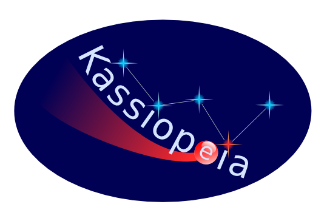

.. Kassiopeia documentation master file, created by
   sphinx-quickstart on Tue Oct 18 13:33:10 2016.
   You can adapt this file completely to your liking, but it should at least
   contain the root `toctree` directive.

Welcome to Kassiopeia's documentation!
**************************************

|Release github|

.. |Release github| image:: https://img.shields.io/github/v/release/KATRIN-Experiment/Kassiopeia
   :target: https://github.com/KATRIN-Experiment/Kassiopeia/releases

|Code Size|

.. |Code Size| image:: https://img.shields.io/github/languages/code-size/KATRIN-Experiment/Kassiopeia
   :target: https://github.com/KATRIN-Experiment/Kassiopeia

|Issues github|

.. |Issues github| image:: https://img.shields.io/github/issues/KATRIN-Experiment/Kassiopeia
   :target: https://github.com/KATRIN-Experiment/Kassiopeia/issues

|Pull Requests github|

.. |Pull Requests github| image:: https://img.shields.io/github/issues-pr/KATRIN-Experiment/Kassiopeia
   :target: https://github.com/KATRIN-Experiment/Kassiopeia/pulls

|Last Commit github|

.. |Last Commit github| image:: https://img.shields.io/github/last-commit/KATRIN-Experiment/Kassiopeia
   :target: https://github.com/KATRIN-Experiment/Kassiopeia/commits

|Contributors github|

.. |Contributors github| image:: https://img.shields.io/github/contributors/KATRIN-Experiment/Kassiopeia
   :target: https://github.com/KATRIN-Experiment/Kassiopeia/graphs/contributors

|Gitter github|

.. |Gitter github| image:: https://badges.gitter.im/kassiopeia-simulation/community.svg
   :target: https://gitter.im/kassiopeia-simulation/community?utm_source=badge&utm_medium=badge&utm_campaign=pr-badge

|Binder github|

.. |Binder github| image:: https://mybinder.org/badge_logo.svg
   :target: https://mybinder.org/v2/gh/KATRIN-Experiment/KassiopeiaBinder/HEAD

This simulation package by `the KATRIN collaboration`_ allows to run highly customizable particle tracking simulations
along with calculations of electric and magnetic fields.

**Quick start:** :strong:`Try it out online`_
in an interactive Binder session. Open a "VNC (Desktop)" tab and a terminal tab and run

.. code-block:: bash
    Kassiopeia $KASPERSYS/config/Kassiopeia/Examples/DipoleTrapSimulation.xml

to run your first simulation! *Note: A VTK error indicates that the "VNC (Desktop)" tab is not open yet.*

:strong:`Cite`:strong:`our paper`_:strong:`:`

.. code-block:: bash

    D. Furse et al. (2017) New J. Phys. 19 053012: “Kassiopeia: A Modern, Extensible C++ Particle Tracking Package” (doi:10.1088/1367-2630/aa6950)

**Docker images**
--------------

**All images:** https://github.com/orgs/KATRIN-Experiment/packages

The `kassiopeia/full` image comes with a JupyterLab installation, can run on Kubernetes based JupyterHubs and is also used for the "try it out online" link above.

Contents
========

.. toctree::
    :maxdepth: 4

    Introduction <introduction.rst>
    References, Citation and Contact <external_documentation.rst>
    Getting Started <compiling.rst>
    Examples and Tests <examples.rst>
    Configuring Your Own Simulation <configuration.rst>
    Basic KGeoBag Shapes <kgeobag_basic.rst>
    Complex KGeoBag Shapes <kgeobag_complex.rst>
    Understanding Simulation Output <output.rst>
    Additional Simulation Tools <tools.rst>
    Visualization Techniques <visualization.rst>
    XML Bindings <bindings.rst>
    License <license.rst>
    Authors <authors.rst>

Indices and tables
==================

* :ref:`search`
.. _`the KATRIN collaboration`: https://katrin.kit.edu
.. _`Try it out online`: https://mybinder.org/v2/gh/KATRIN-Experiment/KassiopeiaBinder/HEAD
.._`our paper`: https://iopscience.iop.org/article/10.1088/1367-2630/aa6950