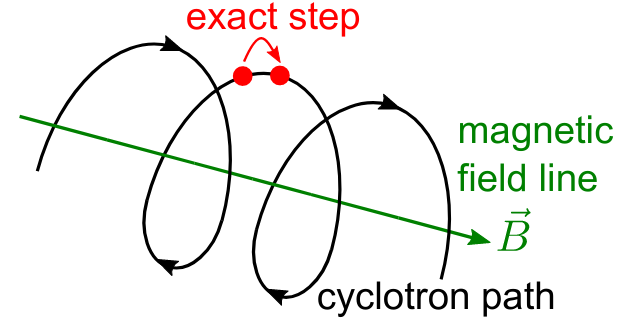
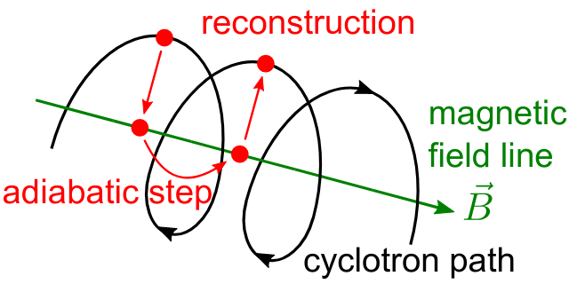

Propagation & Interactions
===========================

Propagation
-----------

The propagation section is used to describe the physical process which is associated with the movement of a particle,
and also the means by which the equations of motion are solved. The equations of motions are solved numerically with
various control methods for the time step used during integration of a specific particle trajectory. The abstract base
class of all particle trajectories is **KSTrajectory**.

There are essential five different equations of motion (trajectories) available for particle tracking in *Kassiopeia*.
These are, exact, adiabatic, electric, magnetic, and linear. These are implemented in :gh-code:`Kassiopeia/Trajectories`
and some specialized classes exist for spin particles.

Exact trajectory
~~~~~~~~~~~~~~~~

The first trajectory type is the so-called *exact* method, which solves the Lorentz equation for charged particles
exactly without any approximations. It is visualized below:

Adiabatic trajectory
~~~~~~~~~~~~~~~~~~~~

The second method is the adiabatic method, which is useful for solving charged particle motion in the presence of
smoothly varying magnetic fields. In this case, only the motion of the "guiding center" (a point on the magnetic field
line) is computed, which allows certain approximations. One may then reconcstruct the cyclotron motion of the particle
around the field line, however this is entirely optional. This method is visualized below:

Electric and magnetic trajectories
~~~~~~~~~~~~~~~~~~~~~~~~~~~~~~~~~~

The next two types, electric and magnetic (not shown here), are used for tracking the field lines of static electric and
magnetic fields respectively. Finally, the linear trajectory calculates a linear motion that is independent of any
external fields.

The definition of a trajectory for the simulation is usually combined with additional parameters that define the
behavior of the simulation:

- The `integrator` is responsible for solving the differential equation (ODE) in order to perform the tracking.
  Integrators are based off the class **KSMathIntegrator**.
- An `interpolator` allows to speed up the ODE solving, by interpolating the particle's parameters over a single step.
  Typically, the ODE solver performs evaluations of the particle state in between the initial and final position,
  which is time-consuming. Interpolators are based off the class **KSMathIntegrator**.
- Additional `terms` extend the differential equation of the base trajectory. For example in case of the adiabatic
  trajectory, one may add terms for gyration or drift that are otherwise not included in the appoximation. The ODE terms
  are based off the class **KSMathDifferentiator**.
- Additional `controls` can modify the step size. Options exist for a static setting (e.g. a step size of 1 mm)
  or dynamic adjustment (e.g. a step size derived from the local magnetic field.) Step controls are based off the class
  **KSMathControl**. Multiple controls can be combined, in which case the smallest possible step is taken.

Trajectory types
~~~~~~~~~~~~~~~~

The tables below lists the available integrators, interpolators, and terms:

+-----------------------------------------------------------------------------------------------------------------------------------------------------------------------+
| Trajectory integrators                                                                                                                                                |
+--------------------+----------------------------+----------------------+----------------------+----------------------+------------------------------------------------+
| Name               | XML Element                | Solution Order       | Function evaluations | Error estimate       | Description                                    |
+====================+============================+======================+======================+======================+================================================+
| RKF54              | ``integrator_rk54``        | 5                    | 6                    | Yes                  | 5th/4th-order Runge-Kutta                      |
+--------------------+----------------------------+----------------------+----------------------+----------------------+------------------------------------------------+
| RKDP54             | ``integrator_rkdp54``      | 5                    | 7                    | Yes                  | 5th-order Runge-Kutta, 4th-order dense output  |
+--------------------+----------------------------+----------------------+----------------------+----------------------+------------------------------------------------+
| RK65               | ``integrator_rk65``        | 6                    | 8                    | Yes                  | 6th/5th-order Runge-Kutta                      |
+--------------------+----------------------------+----------------------+----------------------+----------------------+------------------------------------------------+
| RKF8               | ``integrator_rk8``         | 8                    | 13                   | No                   | 8th-order Runge-Kutta                          |
+--------------------+----------------------------+----------------------+----------------------+----------------------+------------------------------------------------+
| RK86               | ``integrator_rk86``        | 8                    | 12                   | Yes                  | 8th/6th-order Runge-Kutta                      |
+--------------------+----------------------------+----------------------+----------------------+----------------------+------------------------------------------------+
| RK87               | ``integrator_rk87``        | 8                    | 13                   | Yes                  | 8th/7th-order Runge-Kutta                      |
+--------------------+----------------------------+----------------------+----------------------+----------------------+------------------------------------------------+
| RKDP853            | ``integrator_rkdp853``     | 8                    | 16                   | Yes                  | 8th-order Runge-Kutta,  7th-order dense output |
+--------------------+----------------------------+----------------------+----------------------+----------------------+------------------------------------------------+
| Sym4               | ``integrator_sym4``        | 4                    | 4                    | No                   | 4th-order Symplectic; only for exact tracking  |
+--------------------+----------------------------+----------------------+----------------------+----------------------+------------------------------------------------+

+-----------------------------------------------------------------------------------------------------------+
| Trajectory interpolators                                                                                  |
+--------------------+-------------------------------------+------------------------------------------------+
| Name               | XML Element                         | Description                                    |
+====================+=====================================+================================================+
| Fast               | ``interpolator_fast``               | Fast linear interpolation                      |
+--------------------+-------------------------------------+------------------------------------------------+
| Hermite            | ``interpolator_hermite``            | Hermite polynomial interpolation               |
+--------------------+-------------------------------------+------------------------------------------------+
| Cont. Runge-Kutta  | ``kstraj_interpolator_crk``         | Continuous Runge-Kutta (needs dense output)    |
+--------------------+-------------------------------------+------------------------------------------------+

+--------------------------------------------------------------------------------------------------------------------+
| Trajectory terms                                                                                                   |
+--------------------+-------------------------------------+---------------------------------------------------------+
| Name               | XML Element                         | Description                                             |
+====================+=====================================+=========================================================+
| Propagation        | ``term_propagation``                | Basic particle propagation                              |
+--------------------+-------------------------------------+---------------------------------------------------------+
| Constant Force     | ``term_constant_force_propagation`` | Propagation by constant force                           |
+--------------------+-------------------------------------+---------------------------------------------------------+
| Synchrotron        | ``term_synchrotron``                | Energy loss from synchrotron radiation                  |
+--------------------+-------------------------------------+---------------------------------------------------------+
| Drift              | ``term_drift``                      | Electromagnetic field drifts, adiabatic only            |
+--------------------+-------------------------------------+---------------------------------------------------------+
| Gyration           | ``term_gyration``                   | Gyration around guiding center; adiabatic only          |
+--------------------+-------------------------------------+---------------------------------------------------------+
| Gravity            | ``term_gravity``                    | Gravity pull; exact only                                |
+--------------------+-------------------------------------+---------------------------------------------------------+

+--------------------------------------------------------------------------------------------------------------------+
| Trajectory controls                                                                                                |
+--------------------+-------------------------------------+---------------------------------------------------------+
| Name               | XML Element                         | Description                                             |
+====================+=====================================+=========================================================+
| Length             | ``control_length``                  | Fixed length                                            |
+--------------------+-------------------------------------+---------------------------------------------------------+
| Time               | ``control_time``                    | Fixed time                                              |
+--------------------+-------------------------------------+---------------------------------------------------------+
| B-Field Gradient   | ``control_B_change``                | Length scaled by relative B-field gradient              |
+--------------------+-------------------------------------+---------------------------------------------------------+
| Cyclotron          | ``control_cyclotron``               | Length scaled to length of a full cyclotron turn        |
+--------------------+-------------------------------------+---------------------------------------------------------+
| Energy             | ``control_energy``                  | Length adjusted to limit total energy violation         |
+--------------------+-------------------------------------+---------------------------------------------------------+
| Magnetic Moment    | ``control_magnetic_moment``         | Length adjusted to limit adiabaticity violation         |
+--------------------+-------------------------------------+---------------------------------------------------------+
| Momentum Error     | ``control_momentum_numerical_error``| Length adjusted to limit momentum error                 |
+--------------------+-------------------------------------+---------------------------------------------------------+
| Position Error     | ``control_position_numerical_error``| Length adjusted to limit position error                 |
+--------------------+-------------------------------------+---------------------------------------------------------+
| Spin M-Dot         | ``control_m_dot``                   | Length scaled by $\dot{M}$ (spin tracking only)         |
+--------------------+-------------------------------------+---------------------------------------------------------+
| Spin Precession    | ``control_spin_precession``         | Length scaled by precession freq. (spin tracking only)  |
+--------------------+-------------------------------------+---------------------------------------------------------+

Examples
~~~~~~~~

The exact tracking method can be used where accuracy is of the utmost importance, but requires a large number of steps
in order propagate a particle for a long time or distance. An example of its use is given below:

.. code-block:: xml

    <kstraj_trajectory_exact name="trajectory_exact" attempt_limit="8">
        <interpolator_crk name="interpolator_crk"/>
        <integrator_rkdp853 name="integrator_rkdp853"/>
        <term_propagation name="term_propagation"/>
        <control_position_error name="control_position_error" absolute_position_error="1e-12" safety_factor="0.75" solver_order="8"/>
        <control_length name="stepsizelength" length="1e-4" />
        <control_time name="stepsizetime" time="1e-6" />
    </kstraj_trajectory_exact>

In the above example, the integrator type specified ``integrator_rkdp853`` is an 8-th order Runge-Kutta integrator with
a 7-th order dense output interpolant (specified by ``interpolator_crk``). The step size control is accomplished through
the combination of three different methods. Two of them, ``control_length`` and ``control_time``, place a fixed limit on
the step size, while the third ``control_position_error`` dynamically attempts to limit the local numerical error on the
particle's position. In this case no additional terms besides basic propagation are defined, since the exact trajectory
does not make any approximations.

All of the trajectories take an optional parameter ``attempt_limit`` which limits the number of tries an integration
step will be re-attempted if a step size control determines that the step has failed. The default number of maximum
number of attempts is 32. If a trajectory makes no progress after the maximum number of allowed attempts, the track will
be terminated with a ``trajectory_fail`` flag.

An example of the adiabatic trajectory with some additional options is specified in the following:

.. code-block:: xml

    <!--  adiabatic trajectory -->
    <kstraj_trajectory_adiabatic name="trajectory_adiabatic" piecewise_tolerance="1e-6" max_segments="130" use_true_position="true" cyclotron_fraction="{1.0/64.0}" attempt_limit="8">
        <interpolator_crk name="interpolator_crk"/>
        <integrator_rkdp853 name="integrator_rkdp853"/>
        <term_propagation name="term_propagation"/>
        <term_drift name="term_drift"/>
        <term_gyration name="term_gyration"/>
        <control_time name="control_time_adiab" time="1e-6"/>
        <control_position_error name="control_position_error" absolute_position_error="1e-9" safety_factor="0.75" solver_order="8"/>
    </kstraj_trajectory_adiabatic>

In this example, both the motion of the particle's guiding center drift (``term_drift``) and the particle's local
gyration (``term_gyration``) itself are included in the equations of motion. If the second term is not present, the
adiabatic tracjectory only computes the movement of the guiding center. It is important to note that the adiabatic
trajectory cannot be used if there is no magnetic field present. Similar to the example above, the step size is
defined by a combination of two controls.

The last three trajectory types can be specfified as follows:

.. code-block:: xml

    <!--  magnetic trajectory -->
    <kstraj_trajectory_magnetic name="trajectory_magnetic" piecewise_tolerance="1e-12" max_segments="128">
        <interpolator_crk name="interpolator_crk"/>
        <integrator_rkdp54 name="integrator_rkdp54"/>
        <term_propagation name="term_propagation" direction="forward"/>
        <control_time name="control_time" time="1.e-4"/>
        <control_length name="control_length" length="1e-2"/>
    </kstraj_trajectory_magnetic>

    <!--  electric trajectory -->
    <kstraj_trajectory_electric name="trajectory_electric" piecewise_tolerance="1e-12" max_segments="128">
        <interpolator_crk name="interpolator_crk"/>
        <integrator_rkdp54 name="integrator_rkdp54"/>
        <term_propagation name="term_propagation" direction="backward"/>
        <control_time name="control_time" time="1.e-4"/>
        <control_length name="control_length" length="1e-2"/>
    </kstraj_trajectory_electric>

    <kstraj_trajectory_linear name="trajectory_linear" length="1.e-8" />

The electric and magnetic field line trajectories are useful for visualization purposes, and during the design stages of
an experiment or simulation. Note that in the above examples we have used a faster but less accurate Runge-Kutta
integrator ``integrator_rkdp54``. The property ``direction`` in ``term_propagation`` can be used to specify the
direction in which field lines are tracked (positive-to-negative or north-to-south). The linear trajectory takes no
parameters besides a fixed step length,.

In all of the trajectories (exact, adiabatic, electric, magnetic) the parameters ``piecewise_tolerance`` and
``max_segments`` are optional. They dictate how a particles trajectory (in between steps) should be approximated by
piecewise linear segments when determining surface and volume intersections. These parameters are only used when the
``ksnav_meshed_space`` navigator is in use, and determine how accurately intersections are found. The default
``ksnav_space`` navigator ignores these parameters, since it uses a faster but less accurate approximation by linearly
interpolating a particle's intermediate state and position. See below for details on navigation.

The adiabatic trajectory also takes the additional parameters ``use_true_position`` and ``cyclotron_fraction`` when the
``mesh_spaced_navigator`` is in use. The parameter ``use_true_position`` determines whether the particle or its guiding
center position is used for the purpose of finding intersections. If the particle's true position is used, then the
parameter ``cyclotron_fraction`` dictates the number of linear segments the semi-helical path is broken into.

Interactions
------------

In between generation and termination, discrete stochastic interactions involving the particle of interest may be
applied during tracking. These interactions are divided according to whether they are active in a volume, or on a
surface. In both cases, the behavior ties with the *KGeoBag* module that provides the geometric information.

Volume Interactions
~~~~~~~~~~~~~~~~~~~

Volume interactions typically involve scattering off of a gas. The abstract base class of all volume interactions is
**KSSpaceInteraction**. Simple situations where the scattering interactions is treated approximately by a
constant density and cross section can be constructed as follows:

.. code-block:: xml

    <ksint_scattering name="int_scattering" split="true">
        <density_constant temperature="300." pressure="3.e0"/>
        <calculator_constant cross_section="1.e-18"/>
    </ksint_scattering>

In this example the density is computed according to the ideal gas law from the temperature (Kelvin) and pressure
(Pascal) and the cross section is treated as a constant (independent of particle energy). Other forms of interaction
are available in :gh-code:`Kassiopeia/Interactions`. For more complicated interactions (e.g. involving differential or
energy dependent cross sections) the user may need to devise their own interaction class. Volume interactions must
always be associated with a particular volume when describing the simulation structure.

Surface Interactions
~~~~~~~~~~~~~~~~~~~~

Surface interactions are much more limited in their scope and only occur when the track of a particle passes through a
surface. The abstract base class of all surface interactions is **KSSurfaceInteraction**.

For example, to cause a particle to be reflected diffusely (Lambertian) from a surface the user can specify an
interaction of the following type:

.. code-block:: xml

    <ksint_surface_diffuse name="int_surface_diffuse" probability=".3" reflection_loss="0." transmission_loss="1."/>

Similarly, one may use the following code to employ fully specular reflection:

.. code-block:: xml

    <ksint_surface_specular name="int_surface_diffuse" probability="0." reflection_loss="0." transmission_loss="1."/>

In order for this interaction to operate on any particles it must be associated with a surface in the simulation command
structure.

.. _TFormula: http://root.cern.ch/root/htmldoc/TFormula.html
.. _TMath: http://root.cern.ch/root/htmldoc/TMath.html
.. _PDG: http://pdg.lbl.gov/mc_particle_id_contents.html
.. _Paraview: http://www.paraview.org/
.. _ROOT: https://root.cern.ch/
.. _VTK: http://www.vtk.org/
.. _MKS: https://scienceworld.wolfram.com/physics/MKS.html
.. _XML: https://www.w3.org/TR/xml11/
.. _Xpath: https://www.w3.org/TR/xpath-10/
.. _TinyExpr: https://github.com/codeplea/tinyexpr/
.. _Log4CXX: https://logging.apache.org/log4cxx/
.. _Gnuplot: http://www.gnuplot.info/
.. _PyVista: https://www.pyvista.org/

