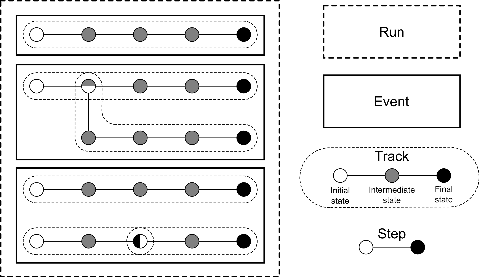
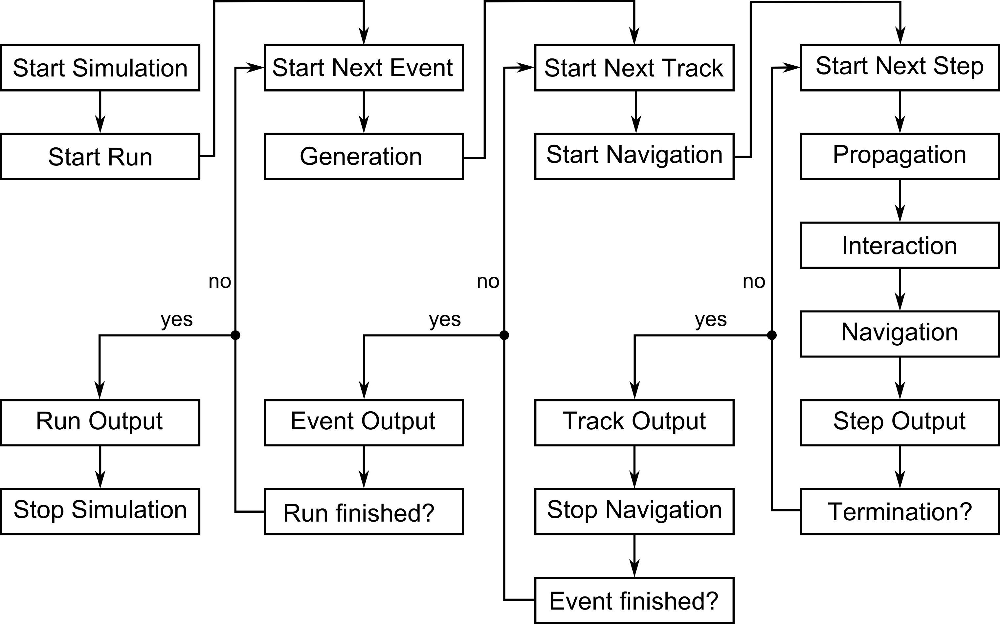

Conceptual overview
====================

To understand the basics of *Kassiopeia*, it is important to note that the simulation is organized into four levels:
run, event, track, and step. At the `step` level, the actual calculation of the particle trajectory takes place. When
a new particle is generated, a `track` is initiated that holds all steps belonging to that particle. The track ends
upon termination. The generation of a particle by a user-defined generator is associated with an `event`, which again
holds all corresponding tracks. Because a particle can create secondaries and tracks can be split, one event can hold
more than one track; all belonging to one generation event. Finally, all events from a single simulation are grouped
into a `run`.

The overall relation between these levels is shown below. In this example, the run consists of three events and six
tracks. In the second event, an interaction occurs which leads to a secondary track. In the third event, the track
is split at the third step.

With this in mind, one can understand the workflow of the simulation shown below. Each step in the work flow is
associated with runs, events, tracks, and steps, and with certain modules of the simulation such as generation,
navigation, propagation etc. which will be explained futher below.

