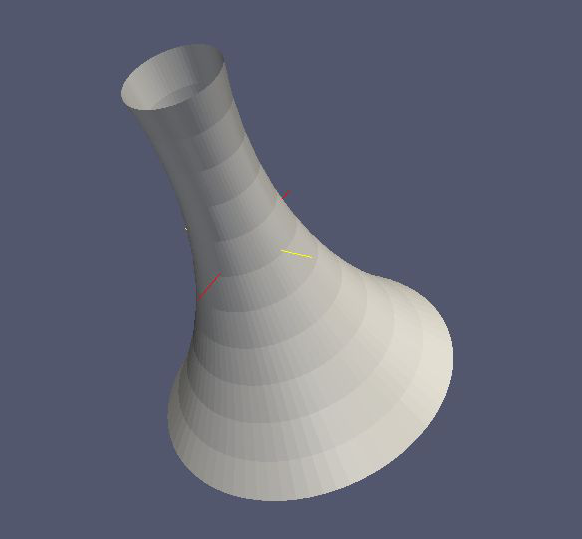

.. _basic-kgeobag-label:

Basic Shapes in KGeoBag
==========================

This section is a description of the basic spaces and surfaces which can be constructed using *KGeoBag*. All of the
following shapes can be displayed by the executables ``MeshViewer`` and ``GeometryViewer`` (see :ref:`visualization-label`).
These executables are built and installed along with *KGeoBag* when it is linked against VTK_.

Geometry visualization
-----------------------

In order to view a geometry you can execute ``GeometryViewer`` from the directory ``$KASPERSYS/install/bin`` with the
path to your geometry file (.xml) and the name of the geometry element you want to display as the arguments:

.. code-block:: bash

    ./GeometryViewer ../config/TheBag/Examples/ExampleShapes.xml example_rotated_surface

An example of the geometry view is shown below:

To visualized the mesh of a geometric element execute MeshViewer in ``$KASPERSYS/install/bin`` with the path to your
geometry file (.xml) and the name of the geometry element you want to display:

.. code-block:: bash

    ./MeshViewer <../config/TheBag/Examples/ExampleShapes.xml> <example_rotated_surface>

There is also an ``AxialMeshViewer`` available, which displays the axial mesh (if defined) in the same way. The
geometric element can be a specific element or several elements collected into a group. To display a single element use
its name, to show a tagged group the argument is written as ``@tag_group``. An example of the mesh viewer being used on
a rod surface is shown below:

.. image:: _images/meshviewer.png
   :width: 400pt

The ``GeometryViewer`` and ``MeshViewer`` will also produce a VTK poly-data file (.vtp) which can then be open in the
external application Paraview_ for more advanced visualization.

The parameters specifying the method by which a geometric element is meshed must be given in the geometry file when the
shape is described. If no mesh is desired for some object, the mesh parameters may be ignored and the defaults will be
used. The commands above may also be tried with one of the *Kassiopeia* simulation examples.

The mesh parameters vary for each object, but essentially describe two properties (for each meshable dimension). These
are the ``mesh_count`` and the ``mesh_power``. If the ``mesh_power`` is set equal to 1.0, then the ``mesh_count`` simply
specifies the number of equally sized segments that a shape will be chopped into, along a particular dimension. If the
``mesh_power`` is greater than 1.0, then the density of segments will increase towards the edges of the shape while
keeping the number of elements the same. The ``mesh_power`` property is useful for tailoring the accuracy of mesh
descriptions for Laplace boundary value problems, where quantities such as charge density may vary considerably near the
sharp edges of an object. Therefore, this parameter is mainly used for electrode meshes.

The following sections provide examples and brief descriptions of some basic shapes available for use in *KGeoBag*.

Basic elements
--------------

The following elements (poly-loop and poly-line) are internal descriptors. They can't be used by themselves outside a
geometry element. This section serves as a brief explanation for the structure of these shapes.

Poly-loop
~~~~~~~~~~

A poly-loop is a closed sequence consisting of several lines and/or arcs that form a polygonal shape. The aequence
starts with ``<start_point ...>`` and ends with ``<last_line ...>`` or ``<last_arc ...>``, and multiple ``<next_line
...>`` or ``<next_arc ...>`` elements can be put in between. An example of a poly-loop element is as follows:

.. code-block:: xml

    <poly_loop>
        <start_point x="0." y="0."/>
        <next_line x="0.4" y="-0.1" line_mesh_count="10" line_mesh_power="2.5"/>
        <next_arc x="-0.1" y="0.4" radius="0.6" right="true" short="false" arc_mesh_count="256"/>
        <last_line line_mesh_count="10" line_mesh_power="2.5"/>
    </poly_loop>

which creates a line from (0,0) to (0.4,-0.1) followed by an arc to (-0.1,0.4), and then the loop is closed by a line
back to the starting point. Note that poly-loop and poly-line are two-dimensional objects that operate in (x,y)
coordinates. Any line that is created by a ``<next_...>`` command goes from the end-point of the previous line to the
specified coordinate. The directive ``<last_line ...>`` or ``<last_arc ...>`` connects the first and last points with
the specified segment type.

The arc elements are described with the boolean parameters ``right`` and ``short``, as shown here:

where ``right="true"`` means that the circle segment will be drawn clockwise, and vice versa. ``short="true"`` means
that the arc will be the shorter one of the two possiblities.

Poly-line
~~~~~~~~~~

This element is desribed using the same procedure as in poly-loop. However, the first and last points are not
necessarily connected. An XML example is below:

.. code-block:: xml

    <poly_line>
        <start_point x="0.2" y="0.3"/>
        <next_line x="0.1" y="0.1" line_mesh_count="36" line_mesh_power="4.5"/>
        <next_arc x="-0.1" y="0.1" radius="0.2" right="true" short="true" arc_mesh_count="96"/>
        <next_line x="-0.2" y="0.2" line_mesh_count="36" line_mesh_power="1."/>
        <next_line x="-0.3" y="0.1" line_mesh_count="24" line_mesh_power="4.5"/>
    </poly_line>

In this case, the sequence progresses through five (x,y) points but does not connect back to the starting point. Hence,
it does not form a closed loop like the poly-loop element does, and does not need a ``<last_...>`` command. Otherwise,
the parameters for poly-line are the same as for poly-loop.

Surfaces
-----------

Flat surfaces
~~~~~~~~~~~~~~

Flattened circle surface
"""""""""""""""""""""""""""

A flattened circle surface is just a surface with circular shape, where (x,y,z) are the coordinates for the center of
the circle and r is the radius:

.. image:: _images/kgeobag_flattened_circle_surface_model.png
   :width: 400pt

- Works with MeshViewer: Yes.
- Works with GeometryViewer: Yes.

An XML example is as follows:

.. code-block:: xml

    <flattened_circle_surface name="flattened_circle_surface" z="0." flattened_mesh_count="10" flattened_mesh_power="4.">
        <circle x="0.1" y="0.2" radius="0.5" circle_mesh_count="128"/>
    </flattened_circle_surface>

Flattened poly-loop surface
"""""""""""""""""""""""""""""

A flattened poly loop surface is a surface consisting of several lines, arcs or both, creating a polygon of your desired
shape. The first line and the last line are connected automatically. By using the features of the poly-loop outlined
above, this provides a very flexible method of designing surface elements.

.. image:: _images/kgeobag_flattened_poly_loop_surface_model.png
   :width: 400pt

- Works with MeshViewer: Yes.
- Works with GeometryViewer: Yes.

An XML example is as follows:

.. code-block:: xml

    <flattened_poly_loop_surface name="flattened_poly_loop_surface" z="0.1" flattened_mesh_count="10" flattened_mesh_power="4.">
        <poly_loop>
            <start_point x="0." y="0."/>
            <next_line x="0.4" y="-0.1" line_mesh_count="10" line_mesh_power="2.5"/>
            <next_arc x="-0.1" y="0.4" radius="0.6" right="true" short="false" arc_mesh_count="256"/>
            <last_line line_mesh_count="10" line_mesh_power="2.5"/>
        </poly_loop>
    </flattened_poly_loop_surface>

Rotated Surfaces
~~~~~~~~~~~~~~~~~~

All rotated surfaces are constructed from lines, arcs, poly-lines, or poly-loops which are then rotated around the local
x-axis.

Rotated line segment surface
"""""""""""""""""""""""""""""""

This type generates the surface of revolution formed by a line that is rotated around the x-axis.

.. image:: _images/kgeobag_rotated_line_segment_surface_model.png
   :width: 400pt

- Works with MeshViewer: Yes.
- Works with GeometryViewer: Yes.

An XML example is as follows:

.. code-block:: xml

    <rotated_line_segment_surface name="rotated_line_segment_forward_surface" rotated_mesh_count="96">
        <line_segment x1="0.15" y1="0.1" x2="-0.1" y2="0.05" line_mesh_count="36" line_mesh_power="2.2"/>
    </rotated_line_segment_surface>

Rotated arc segment surface
"""""""""""""""""""""""""""""

This type generates the surface of revolution formed by an arc that is rotated around the x-axis.

- Works with MeshViewer: Yes.
- Works with GeometryViewer: Yes.

An XML example is as follows:

.. code-block:: xml

    <rotated_arc_segment_surface name="rotated_arc_segment_right_short_surface" rotated_mesh_count="128">
        <arc_segment x1="0.15" y1="0.1" x2="-0.1" y2="0.05" radius="0.3" right="true" short="true" arc_mesh_count="64"/>
    </rotated_arc_segment_surface>

Rotated poly-line surface
"""""""""""""""""""""""""""

This type generates the surface of revolution created by rotating a poly-line around the local x-axis.

.. image:: _images/kgeobag_rotated_poly_line_surface_model.png
   :width: 400pt

- Works with MeshViewer: Yes.
- Works with GeometryViewer: Yes.

An XML example is as follows:

.. code-block:: xml

    <rotated_poly_line_surface name="rotated_poly_line_forward_surface" rotated_mesh_count="64">
        <poly_line>
            <start_point x="0.2" y="0.3"/>
            <next_line x="0.1" y="0.1" line_mesh_count="36" line_mesh_power="4.5"/>
            <next_arc x="-0.1" y="0.1" radius="0.2" right="true" short="true" arc_mesh_count="96"/>
            <next_line x="-0.2" y="0.2" line_mesh_count="36" line_mesh_power="1."/>
            <next_line x="-0.3" y="0.1" line_mesh_count="24" line_mesh_power="4.5"/>
        </poly_line>
    </rotated_poly_line_surface>

Rotated circle surface
"""""""""""""""""""""""

This type generates the surface of revolution created by rotating a circle around the local x-axis. This shape is
essentially or torus, or a section of a torus.

- Works with MeshViewer: Yes.
- Works with GeometryViewer: Yes.

An XML example is as follows:

.. code-block:: xml

    <rotated_circle_surface name="rotated_circle_surface" rotated_mesh_count="32">
        <circle x="0.1" y="0.5" radius="0.3" circle_mesh_count="32"/>
    </rotated_circle_surface>

Rotated poly loop surface
"""""""""""""""""""""""""""

This type generates the surface of revolution created by rotating a poly-loop around the local x-axis.

- Works with MeshViewer: Yes.
- Works with GeometryViewer: Yes.

An XML example is as follows:

.. code-block:: xml

    <rotated_poly_loop_surface name="rotated_poly_loop_surface" rotated_mesh_count="64">
        <poly_loop>
            <start_point x="0.3" y="0.3"/>
            <next_line x="0.3" y="0.5" line_mesh_count="36" line_mesh_power="2.5"/>
            <next_arc x="0.1" y="0.7" radius="0.25" right="false" short="true" arc_mesh_count="64"/>
            <next_line x="-0.1" y="0.7" line_mesh_count="36" line_mesh_power="2.5"/>
            <next_arc x="-0.3" y="0.5" radius="0.25" right="false" short="true" arc_mesh_count="64"/>
            <next_line x="-0.3" y="0.3" line_mesh_count="36" line_mesh_power="2.5"/>
            <next_arc x="-0.1" y="0.1" radius="0.25" right="false" short="true" arc_mesh_count="64"/>
            <next_line x="0.1" y="0.1" line_mesh_count="36" line_mesh_power="2.5"/>
            <last_arc radius="0.25" right="false" short="true" arc_mesh_count="64"/>
        </poly_loop>
    </rotated_poly_loop_surface>

Shell Surfaces
~~~~~~~~~~~~~~~~~

All shell surfaces are lines, arcs or surfaces that are rotated around the x-axis between a given start angle
(angle_start) and stop angle (angle_stop).

Shell line segment surface
"""""""""""""""""""""""""""

This produces an angularly limited portion of a surface of revolution from a line that is rotated around the local
x-axis.

.. image:: _images/kgeobag_shell_line_segment_surface_model.png
   :width: 400pt

- Works with MeshViewer: Yes.
- Works with GeometryViewer: Yes.

An XML example is as follows:

.. code-block:: xml

    <shell_line_segment_surface name="shell_line_segment_forward_surface" angle_start="240" shell_mesh_count="96" shell_mesh_power="6">
        <line_segment x1="0.15" y1="0.1" x2="-0.1" y2="0.05" line_mesh_count="36" line_mesh_power="2.2"/>
    </shell_line_segment_surface>

Shell arc segment surface
"""""""""""""""""""""""""""

This produces an angularly limited portion of a surface of revolution from an arc that is rotated around the local
x-axis.

- Works with MeshViewer: Yes.
- Works with GeometryViewer: Yes.

An XML example is as follows:

.. code-block:: xml

    <shell_arc_segment_surface name="shell_arc_segment_right_short_surface" shell_mesh_count="128" shell_mesh_power="6">
        <arc_segment x1="0.15" y1="0.1" x2="-0.1" y2="0.05" radius="0.3" right="true" short="true" arc_mesh_count="64"/>
    </shell_arc_segment_surface>

Shell poly-line surface
"""""""""""""""""""""""""

This produces an angularly limited portion of a surface of revolution from a poly-line that is rotated around the local
x-axis.

- Works with MeshViewer: Yes.
- Works with GeometryViewer: Yes.

An XML example is as follows:

.. code-block:: xml

    <shell_poly_line_surface name="shell_poly_line_forward_surface" angle_start="270" angle_stop="120" shell_mesh_count="64" shell_mesh_power="6">
        <poly_line>
            <start_point x="0.2" y="0.3"/>
            <next_line x="0.1" y="0.1" line_mesh_count="36" line_mesh_power="4.5"/>
            <next_arc x="-0.1" y="0.1" radius="0.2" right="true" short="true" arc_mesh_count="96"/>
            <next_line x="-0.2" y="0.2" line_mesh_count="36" line_mesh_power="1."/>
            <next_line x="-0.3" y="0.1" line_mesh_count="24" line_mesh_power="4.5"/>
        </poly_line>
    </shell_poly_line_surface>

Shell circle surface
"""""""""""""""""""""

This produces an angularly limited portion of a surface of revolution from a circle that is rotated around the local
x-axis.

- Works with MeshViewer: Yes.
- Works with GeometryViewer: Yes.

An XML example is as follows:

.. code-block:: xml

   <shell_circle_surface name="shell_circle_surface" angle_start="200" angle_stop="130" shell_mesh_count="32" shell_mesh_power="6">
        <circle x="0.1" y="0.5" radius="0.3" circle_mesh_count="32"/>
    </shell_circle_surface>

Shell poly-loop surface
"""""""""""""""""""""""""

This produces an angularly limited portion of a surface of revolution from a poly-loop that is rotated around the local
x-axis.

- Works with MeshViewer: Yes.
- Works with GeometryViewer: Yes.

An XML example is as follows:

.. code-block:: xml

    <shell_poly_loop_surface name="shell_poly_loop_surface"  angle_start="30" angle_stop="360" shell_mesh_count="64" shell_mesh_power="6">
        <poly_loop>
            <start_point x="0.3" y="0.3"/>
            <next_line x="0.3" y="0.5" line_mesh_count="64" line_mesh_power="2.5"/>
            <next_arc x="0.1" y="0.7" radius="0.25" right="false" short="true" arc_mesh_count="64"/>
            <next_line x="-0.1" y="0.7" line_mesh_count="64" line_mesh_power="2.5"/>
            <next_arc x="-0.3" y="0.5" radius="0.25" right="false" short="true" arc_mesh_count="64"/>
            <next_line x="-0.3" y="0.3" line_mesh_count="64" line_mesh_power="2.5"/>
            <next_arc x="-0.1" y="0.1" radius="0.25" right="false" short="true" arc_mesh_count="64"/>
            <next_line x="0.1" y="0.1" line_mesh_count="64" line_mesh_power="2.5"/>
            <last_arc radius="0.25" right="false" short="true" arc_mesh_count="64"/>
        </poly_loop>
    </shell_poly_loop_surface>

Extruded Surfaces
~~~~~~~~~~~~~~~~~~~

Extruded surfaces are surfaces that are extruded along the direction of the local z-axis from a minimum z-position
(zmin) to a maximum z-position (zmax).

Extruded poly-line surface
"""""""""""""""""""""""""""

This generates a surface by extruding a poly-line.

An XML example is as follows:

.. code-block:: xml

    <extruded_poly_line_surface name="extruded_poly_line_surface" zmin="-0.3" zmax="0.2" extruded_mesh_count="96" extruded_mesh_power="6.3">
        <poly_line>
            <start_point x="-0.3" y="0.1"/>
            <next_line x="-0.2" y="0.2" line_mesh_count="24" line_mesh_power="4.5"/>
            <next_line x="-0.1" y="0.1" line_mesh_count="36" line_mesh_power="1."/>
            <next_arc x="0.1" y="0.1" radius="0.2" right="false" short="true" arc_mesh_count="96"/>
            <next_line x="0.2" y="0.3" line_mesh_count="36" line_mesh_power="4.5"/>
        </poly_line>
    </extruded_poly_line_surface>

Extruded circle surface
"""""""""""""""""""""""""

This generates the surfaced produced by extruding a circle (this is the same as a cylinder).

- Works with MeshViewer: Yes.
- Works with GeometryViewer: Yes.

An XML example is as follows:

.. code-block:: xml

    <extruded_circle_surface name="extruded_circle_surface" zmin="-0.1" zmax="0.1" extruded_mesh_count="32" extruded_mesh_power="1">
        <circle x="0.1" y="0.5" radius="0.3" circle_mesh_count="128"/>
    </extruded_circle_surface>

Extruded poly-loop surface
"""""""""""""""""""""""""""

This generates a surface by extruding a poly-loop.

- Works with MeshViewer: Yes.
- Works with GeometryViewer: Yes.

An XML example is as follows:

.. code-block:: xml

    <extruded_poly_loop_surface name="extruded_poly_loop_surface" zmin="-0.3" zmax="0.3" extruded_mesh_count="37" extruded_mesh_power="6.3">
        <poly_loop>
            <start_point x="0.3" y="0.3"/>
            <next_line x="0.3" y="0.5" line_mesh_count="36" line_mesh_power="2.5"/>
            <next_arc x="0.1" y="0.7" radius="0.25" right="false" short="true" arc_mesh_count="64"/>
            <next_line x="-0.1" y="0.7" line_mesh_count="36" line_mesh_power="2.5"/>
            <next_arc x="-0.3" y="0.5" radius="0.25" right="false" short="true" arc_mesh_count="64"/>
            <next_line x="-0.3" y="0.3" line_mesh_count="36" line_mesh_power="2.5"/>
            <next_arc x="-0.1" y="0.1" radius="0.25" right="false" short="true" arc_mesh_count="64"/>
            <next_line x="0.1" y="0.1" line_mesh_count="36" line_mesh_power="2.5"/>
            <last_arc radius="0.25" right="false" short="true" arc_mesh_count="64"/>
        </poly_loop>
    </extruded_poly_loop_surface>

Special Surfaces
~~~~~~~~~~~~~~~~~

These surfaces are just specific cases of the more general surface types already listed. However, since their use is
extremely common, they have been made available as unique, special types. For many simple simulations, it is possible
to design the geometry entirely using these elements.

Disk surface
"""""""""""""

This produces a disk centered on the local z-axis.

.. image:: _images/kgeobag_disk_surface_model.png
   :width: 400pt

- Works with MeshViewer: Yes.
- Works with GeometryViewer: Yes.

An XML example is as follows:

.. code-block:: xml

    <disk_surface name="disk_surface" z=".01" r=".35" radial_mesh_count="14" radial_mesh_power="5" axial_mesh_count="20"/>

The parameters are:

- z: z-position in meters
- r: radius in meters
- radial_mesh_count: radial mesh parameter (default is 1)
- radial_mesh_power: radial meshing power (default is 1.)
- axial_mesh_count: axial mesh parameter (default is 16)

Annulus surface
"""""""""""""""""
This produces an annulus centered on the z axis.

.. image:: _images/kgeobag_annulus_surface_model.png
   :width: 400pt

- Works with MeshViewer: Yes.
- Works with GeometryViewer: Yes.

An XML example is as follows:

.. code-block:: xml

    <annulus_surface name="annulus_surface" z="-.01" r1="0.1" r2="0.45" radial_mesh_count="22" radial_mesh_power="1.5" axial_mesh_count="32"/>

The parameters are:

- z: z-position in meters
- r1: the first of the radii in meters
- r2: the second radius in meters
- radial_mesh_count: radial mesh parameter (default is 1)
- radial_mesh_power: radial meshing power (default is 1.)
- axial_mesh_count: axial mesh parameter (default is 16)

Cylinder surface
"""""""""""""""""

Generates a cylinder centered on the z axis.

- Works with MeshViewer: Yes.
- Works with GeometryViewer: Yes.

An XML example is as follows:

.. code-block:: xml

    <cylinder_surface name="cylinder_surface" z1="-0.3" z2="0.4" r="0.55" longitudinal_mesh_count="15" longitudinal_mesh_power="2." axial_mesh_count="32"/>

The parameters are:

- z1: the first z position in meters
- z2: the second z position in meters
- r: radius in meters
- longitudinal_mesh_count: longitudinal mesh parameter (default is 1)
- longitudinal_mesh_power: longitudinal meshing power (default is 1.)
- axial_mesh_count: axial mesh parameter (default is 16)

Cone Surface
"""""""""""""""

Generates a cone centered on the z axis.

.. image:: _images/kgeobag_cone_surface_model.png
   :width: 400pt

- Works with MeshViewer: Yes.
- Works with GeometryViewer: Yes.

An XML example is as follows:

.. code-block:: xml

    <cone_surface name="cone_surface" za="-0.4" zb="0.4" rb="0.25" longitudinal_mesh_count="48" longitudinal_mesh_power="1." axial_mesh_count="72"/>

The parameters are:

- za: apex z position in meters
- zb: base z position in meters
- rb: base radius in meters
- longitudinal_mesh_count: longitudinal mesh parameter (default is 1)
- longitudinal_mesh_power: longitudinal meshing power (default is 1.)
- axial_mesh_count: axial mesh parameter (default is 16)

Cut Cone Surface
"""""""""""""""""

Produces a truncated cone centered on the local z-axis.

- Works with MeshViewer: Yes.
- Works with GeometryViewer: Yes.

An XML example is as follows:

.. code-block:: xml

    <cut_cone_surface name="cut_cone_surface" z1="0.5" r1="0.6" z2="-0.1" r2="0.2" longitudinal_mesh_count="23" longitudinal_mesh_power="4." axial_mesh_count="48"/>

The parameters are:

- z1: the first z coordinates in meters
- r1: the first r coordinates in meters
- z2: the second z coordinate in meters
- r2: the second r coordinate in meters
- longitudinal_mesh_count: longitudinal mesh parameter (default is 1)
- longitudinal_mesh_power: longitudinal meshing power (default is 1.)
- axial_mesh_count: axial mesh parameter (default is 16)

Torus Surface
"""""""""""""""

Generates a torus centered on the local z axis.

.. image:: _images/kgeobag_torus_surface_model.png
   :width: 400pt

- Works with MeshViewer: Yes.
- Works with GeometryViewer: Yes.

An XML example is as follows:

.. code-block:: xml

    <cut_torus_surface name="cut_torus_surface" z1="0.3" r1="0.1" z2="-0.1" r2="0.2" radius="0.3" right="true" short="true" toroidal_mesh_count="128" axial_mesh_count="256"/>

The parameters are:

- z: z coordinate of the center in meters
- r: r coordinate of the center in meters
- radius: the toroidal radius in meters
- toroidal_mesh_count: toroidal mesh parameter (default is 64)
- axial_mesh_count: axial mesh parameter (default is 64)

Cut Torus Surface
"""""""""""""""""""

Produces an angularly limited toroidal section centered on the z axis.

.. image:: _images/kgeobag_cut_torus_surface_model.png
   :width: 400pt

- Works with MeshViewer: Yes.
- Works with GeometryViewer: Yes.

An XML example is as follows:

.. code-block:: xml

    <torus_surface name="torus_surface" z="0.2" r="0.5" radius="0.35" toroidal_mesh_count="256" axial_mesh_count="512"/>

The parameters are:

- z1: the first z coordinate in meters
- r1: the first r coordinate in meters
- z2: the second z coordinate in meters
- r2: the second r coordinate in meters
- radius: the toroidal radius in meters
- right: is the arc on the right side of the directed line connecting point 1 to point 2?
- short: does the arc subtend less than pi radians?
- toroidal_mesh_count: toroidal mesh parameter (default is 64)
- axial_mesh_count: axial mesh parameter (default is 64)

Spaces
--------

Spaces are considered distinct from surfaces as they are (water-tight) volumes. The cannot be open or have holes which
puncture their boundaries. In the *Kassiopeia* interface, spaces are treated very differently than surfaces and have
different features on purposes.

Extruded Spaces
~~~~~~~~~~~~~~~~

Extruded spaces are from in a manner similar to extruded surfaces, the only difference being that they also provide
planar caps to fully enclose a central volume.

Extruded Circle Space
"""""""""""""""""""""""""

Generates a volume by extruding a cycle (cynlinder).

- Works with MeshViewer: Yes.
- Works with GeometryViewer: Yes.

An XML example is as follows:

.. code-block:: xml

    <extruded_circle_space name="extruded_circle_space" zmin="-0.1" zmax="0.1" extruded_mesh_count="32" extruded_mesh_power="1" flattened_mesh_count="28" flattened_mesh_power="1.4">
        <circle x="0.1" y="0.5" radius="0.3" circle_mesh_count="128"/>
    </extruded_circle_space>

Extruded Poly-Loop Space
"""""""""""""""""""""""""""

Generates a volume by extruding a poly-loop.

.. image:: _images/kgeobag_extruded_poly_loop_space_model.png
   :width: 400pt

- Works with MeshViewer: Yes.
- Works with GeometryViewer: Yes.

An XML example is as follows:

.. code-block:: xml

    <extruded_poly_loop_space name="extruded_poly_loop_space" zmin="-0.7" zmax="0.7" extruded_mesh_count="37" extruded_mesh_power="6.3" flattened_mesh_count="28" flattened_mesh_power="1.4">
        <poly_loop>
            <start_point x="0.3" y="0.3"/>
            <next_line x="0.3" y="0.5" line_mesh_count="36" line_mesh_power="2.5"/>
            <next_arc x="0.1" y="0.7" radius="0.25" right="false" short="true" arc_mesh_count="64"/>
            <next_line x="-0.1" y="0.7" line_mesh_count="36" line_mesh_power="2.5"/>
            <next_arc x="-0.3" y="0.5" radius="0.25" right="false" short="true" arc_mesh_count="64"/>
            <next_line x="-0.3" y="0.3" line_mesh_count="36" line_mesh_power="2.5"/>
            <next_arc x="-0.1" y="0.1" radius="0.25" right="false" short="true" arc_mesh_count="64"/>
            <next_line x="0.1" y="0.1" line_mesh_count="36" line_mesh_power="2.5"/>
            <last_arc radius="0.25" right="false" short="true" arc_mesh_count="64"/>
        </poly_loop>
    </extruded_poly_loop_space>

Rotated Spaces
~~~~~~~~~~~~~~~~

Rotated Line Segment
"""""""""""""""""""""

Generates a volume enclosed by a surface of revolution produced from rotating a line segement.

.. image:: _images/kgeobag_rotated_line_segment_space_model.png
   :width: 400pt

- Works with GeometryViewer: Yes.
- Works with MeshViewer: Yes.

An XML example is as follows:

.. code-block:: xml

    <rotated_line_segment_space name="rotated_line_segment_space" rotated_mesh_count="100" flattened_mesh_count="10" flattened_mesh_power="2.2">
        <line_segment x1="0.15" y1="0.1" x2="-0.1" y2="0.05" line_mesh_count="10" line_mesh_power="2.2"/>
    </rotated_line_segment_space>

Rotated Arc Segment
"""""""""""""""""""""

Generates a volume enclosed by a surface of revolution produced from rotating an arc segment.

.. image:: _images/kgeobag_rotated_arc_segment_space_model.png
   :width: 400pt

- Works with GeometryViewer: Yes.
- Works with MeshViewer: Yes.

An XML example is as follows:

.. code-block:: xml

    <rotated_arc_segment_space name="rotated_arc_segment_space" rotated_mesh_count="128" flattened_mesh_count="10" flattened_mesh_power="1.5">
        <arc_segment x1="0.15" y1="0.1" x2="-0.1" y2="0.03" radius="0.5" right="true" short="true" arc_mesh_count="64"/>
    </rotated_arc_segment_space>

Rotated Poly-Line Space
"""""""""""""""""""""""""

Generates a volume enclosed by a surface of revolution produced from rotating a poly-line.

.. image:: _images/kgeobag_rotated_poly_line_space_model.png
   :width: 400pt

- Works with GeometryViewer: Yes.
- Works with MeshViewer: Yes.

An XML example is as follows:

.. code-block:: xml

    <rotated_poly_line_space name="rotated_poly_line_reverse_space" rotated_mesh_count="128" flattened_mesh_count="36" flattened_mesh_power="3.8">
        <poly_line>
            <start_point x="-0.1" y="0.1"/>
            <next_arc x="-0.3" y="0.3" radius="0.315" right="false" short="true" arc_mesh_count="24"/>
            <next_line x="0.2" y="0.4" line_mesh_count="52" line_mesh_power="3.5"/>
            <next_line x="0.1" y="0.1" line_mesh_count="24" line_mesh_power="2."/>
        </poly_line>
    </rotated_poly_line_space>

Rotated Circle Space
"""""""""""""""""""""

Generates a volume by rotating a circle (torus).

- Works with GeometryViewer: Yes.
- Works with MeshViewer: Yes.

An XML example is as follows:

.. code-block:: xml

    <rotated_circle_space name="rotated_circle_space" rotated_mesh_count="128">
        <circle x="0.1" y="0.5" radius="0.3" circle_mesh_count="128"/>
    </rotated_circle_space>

Rotated Poly-Loop Space
"""""""""""""""""""""""""

Generates a volume enclosed by a surface of revolution produced from rotating a poly-loop

.. image:: _images/kgeobag_rotated_poly_loop_space_model.png
   :width: 400pt

- Works with GeometryViewer: No.
- Works with MeshViewer: Yes.

An XML example is as follows:

.. code-block:: xml

    <rotated_poly_loop_space name="rotated_poly_loop_space" rotated_mesh_count="64">
        <poly_loop>
            <start_point x="0.3" y="0.3"/>
            <next_line x="0.3" y="0.5" line_mesh_count="36" line_mesh_power="2.5"/>
            <next_arc x="0.1" y="0.7" radius="0.25" right="false" short="true" arc_mesh_count="64"/>
            <next_line x="-0.1" y="0.7" line_mesh_count="36" line_mesh_power="2.5"/>
            <next_arc x="-0.3" y="0.5" radius="0.25" right="false" short="true" arc_mesh_count="64"/>
            <next_line x="-0.3" y="0.3" line_mesh_count="36" line_mesh_power="2.5"/>
            <next_arc x="-0.1" y="0.1" radius="0.25" right="false" short="true" arc_mesh_count="64"/>
            <next_line x="0.1" y="0.1" line_mesh_count="36" line_mesh_power="2.5"/>
            <last_arc radius="0.25" right="false" short="true" arc_mesh_count="64"/>
        </poly_loop>
    </rotated_poly_loop_space>

Special Spaces
~~~~~~~~~~~~~~~~

These spaces are just specific cases of the more general space types already listed. They have been made separately
available because of their common use. As with the special surfaces, these elements may be used to design a simple
simulation geometry.

Cylinder Space
"""""""""""""""

Produces a cylinder space centered on the local z axis.

- Works with MeshViewer: Yes.
- Works with GeometryViewer: Yes.

An XML example is as follows:

.. code-block:: xml

    <cylinder_space name="cylinder_space" z1="-0.4" z2="0.4" r="0.3" longitudinal_mesh_count="32" longitudinal_mesh_power="2." radial_mesh_count="24" radial_mesh_power="1.5" axial_mesh_count="32"/>

The parameters are:
    - z1: the first z coordinate in meters
    - z2: the second z coordinate in meters
    - r: the radius in meters
    - longitudinal_mesh_count: longitudinal mesh parameter (default is 1)
    - longitudinal_mesh_power: longitudinal meshing power (default is 1.)
    - radial_mesh_count: radial mesh parameter (default is 1)
    - radial_mesh_power: radial meshing power (default is 1.)
    - axial_mesh_count: axial mesh parameter (default is 16)

Cone Space
"""""""""""""

Generates a conical space centered on the local z axis.

.. image:: _images/kgeobag_cone_space_model.png
   :width: 400pt

- Works with MeshViewer: Yes.
- Works with GeometryViewer: Yes.

An XML example is as follows:

.. code-block:: xml

    <cone_space name="cone_space" za="-0.1" zb="0.65" rb="0.4" longitudinal_mesh_count="28" longitudinal_mesh_power="1.8" radial_mesh_count="56" radial_mesh_power="1." axial_mesh_count="24"/>

The parameters are:

- za: apex z position in meters
- zb: base z position in meters
- rb: base radius in meters
- longitudinal_mesh_count: longitudinal mesh parameter (default is 1)
- longitudinal_mesh_power: longitudinal meshing power (default is 1.)
- radial_mesh_count: radial mesh parameter (default is 1)
- radial_mesh_power: radial meshing power (default is 1.)
- axial_mesh_count: axial mesh parameter (default is 16)

Cut Cone Space
"""""""""""""""

Produces a cut cone volume (frustrum).

- Works with MeshViewer: Yes.
- Works with GeometryViewer: Yes.

An XML example is as follows:

.. code-block:: xml

    <cut_cone_space name="cut_cone_space" z1="-0.3" r1="0.4" z2="0.2" r2="0.2" longitudinal_mesh_count="88" longitudinal_mesh_power="1." radial_mesh_count="28" radial_mesh_power="1.6" axial_mesh_count="50"/>

The parameters are:

- z1: the first  z coordinate in meters
- r1: the first r coordinate in meters
- z2: the second z coordinate in meters
- r2: the second r coordinate in meters
- longitudinal_mesh_count: longitudinal mesh parameter (default is 1)
- longitudinal_mesh_power: longitudinal meshing power (default is 1.)
- radial_mesh_count: radial mesh parameter (default is 1)
- radial_mesh_power: radial meshing power (default is 1.)
- axial_mesh_count: axial mesh parameter (default is 16)

- Works with MeshViewer: Yes.
- Works with GeometryViewer: Yes.

Torus Space
"""""""""""""

Produces a torus centered on the local z axis.

.. image:: _images/kgeobag_torus_space_model.png
   :width: 400pt

- Works with MeshViewer: Yes.
- Works with GeometryViewer: Yes.

An XML example is as follows:

.. code-block:: xml

    <torus_space name="torus_space" z="0.2" r="0.5" radius="0.35" toroidal_mesh_count="256" axial_mesh_count="512"/>

The parameters are:

- z: z coordinate of the center in meters
- r: r coordinate of the center in meters
- radius: the toroidal radius in meters
- toroidal_mesh_count: toroidal mesh parameter (default is 64)
- axial_mesh_count: axial mesh parameter (default is 64)

Cylinder Tube Space
"""""""""""""""""""""

Creates a tube, (a hollow cylinder with finite wall thickness).

.. image:: _images/kgeobag_cylinder_tube_space_model.png
   :width: 400pt

- Works with MeshViewer: Yes.
- Works with GeometryViewer: Yes.

An XML example is as follows:

.. code-block:: xml

    <cylinder_tube_space name="cylinder_tube_space" z1="-0.45" r1="0.25" z2="0.45" r2="0.45" longitudinal_mesh_count="32" longitudinal_mesh_power="2." radial_mesh_count="24" radial_mesh_power="1.5" axial_mesh_count="32"/>

The parameters are:

- z1: the first z position in meters
- z2: the second z position in meters
- r1: the first radius in meters
- r2: the second radius in meters
- longitudinal_mesh_count: longitudinal mesh parameter (default is 1)
- longitudinal_mesh_power: longitudinal meshing power (default is 1.)
- radial_mesh_count: radial mesh parameter (default is 1)
- radial_mesh_power: radial meshing power (default is 1.)
- axial_mesh_count: axial mesh parameter (default is 16)

Cut Cone Tube Space
"""""""""""""""""""""

Generates a tubular frustrum (a cut cone with central axially symmetric void).

- Works with MeshViewer: Yes.
- Works with GeometryViewer: Yes.

An XML example is as follows:

.. code-block:: xml

    <cut_cone_tube_space name="cut_cone_tube_space" z1="-0.3" z2="0.3" r11="0.3" r12="0.48" r21="0.1" r22="0.18" longitudinal_mesh_count="32" longitudinal_mesh_power="2." radial_mesh_count="24" radial_mesh_power="1.5" axial_mesh_count="32"/>

The parameters are:

- z1: the first side's z position in meters
- z2: the second side's z position in meters
- r11: one of the side's first radius in meters
- r12: the other side's first radius in meters
- r21: one of the side's second radius in meters
- r22: the other side' second radius in meters
- longitudinal_mesh_count: longitudinal mesh parameter (default is 1)
- longitudinal_mesh_power: longitudinal meshing power (default is 1.)
- radial_mesh_count: radial mesh parameter (default is 1)
- radial_mesh_power: radial meshing power (default is 1.)
- axial_mesh_count: axial mesh parameter (default is 16)

Box Space
"""""""""""""

Produces an axis aligned rectangular prism.

.. image:: _images/kgeobag_box_space_model.png
   :width: 400pt

- Works with MeshViewer: No.
- Works with GeometryViewer: Yes.

An XML example is as follows:

.. code-block:: xml

    <box_space name="box_space" xa="0.1" xb="0.65" x_mesh_count="1000" x_mesh_power="5.5" ya="-0.4" yb="0.3" y_mesh_count="100" y_mesh_power="1.8" za="0.4" zb="-0.1" z_mesh_count="10" z_mesh_power="1."/>

The parameters are:

- xa: one of the x extrema in meters
- xb: the other x extremum in meters
- x_mesh_count: x mesh count
- x_mesh_power: x mesh power
- ya: one of the y extrema in meters
- yb: the other y extremum in meters
- y_mesh_count: y mesh count
- y_mesh_power: y mesh power
- za: one of the z extrema in meters
- zb: the other z extremum in meters
- z_mesh_count: z mesh count
- z_mesh_power: z mesh power

