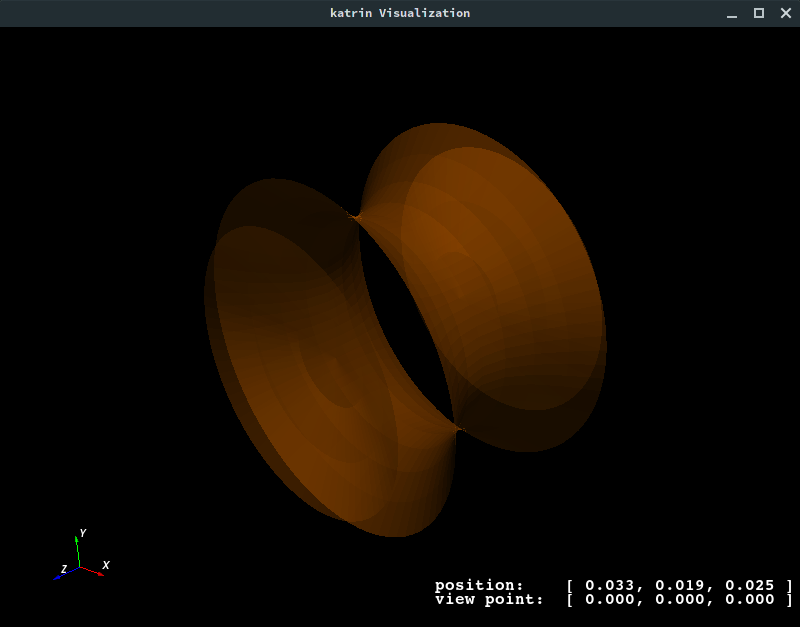
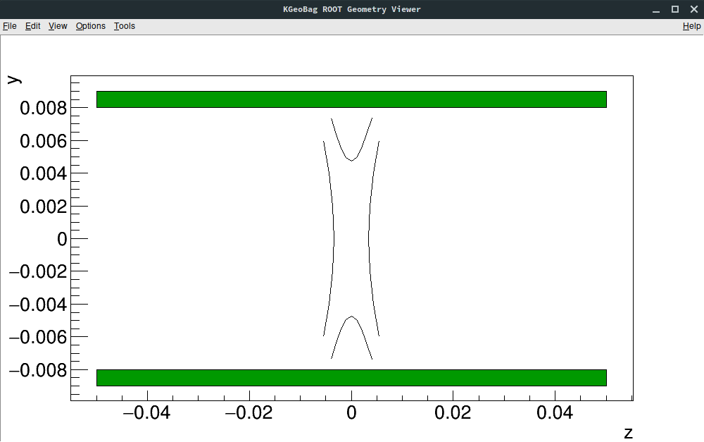
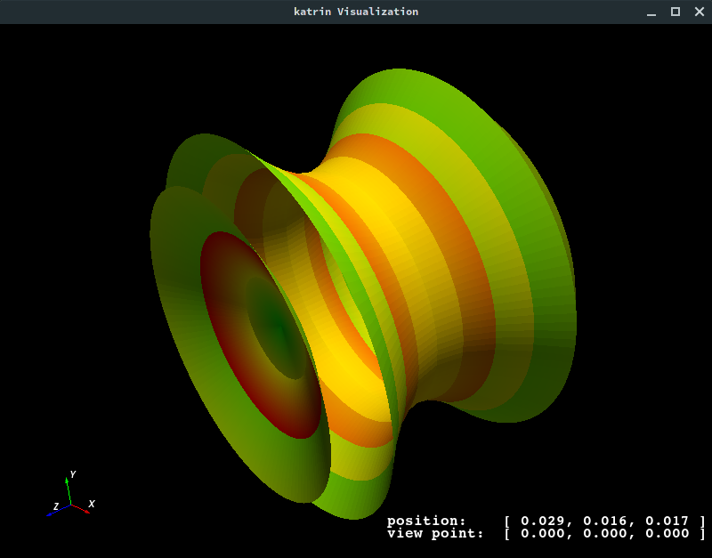

Tools
*****

The main application for simulations is ``Kassiopeia``. The XML interface allows flexible configuration that is suited
to many tasks. However, sometimes a more direct approach to certain investigations is needed. In the following, 
additional tools that are included with *KGeoBag* are presented that are typically of use during simulation design and
debugging.

Geometry viewers
================

The geometry viewwers are intended to help with constructing and optimizing a simulation geometry that is typically
used with *Kassiopeia* and *KEMField*. In most cases, the simulation requires a sophistocated geometry setup where
additional tools are beneficial.

* ``GeometryDump`` prints information about the selected geometry elements to the terminal. This provides a quick method
  to access positions and rotations of any elements placed in the global coordinate system. The output is constructed
  in XML_ format, which can be further processed by external software.
* ``GeometryViewer`` opens a VTK_ visualization window showing the geometry in a 3D view. In the case that appearance
  definitions are embedded in the configuration file (via the ``<appearance .../>`` element), the shown geometry
  elements will be displayed accordingly.
* ``GeometryViewerROOT`` opens a ROOT_ visualization window showing the geometry in a 2D view. Spaces are shown as green
  boxes, surfaces as black lines. In order to project the geometry onto a 2D plane, the center point and direction
  of the plane must be defined. By default, the ROOT viewer draws the geometry in the Y-Z plane.

Usage
-----

All listed programs will show a brief usage summary if called without arguments. The applications are called with a
configuration file name and a valid geometry path, e.g.:

.. code-block:: bash

    GeometryViewer QuadrupoleTrapSimulation.xml 'world/@electrode_tag'

Below is an example of the VTK_ geometry viewer:

In case of the ROOT_ viewer, additional options can be passed to define the 2D view plane:

.. code-block:: bash

    GeometryViewerROOT QuadrupoleTrapSimulation.xml 'world/@electrode_tag' 'world/@magnet_tag' --plane=XZ

Below is an example of the ROOT_ geometry viewer:

As shown above, it is possible to specify multiple geometry paths as well.

Advanced visualization
----------------------

Note that in addition to these geometry viewers, *Kassiopeia* also supports to define visualizations in the
configuration file directly so that no additional commands are necessary. For details see :ref:`visualization-label`.

Mesh viewers
============

The mesh viewers are intended to help with constructing and optimizing an electrostatic geometry that is provided
to *KEMField*. In this case a mesh needs to be defined according to the selected symmetry level. The viewers show
the defined mesh in a VTK_ window, coloring each mesh element individually.

* ``AxialMeshViewer`` opens a visualization window showing the axial mesh. A corresponding mesh must be defined in the
  configuration file with the ``<axial_mesh .../>`` element.
* ``MeshViewer`` opens a visualization window showing the asymmetric (3D) mesh. A corresponding mesh must be defined in
  the configuration file with the ``<mesh .../>`` element.

Usage
-----

All listed programs will show a brief usage summary if called without arguments. The viewers are called with a
configuration file name and a valid geometry path, e.g.:

.. code-block:: bash

    AxialMeshViewer QuadrupoleTrapSimulation.xml 'world/@electrode_tag'

In this case, the geometry path selects all elements with the tag `electrode_tag`, which in this geometry corresponds
to all electrode elements. Note that because the configuration file is processed before the mesh viewer visualization,
there may be additional messages or windows shown (e.g. the internal VTK_ geometry viewer). Below is an example of the
axial mesh viewer:

