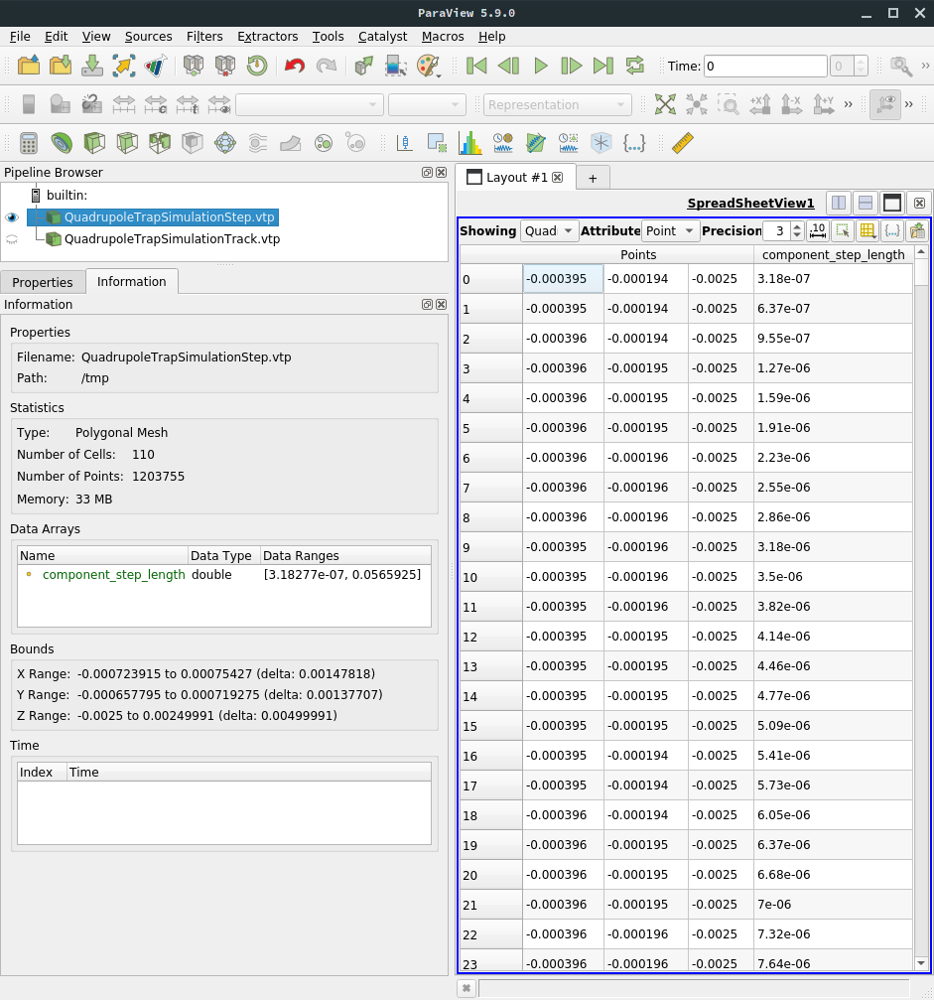

.. _output-label:

Understanding Simulation Output
*******************************

This section provides a description of the output files created by a *Kassiopeia* simulation, along with examples to
read and analyze the files.

Output configuration
--------------------

Generally, *Kassiopeia* output is written to ROOT_ output (.root) files that store simulation data at the run, event,
track and step level. In addition, if *Kassiopeia* was compiled with VTK_ support, output files in VTK polydata (.vtp)
format may be written. These files are mainly intended for visualization, e.g. with the ParaView_ software. It is
also possible to write simulation data as plaintext ASCII files, however this is not recommened for large simulations.

As explained in :ref:`configuration-label`, the output format is configured by the available writers. Writers use the
description of the output format in the XML configuration file, which specifies the output fields that will be written
to file. Different output descriptions may be used for different writers.

Groups and fields
~~~~~~~~~~~~~~~~~

Structured output formats like ROOT and VTK allow to combine several output fields into a common group. This is not
only useful for analyzing the simulation results, but also allows to distinguish between data produces at the run,
event, track and step levels. An output group may be defined by the structure:

.. code-block:: xml

    <output_group name="output_step_world">
        <output name="step_id" field="step_id" parent="step"/>
    </output_group>

or, alternatively in the older XML syntax:

.. code-block:: xml

    <ks_component_group name="output_step_world">
        <output name="step_id" field="step_id" parent="step"/>
    </ks_component_group>

In this case, the output file will have one group `output_step_world` that contains one member field `step_id` and is
updated at the step level, meaning that one entry will be added to the member field with each simulation step.

In the case above, the member field `step_id` refers to an attribute of the step class :kassiopeia:`KSStep`. Similar
fields are available in the other classes, such as :kassiopeia:`KSTrack`. However, in a typical simulation one also
wants to access physical attributes of the simulated particle. This is possible at the step level as well. In this case,
one may access the initial or final state of the particle in each step (where the initial state of one step equals the
final state of the preceding step, unless it is the first step in which the particle was generated). For example:

.. code-block:: xml

    <output name="step_initial_particle" field="final_particle" parent="step"/>
    <output name="step_final_particle" field="final_particle" parent="step"/>

    <output_group name="output_step_world">
        <output name="step_id" field="step_id" parent="step"/>
        <output name="initial_position" field="position" parent="step_initial_particle"/>
        <output name="final_position" field="position" parent="step_final_particle"/>
    </output_group>

writes the initial and final particle position at each step to file. Note that in this case, one must declare a member
field `step_..._particle` that can be referenced inside the output group. Because the declaration is outside the group
it is not written to file, and so the output file will contain three fields at the step level. The at the track level:

.. code-block:: xml

    <output name="track_initial_particle" field="initial_particle" parent="track"/>
    <output name="track_final_particle" field="final_particle" parent="track"/>

    <output_group name="output_track_world">
        <output name="track_id" field="track_id" parent="track"/>
        <output name="initial_position" field="position" parent="track_initial_particle"/>
        <output name="final_position" field="position" parent="track_final_particle"/>
    </output_group>

Vector data like the particle position is stored as an array of `(x,y,z)` components for each entry. Similarly, tensor
data is stored as an array of nine components. One may also store derived attributes like magnitude or radius:

.. code-block:: xml

    <output name="step_initial_particle" field="final_particle" parent="step"/>
    <output name="initial_position" field="position" parent="step_initial_particle"/>

    <output_group name="output_step_world">
        <output name="initial_position" field="position" parent="step_initial_particle"/>
        <output name="initial_radius" field="perp" parent="initial_position"/>
    </output_group>

In addition to simple fields that reference internal attributes, some advanced calculation features are available:

* `math` allows to evaluate arbitrary functions (using ROOT_'s ``TFormula`` class) that references one or more existing
  members.
* `integral` calculates the discrete integral of the referenced member field.
* `delta` calculates the difference between the current value of a member field to the previous one.
* `minimum` and `maximum` calculate the minimum/maximum value of a member field over the given interval (e.g. a track).
* `minimum_at` and `maximum_at` calculate the position of the minimum/maximum value.

The example below shows usage of these advanced fields:

.. code-block:: xml

    <output name="step_final_particle" field="final_particle" parent="step"/>
    <output name="step_kinetic_energy" field="kinetic_energy_ev" parent="step_final_particle"/>
    <output name="step_polar_angle_to_b" field="polar_angle_to_b" parent="step_final_particle"/>

    <output_group name="output_step_world">
        <output name="kinetic_energy" field="kinetic_energy_ev" parent="step_final_particle"/>

        <!-- change in kinetic energy at each step -->
        <output_delta name="kinetic_energy_change" parent="step_kinetic_energy"/>

        <!-- longitudinal kinetic energy at each step, derived from kinetic energy and pitch angle -->
        <output_math name="long_kinetic_energy" term="x0*cos(x1*TMath::Pi()/180.)*cos(x1*TMath::Pi()/180.)"
                parent="step_kinetic_energy" parent="step_polar_angle_to_b"/>
    </output_group>

    <output name="step_length" field="continuous_length" parent="step"/>

    <output_group name="output_track_world">
        <!-- value and position of minimum/maximum kinetic energy over each track -->
        <output_maximum name="max_kinetic_energy" group="output_step_world" parent="kinetic_energy"/>
        <output_minimum name="min_kinetic_energy" group="output_step_world" parent="kinetic_energy"/>
        <output_maximum_at name="max_kinetic_energy_position" group="output_step_world" parent="kinetic_energy"/>
        <output_minimum_at name="min_kinetic_energy_position" group="output_step_world" parent="kinetic_energy"/>

        <!-- integrated length of all steps in each track -->
        <output_integral name="total_length" parent="step_length"/>
    </output_group>

Output structure
~~~~~~~~~~~~~~~~

For the remainder of this section, we will refer to the ``QuadrupoleTrapSimulation.xml`` example file to discuss the
output fields and their structure. Here is the (slightly shortened) output confuguration of this example:

.. code-block:: xml

    <output_group name="component_step_world">
        <output name="step_id" field="step_id" parent="step"/>
        <output name="continuous_time" field="continuous_time" parent="step"/>
        <output name="continuous_length" field="continuous_length" parent="step"/>
        <output name="number_of_turns" field="number_of_turns" parent="step"/>
        <output name="time" field="time" parent="component_step_final_particle"/>
        <output name="position" field="position" parent="component_step_final_particle"/>
        <output name="momentum" field="momentum" parent="component_step_final_particle"/>
        <output name="magnetic_field" field="magnetic_field" parent="component_step_final_particle"/>
        <output name="electric_field" field="electric_field" parent="component_step_final_particle"/>
        <output name="electric_potential" field="electric_potential" parent="component_step_final_particle"/>
        <output name="kinetic_energy" field="kinetic_energy_ev" parent="component_step_final_particle"/>
    </output_group>

    <output_group name="component_step_cell">
        <output name="polar_angle_to_z" field="polar_angle_to_z" parent="component_step_final_particle"/>
        <output name="polar_angle_to_b" field="polar_angle_to_b" parent="component_step_final_particle"/>
        <output name="guiding_center_position" field="guiding_center_position" parent="component_step_final_particle"/>
        <output name="orbital_magnetic_moment" field="orbital_magnetic_moment" parent="component_step_final_particle"/>
    </output_group>

    <output name="z_length" field="continuous_length" parent="step"/>
    <output_group name="component_track_world">
        <output name="creator_name" field="creator_name" parent="track"/>
        <output name="terminator_name" field="terminator_name" parent="track"/>
        <output name="total_steps" field="total_steps" parent="track"/>
        <output name="number_of_turns" field="number_of_turns" parent="track"/>
        <output name="initial_time" field="time" parent="component_track_initial_particle"/>
        <output name="initial_position" field="position" parent="component_track_initial_particle"/>
        <output name="initial_momentum" field="momentum" parent="component_track_initial_particle"/>
        <output name="initial_magnetic_field" field="magnetic_field" parent="component_track_initial_particle"/>
        <output name="initial_electric_field" field="electric_field" parent="component_track_initial_particle"/>
        <!-- ... skipped lines ... -->
        <output name="final_time" field="time" parent="component_track_final_particle"/>
        <output name="final_position" field="position" parent="component_track_final_particle"/>
        <output name="final_momentum" field="momentum" parent="component_track_final_particle"/>
        <output name="final_magnetic_field" field="magnetic_field" parent="component_track_final_particle"/>
        <output name="final_electric_field" field="electric_field" parent="component_track_final_particle"/>
        <!-- ... skipped lines ... -->
        <output name="z_length_internal" field="continuous_length" parent="track"/>
        <output_integral name="z_length_integral" parent="z_length"/>
    </output_group>

The output structure (with some fields skipped) is as follows:

.. graphviz::

    digraph output {
      node [fontname="helvetica", fontsize=10];
      graph [rankdir="LR"] {
        rank=same
        "component_step_world" [shape="folder", style=filled, fillcolor=yellow];
        "component_step_cell" [shape="folder", style=filled, fillcolor=yellow];
        "component_track_world" [shape="folder", style=filled, fillcolor=yellow];
      }
      {
        rank=same
        "step" [shape="rectangle", style=filled, fillcolor=lightskyblue];
        "track" [shape="rectangle", style=filled, fillcolor=lightgreen];

        "component_step_final_particle" [shape="note", style=filled, fillcolor=whitesmoke];
        "component_step_position" [shape="note", style=filled, fillcolor=whitesmoke];
        "component_step_length" [shape="note", style=filled, fillcolor=whitesmoke];
        "component_track_initial_particle" [shape="note", style=filled, fillcolor=whitesmoke];
        "component_track_final_particle" [shape="note", style=filled, fillcolor=whitesmoke];
        "component_track_position" [shape="note", style=filled, fillcolor=whitesmoke];
        "component_track_length" [shape="note", style=filled, fillcolor=whitesmoke];
        "z_length" [shape="note", style=filled, fillcolor=whitesmoke];
      }

      "component_step_world" -> "step_id" -> "step";
      "component_step_world" -> "continuous_time" -> "step";
      "component_step_world" -> "continuous_length" -> "step";
      "component_step_world" -> "number_of_turns" -> "step";
      "component_step_world" -> "time" -> "component_step_final_particle";
      "component_step_world" -> "position" -> "component_step_final_particle";
      "component_step_world" -> "momentum" -> "component_step_final_particle";
      "component_step_world" -> "magnetic_field" -> "component_step_final_particle";
      "component_step_world" -> "electric_field" -> "component_step_final_particle";
      "component_step_world" -> "electric_potential" -> "component_step_final_particle";
      "component_step_world" -> "kinetic_energy" -> "component_step_final_particle";

      "component_step_cell" -> "polar_angle_to_z" -> "component_step_final_particle";
      "component_step_cell" -> "polar_angle_to_b" -> "component_step_final_particle";
      "component_step_cell" -> "guiding_center_position" -> "component_step_final_particle";
      "component_step_cell" -> "orbital_magnetic_moment" -> "component_step_final_particle";

      "component_track_world" -> "creator_name" -> "track";
      "component_track_world" -> "terminator_name" -> "track";
      "component_track_world" -> "total_steps" -> "track";
      "component_track_world" -> "number_of_turns" -> "track";
      "component_track_world" -> "initial_time" -> "component_track_initial_particle";
      "component_track_world" -> "initial_position" -> "component_track_initial_particle";
      "component_track_world" -> "initial_momentum" -> "component_track_initial_particle";
      "component_track_world" -> "initial_magnetic_field" -> "component_track_initial_particle";
      "component_track_world" -> "initial_electric_field" -> "component_track_initial_particle";
      "component_track_world" -> "final_time" -> "component_track_final_particle";
      "component_track_world" -> "final_position" -> "component_track_final_particle";
      "component_track_world" -> "final_momentum" -> "component_track_final_particle";
      "component_track_world" -> "final_magnetic_field" -> "component_track_final_particle";
      "component_track_world" -> "final_electric_field" -> "component_track_final_particle";
      "component_track_world" -> "z_length_internal" -> "track";
      "component_track_world" -> "z_length_integral" -> "z_length";

      "component_step_position" -> "step" [style=dashed];
      "component_step_length" -> "step" [style=dashed];
      "component_step_final_particle" -> "step" [style=dashed];
      "z_length" -> "step" [style=dashed];

      "component_track_position" -> "track" [style=dashed];
      "component_track_length" -> "track" [style=dashed];
      "component_track_final_particle" -> "track" [style=dashed];
      "component_track_initial_particle" -> "track" [style=dashed];
   }

where the relations between the output groups (left), member fields (middle), and parent objects (right) are indicated
by connecting arrows and the different node shapes. The output groups and fields are what is visible in the output file.
Member fields either refer to a particle state of a step/track, or to attributes at the step/track level directly. The
field `z_length` is a special case, since an intermediate field is necessary to perform the integration at track level.

ROOT output files
-----------------

The ROOT_ output format is the standard file format that *Kassiopeia* produces. It supports flexible configuration,
structured data fields, and efficient storage on disk. The data fields are placed in ROOT's ``TTree`` and ``TLeaf``
objects that are created for each output group and member field, respectively.

Data structure
~~~~~~~~~~~~~~

In the output file, several tree structures are present that open into a list of leafs, corresponding to the simulation
data. Here is an example view in the ROOT_ ``TBrowser``:

.. image:: _images/root_output.png
   :width: 350pt

According to the configuration in ``QuadrupoleTrapSimulation.xml``, three output groups have been created:
`component_track_world`, `component_step_world`, and `component_step_cell`. Each of these is split into several tree
in the ROOT file, distinguished by their postfix:

* `..._DATA` contains the actual simulation data. For each output field, one leaf object (an array-like structure) is
  created in the output file. In the example shown here, the `component_step_world_DATA` tree contains the fields
  `step_id`, `time` and so on. In case of vector or tensor data, one individual field is created for each component,
  e.g. `position_x`, `position_y`, `position_z`. All output fields are sorted by the respective index, e.g. `STEP_DATA`
  is sorted by `STEP_INDEX` (which is a continually increasing integer number). This allows direct access to any
  specific data field at any output level.
* `..._PRESENCE` indicates at which indices in the output fields valid data is present. This tree contains the fields
  `INDEX`, referring to the start index in the output data, and `LENGTH`, referring to the length of one segment.
* `..._STRUCTURE` contains the fields `LABEL` and `TYPE`. For each output field present in the file, they indicate their
  name (i.e. the name of the leaf placed under `..._DATA`) and their type (``double`` etc.).

Note that the data in each leaf is written continuously, i.e. there is no distinction between individual tracks, events,
or runs. This is done in order to improve storage efficiency and to provide a clean output structure. See below for
information on how to map output fields between the step, track, event, and run level.

In addition to the output groups defined in the XML configuration file, several trees containing meta-data are present
as well. These trees and their data fields are always present, regardless of the output configuration:

* `LABEL`
* `RUN_KEYS`, `EVENT_KEYS`, etc. contain the names of the output groups present in the file. In the example shown here,
  the `TRACK_KEYS` tree contains one element ``component_track_world``.
* `RUN_DATA`, `EVENT_DATA`, etc. contain a list of run/event/... indices that correspond to the number of elements
  present in the output file at the corresponding level. This is accessible by the field `RUN_INDEX` and so on.
  In addition, these fields provide a mapping between the different levels:

  * `TRACK_DATA` contains the arrays `FIRST_STEP_INDEX` and `LAST_STEP_INDEX`. Their size corresponds to the number of
    tracks and they are sorted by `TRACK_INDEX`. For each track index, the two fields indicate the first and last step
    of the track. Hence if one looks at the step output, `component_step_world` in this case, one may use this
    information to split the continuous step data (sorted by `STEP_INDEX`) into individual tracks.
  * `EVENT_DATA` contains the fields `(FIRST|LAST)_STEP_INDEX` and `(FIRST|LAST)_TRACK_INDEX`, sorted by `EVENT_INDEX`.
  * `RUN_DATA` contains the same fields and `(FIRST|LAST)_EVENT_INDEX`, sorted by `RUN_INDEX`.

Accessing simulation data
-------------------------

Using Kassiopeia
~~~~~~~~~~~~~~~~

Using ROOT
~~~~~~~~~~

Using Python
~~~~~~~~~~~~

VTK output files
-----------------

The VTK_ output format can be used in addition to the standard format and is mainly intended for visualization purposes.
The most flexible way to visualize simulation output is by using the ParaView_ software, which can import the output
files created by *Kassiopeia*. The VTK format supports flexible configuration and can be set up independently of the
ROOT output. The VTK writer creates indepdendent files at the track and step level, which typically hold the position
as the main data field (required for 3D visualization), and any number of additional data fields.

Data structure
~~~~~~~~~~~~~~

In the output file, several tree structures are present that open into a list of leafs, corresponding to the simulation
data. Here is an example view in ParaView_:

In this example, the step and track output only contains one data field in addition to the particle position. For the
step output, the file contains the value of `component_step_length` and the position at each point. Each point
corresponds to one step in the simulation. As with the ROOT output, the step data itself is continuous and not split
into individual tracks. However, because the 3D representation of the steps is stored as a ``vtkPolyLine``, the
visualization can dinstignuish between individual tracks: Each track in the simulation corresponds to a polyline in the
VTK step file.

Accessing simulation data
-------------------------

Using ParaView
~~~~~~~~~~~~~~

Using Python
~~~~~~~~~~~~

ASCII output files
------------------

.. _Paraview: http://www.paraview.org/
.. _ROOT: https://root.cern.ch/
.. _VTK: http://www.vtk.org/

.. rubric:: Footnotes
